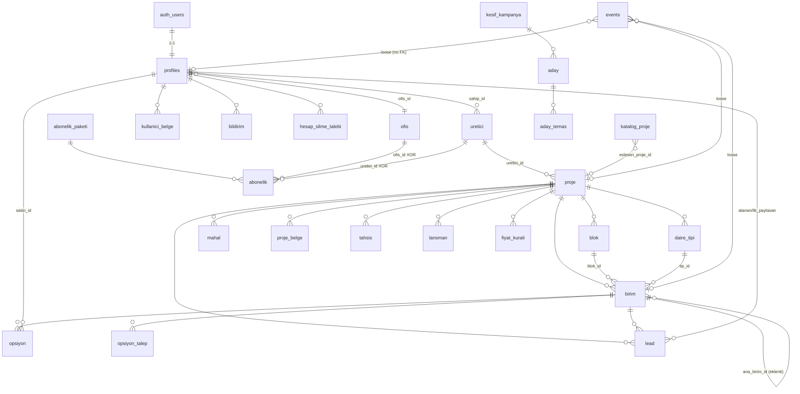

# 04 — DATA MODEL (Supabase Postgres + RLS)

Etiketler: KANITLI / ÇIKARIM. Kaynak: `supabase-schema.sql` (kök, **bilinçli eski**) + `db/*.sql` (27 migration, canlı gerçek) + `supabase/migrations/*.sql` (4 CLI migration) + `supabase/seed.sql`. Çelişkide **`db/*.sql` kazanır**.

**Özet:** 25 tablo · 14 enum · 2 storage bucket · Vercel cron (günlük) + pg_cron (2×15dk).

---

## 1. ENUM'lar (14 — exact değerler, KANITLI)

| Enum | Değerler |
|---|---|
| `rol` | uretici, emlakci, ofis_yetkili, arsa_sahibi, marka_yetkili, admin |
| `hesap_durum` | onay_bekliyor, aktif, pasif, askida, arsivli |
| `birim_durum` | musait, opsiyonlu, satis_beklemede, satildi, stop, planli, kiralandi |
| `birim_tur` | daire, ofis, dukkan, villa, depo, otopark |
| `islem_tipi` | satilik, kiralik, satilik_kiralik, pay_satisi, satisa_kapali |
| `tapu_durum` | kat_irtifaki, kat_mulkiyeti, arsa_tapusu, kocan, yok |
| `sahiplik` | muteahhit, arsa |
| `komisyon_tip` | yuzde, sabit, yok |
| `opsiyon_yontem` | dogrudan, talep_kod |
| `insaat_asama` | planlama, temel, kaba_insaat, ince_insaat, cevre_duzenleme, tamamlandi |
| `lead_kaynak` | paylasim, jenerik, kendi_kanali |
| `lead_durum` | yeni, arandi, gorusme, opsiyon, kazanildi, kaybedildi |
| `tahsis_hedef` | herkes, ofis, danisman |

**Enum değil, free `text` (yalnız comment/app enforce, DB CHECK yok):** `abonelik.durum` (deneme/aktif/askida/iptal), `opsiyon_talep.durum` (beklemede/onaylandi/reddedildi + legacy kod_verildi/kullanildi), `kullanici_belge.durum`, `profiles.belge_durumu` (yok/beklemede/dogrulandi/red), `lansman.durum`, `katalog_proje.durum`, `aday.durum` (funnel), `hesap_silme_talebi.durum`, opsiyon disiplininde `proje.opsiyon_ayar.yontem` (gecici/onay/dogrudan).

---

## 2. Tablo envanteri (25)

### profiles — kullanıcı/aktör (1:1 auth.users)
PK `id`→auth.users(id) cascade. `rol rol default emlakci`, `ad`, `telefon`, `ofis_id`→ofis, `foto_url`, `logo_url`, `aktif bool`, `durum hesap_durum default onay_bekliyor`, `son_giris`, `onaylayan_id`→profiles, `onay_tarihi`, `talep_rol rol`, `kayit_meta jsonb`, `belge_durumu text default 'yok'`, `marka/il/ilce/uzmanlik text` (segment), `profil_detay jsonb` (YAMBİS/MERSİS/TTBS/MYS/TCKN), `created_at`. Index `(il, marka) where rol='emlakci'`. RLS: self+admin; `profiles_belge_guard` trigger (non-admin `belge_durumu='dogrulandi'` yasak); `on_auth_user_created`→`handle_new_user()`.

### ofis — emlak ofisi/franchise
`id`, `ad`, `marka`, `il`, `ilce`. RLS: public read (`using(true)`), yazma yok → service-role/admin.

### uretici — müteahhit firma
`id`, `ad`, `vergi_no`, `dogrulanmis bool default false`, `sahip_id`→profiles, `profil jsonb` (logo/kurulus_yili/hakkinda/web/il/ilce/telefon), `created_at`. RLS: owner(sahip_id)+admin; `uretici_emlakci_select` (tahsisli emlakçı üretici kartını görür).

### proje
`id`, `uretici_id`→uretici cascade. Konum: ulke default TR, il/ilce/mahalle/ada/parsel, emsal/taks, lat/lng. Zaman: baslama/teslim/iskan_tarihi, `insaat_asamasi`, `ilerleme_yuzde`, etap. `kunye jsonb` (açıklama/donatı/öznitelik/yakın çevre), `opsiyon_yontemi opsiyon_yontem default dogrudan`, `opsiyon_ayar jsonb` (opsiyon disiplini), `belge_dogrulandi bool`, `video_url`, `sorumlu_ad/tel`, `public_slug text unique`, `demo bool default false`. Faz-2 yurtdışı: `para_birimi default TRY`, `kira_getirisi_pct`, `amortisman_yil`, `oturum_uygun`, `golden_visa_esik`, `diller text[]`. `son_guncelleme`, `created_at`. RLS: owner + `proje_emlakci_select`(emlakci_proje_tahsisli).

### blok
`id`, `proje_id` cascade, `ad`, `kat_sayisi`. RLS: owner + tahsisli emlakçı okur.

### daire_tipi — daire tipi şablonu
`id`, `proje_id` cascade, `ad`, `oda`, `net_m2/brut_m2`, `plan_url`, `taban_fiyat`, `para_birimi`, `banyo`, `balkon`, `otopark`. RLS: owner + tahsisli.

### birim — TEK DOĞRU KAYNAK (fiyat/durum)
`id`, `proje_id` cascade, `blok_id`→blok, `tip_id`→daire_tipi. `tur birim_tur default daire`, `islem_tipi default satilik`, `satilabilir bool default true`, `satisa_acilis timestamptz`, `tapu_durumu tapu_durum default kat_irtifaki`, `kat`, `daire_no`, `durum birim_durum default musait`, `liste_fiyati numeric`, `kira_bedeli`, `kira_sartlari jsonb`, `para_birimi`, `usd_endeksli bool`, `serefiye jsonb`, `yon/manzara`, `net_m2/brut_m2`, `sahiplik sahiplik default muteahhit`, `odeme_plani_url` (legacy), `odeme_plani jsonb` (pesinat_pct/taksit_sayisi/ara_odemeler/vade_farki_pct), `durum_notu`, `son_guncelleme` (freshness), `stale bool default false`, `ana_birim_id`→birim(self, eklenti), `created_at`. Index: proje_id, durum, ana_birim_id. **Realtime publication'da.** RLS: owner + `birim_emlakci_select`(emlakci_birim_gorebilir 6-arg). Trigger: `opsiyon_birim_senkron` (opsiyon'dan), `birim_fiyat_log` (liste_fiyati AFTER UPDATE → events fiyat).

### tahsis — GÖRÜNÜRLÜK MOTORU (DEĞİŞMEZ #1)
`id`, `proje_id` cascade, `kapsam jsonb {bloklar,katlar,tipler,turler,birimler}`, `hedef_tip tahsis_hedef`, `hedef_id`, `hedef_filtre jsonb {marka,il,ilce,uzmanlik}`, `munhasir bool`, `kontenjan`, `fiyat_gorunur bool default true`, `komisyon_tip komisyon_tip default yuzde`, `komisyon_deger`, `baslangic default now()`, `bitis`. Index proje_id. RLS: **owner-only (admin/üretici); emlakçı SELECT YOK** — emlakçı tahsisi doğrudan okumaz, görünürlük SECURITY DEFINER fonksiyonlarından.

### opsiyon — kilit
`id`, `birim_id` cascade, `satici_id`→profiles, `yontem`, `durum birim_durum default opsiyonlu`, `kilit_bitis`, `dogrulandi bool default true`, `dogrulama_bitis`, `musteri_ad`, `musteri_tel`, `gerekce`, `sonuc text` (satildi/vazgecildi), `sonuc_at`, `hatirlatildi bool`, `uzatildi bool`, `created_at`.
**★ ÇİFT-SATIŞ KALKANI (DEĞİŞMEZ #3):**
```sql
create unique index opsiyon_tek_aktif on opsiyon (birim_id)
  where durum in ('opsiyonlu','satis_beklemede');
```
RLS: `opsiyon_insert with check(is_admin())` (emlakçı doğrudan INSERT yasak → RPC'ler); select own/admin/owner; update admin/owner; delete own/admin. Trigger `opsiyon_birim_senkron` (birim.durum sync + son_guncelleme + delete'te serbest bırak).

### opsiyon_talep — talep→onay
`id`, `birim_id` cascade, `talep_eden_id`→profiles, `durum text default beklemede`, `kod`/`kod_son` (dormant), `not_emlakci`, `karar_veren_id`→profiles, `karar_at`, `opsiyon_id`→opsiyon. Partial unique `(talep_eden_id, birim_id) where durum='beklemede'`. RLS: own/admin/owner select; insert 6-arg gorebilir + müsait+satılabilir; delete own pending/admin.

### lead
`id`, `proje_id`→proje, `birim_id`→birim, `kaynak lead_kaynak`, `ad`, `telefon`, `telefon_norm` (normalize), `durum lead_durum default yeni`, `atanan_id`→profiles, `ilk_paylasan_id`→profiles, `kvkk_riza bool`, `created_at`. Index telefon_norm. RLS: insert `with check(true)` (anon form); select **admin OR atanan OR ilk_paylaşan** (üretici feed görmez — `db/2026-07-24`).

### events — append-only iz zinciri/audit
`id bigint identity`, `tip text` (paylasim/goruntuleme/lead/satis/opsiyon/fiyat/favori/durum/katalog/acilis/ilgi/kurucu/dogrulama/abonelik/seo_yayin), `profile_id/proje_id/birim_id`, `payload jsonb` (`eylem`: gecici/dogrudan/talep/satisa_donustu/vazgecildi/iptal/sure_doldu/dogrulandi…), `created_at`. Index birim_id, (tip, created_at desc). RLS: select admin/own/owner; **INSERT politikası YOK → yalnız SECURITY DEFINER + service-role.** Ayrı `denetim` tablosu yoktur.

### proje_belge / mahal
`proje_belge`: tip (ruhsat/iskan/yapi_denetim/kapak/foto/video/brosur), ad, url, dogrulandi. `mahal`: teslim standardı (mahal/zemin/duvar/tavan/marka/aciklama/sira). İkisi de owner + tahsisli-read.

### kullanici_belge — KYC
`id`, `profile_id` cascade, `tip` (mesleki_yeterlilik/vergi_levhasi), `url`, `ai_sonuc jsonb` (tip/ad/vergi_no/gecerli/skor/ozet), `durum text default beklemede`, `created_at`. RLS: self+admin. Bucket `kyc-belge` (private).

### abonelik_paketi / abonelik — SaaS
`abonelik_paketi`: ad, `hedef` (ofis/uretici/emlakci), `fiyat_aylik`, para_birimi, `kota_proje/kota_koltuk/kota_ai`, `gelismis_rapor bool`, `aktif`, `siralama`. RLS: public read + admin CRUD.
`abonelik`: `ofis_id`→ofis XOR `uretici_id`→uretici (CHECK `abonelik_tek_abone`), `paket_id`, `durum text default deneme`, baslangic/bitis, override kotalar, not_admin. Partial unique: `abonelik_ofis_aktif` + `abonelik_uretici_aktif` (tek aktif abonelik). RLS: admin + self.

### fiyat_kurali — dinamik fiyat (Faz-2 iskelet, iş mantığı YOK)
`proje_id`, `kapsam jsonb`, `tetik` (tarih/satis_adedi/doluluk_yuzde), `tetik_deger`, `aksiyon` (yuzde_zam/sabit_zam/yeni_fiyat), `aksiyon_deger`, `aktif`, `son_calisma`. RLS: owner.

### bildirim
`profile_id` cascade, `tip` (talep/onay/red/tahsis/lead/sistem), `baslik`, `govde`, `link`, `okundu bool default false`, `created_at`. Index (profile_id, okundu, created_at desc). RLS: self select/update; **INSERT yok → service-role** (anti-spoof).

### lansman
`proje_id` cascade, `baslik`, `aciklama`, `tarih`, `konum`, `durum text default lansman` (lansman/on_talep/satista/etkinlik). RLS: owner + tahsisli emlakçı select.

### katalog_proje — dış SEO katalog (olgusal-only)
`slug unique`, `ad`, `il/ilce/mahalle`, `gelistirici`, `oda_tipleri text[]`, `m2_min/max`, `daire_sayisi`, `durum` (lansman/insaat/teslim), `teslim`, `proje_web`, `kaynak_url`, `eslesen_proje_id`→proje, `aktif bool`, `icerik jsonb` (zengin SEO), created/updated. Index (il,ilce), (aktif) partial. **RLS açık, politika YOK → yalnız service-role** (SEO sayfaları createAdminClient).

### pazarlama_entegrasyon — BYOK anahtar kasası (singleton)
PK `id text default 'default' check(id='default')`. `claude_key`, `fal_key`, `elevenlabs_key`, `publer_key`, `publer_workspace_id`, `render_url`, `render_token`, `serpapi_key`, `serper_key`, `places_key`, `updated_at`, `updated_by`. **RLS açık, politika YOK → service-role only.** Plaintext (pgsodium/Vault Faz-2 sertleştirme notu).

### kesif_kampanya / aday / aday_temas — büyüme funnel (admin, service-role only)
`kesif_kampanya`: il, `segmentler text[]` (muteahhit/proje/ofis/emlakci), durum (calisiyor/tamamlandi/hata), bulunan_aday, sonuc jsonb, baslatan.
`aday`: firma_adi, `firma_adi_norm` (dedup), segment, kisi/email/telefon/website/il/ilce/adres, proje_sayisi, uygunluk_skoru (0-100 Claude), ozet, kaynak (serpapi_maps/serper_web/places), kaynak_url, kampanya_id, `durum` funnel (yeni→zenginlesti→davet_edildi→acildi→kayit_oldu|reddedildi|soguk), ilk/son_temas, sonraki_takip, temas_sayisi, donusen_user_id, `opt_out bool` (İYS/ETK), notlar, proje_adi/proje_durumu/proje_website/proje_telefon. Unique `(firma_adi_norm, il)`; partial takip index. Trigger updated_at. RLS yok → service-role.
`aday_temas`: aday_id cascade, kanal (email/whatsapp), yon (giden/gelen), konu/mesaj, durum (gonderildi/acildi/yanit/opt_out/hata), gonderen, meta. RLS yok → service-role.

### hesap_silme_talebi — KVKK
`profile_id` cascade, eposta, sebep, `durum text default beklemede` (beklemede/islendi/reddedildi), created_at, islenme_tarihi, isleyen_admin. Index (durum, created_at desc). Partial unique `(profile_id) where durum='beklemede'`. RLS: self insert/select + admin update. Gerçek silme manuel.

---

## 3. Fonksiyonlar & trigger'lar (hepsi SECURITY DEFINER, KANITLI)

**Görünürlük (RLS backbone):** `is_admin()`, `current_ofis()`, `current_marka/il/ilce/uzmanlik()`, `emlakci_proje_tahsisli(p_proje_id)` (demo OR KYC+eşleşen tahsis+segment), `emlakci_birim_gorebilir(birim,proje,blok,tip,kat,tur)` (6-arg, kapsam.birimler dahil; 5-arg drop edildi), `emlakci_uretici_gorebilir(uretici)`, `handle_new_user()` (+`on_auth_user_created`), `belge_durumu_guard()` (+trigger).

**Opsiyon yaşam döngüsü:** `opsiyon_birim_senkron()` (+trigger), `opsiyon_talep_onayla(talep,gun)` (FOR UPDATE, gün→opsiyon_ayar.onay_gun else 7), `opsiyon_talep_reddet`, `opsiyon_al_dogrudan(birim,gun=3)`, `opsiyon_al_gecici(birim,ad,tel,gerekce)` (müşteri zorunlu+kota, düşük-skor kota=1), `opsiyon_dogrula(ops)`, `opsiyon_reddet(ops)`, `opsiyon_uzat(birim)` (bir kez), `opsiyon_serbest_birak()`, `opsiyon_hatirlat()` (pg_cron).

**Fiyat geçmişi:** `birim_fiyat_log()` (+trigger AFTER UPDATE OF liste_fiyati; null/0 guard).

**Güven skoru:** `emlakci_skor(profil)`, `muteahhit_skor(uretici)` (yanıt 30/SLA 25/doğrulama 25/tazelik 20), `emlakci_skor_tablo()`, `muteahhit_skor_tablo()` (`<3` → null "Yeni").

**pg_cron:** extension + iki job `*/15 * * * *`: `opsiyon-serbest-birak`, `opsiyon-hatirlat`.

**Freshness:** `son_guncelleme=now()` `opsiyon_birim_senkron` ve app/RPC yazışlarında; `stale bool` günlük Vercel cron `freshnessCalistir` ile set edilir (15g eşik).

---

## 4. Storage bucket'ları (2)

- `proje-medya` — **public=true**, 50 MB; yazma yalnız service-role (client write policy yok).
- `kyc-belge` — **public=false**, 8 MB; policy `(storage.foldername(name))[1] = auth.uid()::text` (own folder) OR is_admin.

---

## 5. DB-kalkanı deseni (partial-unique/CHECK, hepsi DB'de — KANITLI)

| Kalkan | Mekanizma |
|---|---|
| Çift satış | `opsiyon_tek_aktif` partial unique on opsiyon(birim_id) |
| Bekleyen talep tekilliği | `opsiyon_talep_bekleyen_tek` (talep_eden_id,birim_id) where beklemede |
| Tek aktif abonelik | `abonelik_ofis_aktif` / `abonelik_uretici_aktif` |
| Abonelik XOR abone | CHECK `abonelik_tek_abone` |
| Tek açık silme talebi | `hesap_silme_tek_aktif` (profile_id) where beklemede |
| Aday dedup | `aday_firma_il_uniq` (firma_adi_norm, il) |

---

## 6. ER Diyagramı (Mermaid)



**Görünürlük kuralı (tüm ürünün özü):** emlakçı `tahsis`'i doğrudan okumaz; `proje/blok/daire_tipi/birim/mahal/proje_belge/lansman` RLS'i SECURITY DEFINER `emlakci_proje_tahsisli`/`emlakci_birim_gorebilir` çağırır → `demo` OR (KYC dogrulandi AND aktif eşleşen tahsis [herkes+segment | danisman=uid | ofis=current_ofis()] AND kapsam boyutları bloklar/katlar/tipler/turler/birimler).

---

## 7. Seed / mock veri (KANITLI — `supabase/seed.sql` + `scripts/`)

- `seed.sql`: 4 auth.users + 1 admin (`a0000000-…-0001`), 1 ofis (`5555…` Demo Gayrimenkul), 1 uretici (`6666…` Demo İnşaat A.Ş.), 1 proje (`7777…` Çankaya Vadi Konakları — 29c'nin demo projesi), 2 blok, 2 daire_tipi, **40 birim** (kat-premium fiyat, kat1-daire1 arsa payı `satilabilir=false`), 2 tahsis. Test şifresi `Projedar123!`. Hardcoded abonelik paketi **YOK** (admin tanımlar).
- Sabit UUID'ler: users 1111/2222/3333/4444, admin a0000000…, ofis 5555, uretici 6666, proje 7777, blok 8888/9999, tip aaaa/bbbb.
- Scriptler (hepsi `.env.local` okur, anahtar basmaz): `test-hesaplar.mjs`, `seed-uretici-hesap.mjs`, `seed-projeler.mjs`, `seed-demo.mjs` (fal.ai medya + events), `seed-tahsis.mjs`, `gen-gorseller.mjs`/`gen-katplan.mjs` (fal.ai FLUX), `katalog-import.mjs`, `katalog-uret.mjs` (SerpAPI+Claude sonnet-5), `katalog-enrich.mjs`, `mail-sablon-uret.mjs`.
- Python (`scripts/rakip-tarama/`, `scripts/emlakjet-envanteri/`): SerpAPI rakip tarama + emlakjet SSR scraping + benchmark üretimi (`bolge-benchmark.json` kaynağı). Stdlib, DB yazmaz.

## 8. Şemada olup kullanılmayan / dormant (ÇIKARIM)

- `fiyat_kurali` (Faz-2, iş mantığı yok).
- `opsiyon_talep.kod`/`kod_son` (kod-mekanizması dormant; geçici/dogrudan/onay'a geçildi).
- `proje` yurtdışı kolonları (para_birimi≠TRY, oturum_uygun, golden_visa_esik, diller) — boş.
- `birim.usd_endeksli`, `odeme_plani_url` (legacy).
