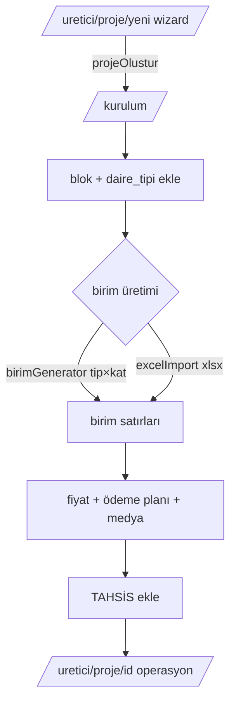
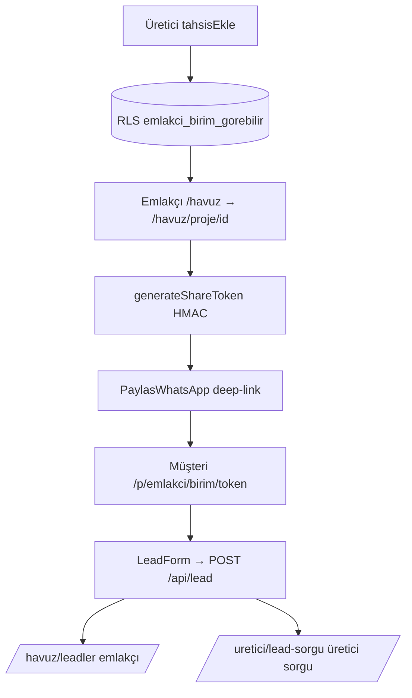
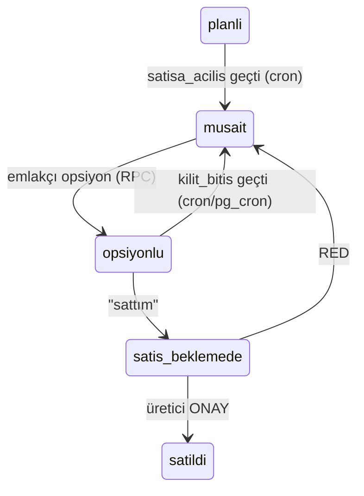
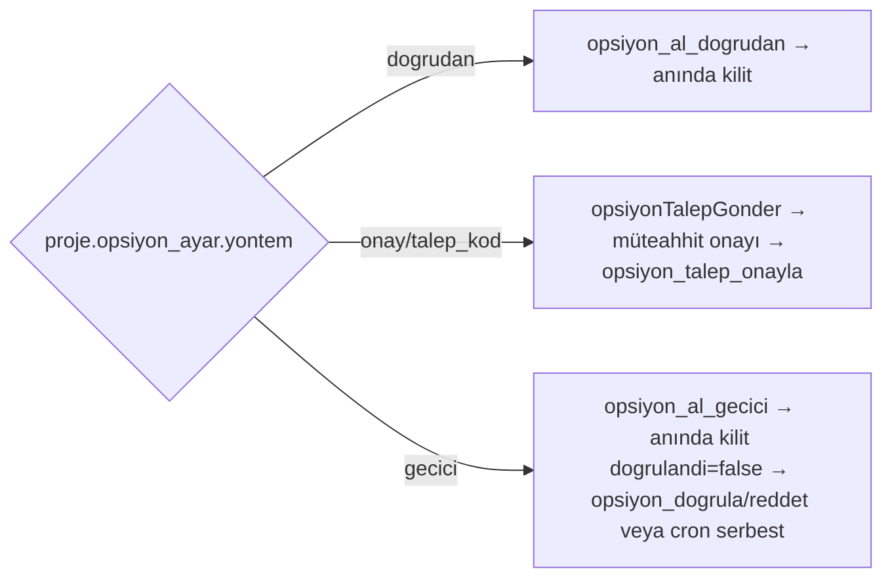
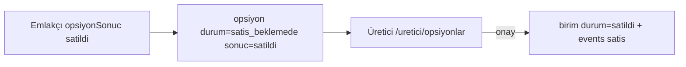

# 05 — ROUTES & PAGES (+ component & flows)

Etiketler: KANITLI. Index durumu: robots.ts + page-level metadata'dan.

---

## 1. Route envanteri

### Public (index)
| URL | Rol | Amaç | Index |
|---|---|---|---|
| `/` | Public | Ana hub landing (hero video + canlı portföy demo + ağ etkisi + SSS + JSON-LD) | index |
| `/muteahhit` | Public | Üretici rol landing | index |
| `/emlakci` | Public | Emlakçı rol landing | index |
| `/guven` | Public | Güven protokolü sayfası | index |
| `/proje/[slug]` | Public | Public proje mikrosite (ISR 3600; canlı stok/fiyat GİZLİ) | index (eşik geçerse) |
| `/konut-projeleri/[[...dilim]]` | Public | SEO hub (kök/il/ilçe kırılımı) | index |

### Public (noindex / gizli)
| URL | Rol | Amaç | Index |
|---|---|---|---|
| `/p/[emlakci]/[birim]/[token]` | Public anonim | İmzalı paylaşım mikrositesi (HMAC) | noindex |
| `/kayit` (+ `/kayit/belge`) | Public/Auth | Self-registration + KYC belge | noindex (robots disallow) |
| `/login`, `/sifremi-unuttum`, `/sifre-yenile` | Public | Auth | disallow |
| `/hesap-bekliyor` | Auth | Durum bekleme + WhatsApp CTA | disallow |
| `/gizlilik`, `/kullanim-kosullari`, `/kvkk-aydinlatma` | Public | Hukuki (TASLAK) | **noindex** (ama sitemap'te var — tutarsızlık) |
| `/sunum`, `/sunum/*`, `/sunum/v2/*` | Gizli link | Yüz yüze deck'ler (üretici/emlakçı/pitch/gtm/finansal/is-plani) | noindex, sitemap dışı |
| `/tasarim` + `/tasarim/[yon]` | Dahili | Tasarım yönü örnekleri | disallow |
| `/mockup-01..11` | Dahili | Tasarım laboratuvarı | noindex |
| `/auth/callback` | Sistem | PKCE callback (route) | — |

### Private paneller
| URL ailesi | Rol | Amaç |
|---|---|---|
| `/uretici`, `/uretici/*` (17 sayfa) | uretici/admin | Müteahhit kokpiti (§03.A) |
| `/havuz`, `/havuz/*` (12 sayfa) | emlakci/admin/ofis/marka/arsa | Emlakçı havuzu (§03.B) |
| `/admin`, `/admin/*` (15+ sayfa) | admin | Platform yönetimi (§03.D) |

### Dynamic route şablonları
```
/proje/[slug]
/konut-projeleri/[[...dilim]]         (optional catch-all: [], [il], [il,ilce])
/p/[emlakci]/[birim]/[token]
/uretici/proje/[id]
/uretici/proje/[id]/kurulum
/uretici/proje/yeni
/havuz/proje/[id]
/havuz/proje/[id]/katalog
/admin/kullanicilar/[id]
/tasarim/[yon]
```

### API route'ları (detay §06)
```
/api/cron  (+ /freshness /option-expiry /stok-acilis)
/api/lead            (POST public, HMAC)
/api/etkilesim       (POST public, HMAC)
/api/kesif/cikis     (GET public, opt-out)
/api/indexnow        (GET, CRON_SECRET)
/api/uretici/emlakci-ara   (GET, uretici/admin)
/api/admin/kesif           (GET/POST/PATCH, admin)
/api/admin/kesif/davet     (POST, admin)
/auth/callback             (GET)
```

## 2. Public proje sayfası (`/proje/[slug]`) — public vs panel farkı (§10)

- **Public'te gösterilen:** proje adı, konum, aşama+ilerleme%, teslim, kira getirisi%, oda tipleri, m² band, birim sayısı ("N bağımsız bölüm"), künye (ada/parsel/emsal/TAKS/imar/arsa/otopark), olanaklar, açıklama, harita, geliştirici kartı.
- **Public'te GİZLENEN (bilinçli):** **canlı stok SAYISI ve FİYAT asla public değil** (`AgdaGuvenSeridi` yalnız doğrulama + aşama + teslim + "canlı stok danışman panelinde" sinyali). FAQ: "fiyat ve güncel stok yalnız ağdaki yetkili danışmanlara canlı açılır."
- **Çift kaynak:** kendi DB `proje` (opt-in `public_slug`) + dış `katalog_proje` (kazınan); `eslesen_proje_id` set → matched public_slug'a redirect.
- **İnce-içerik kalkanı:** `projeIcerikSkoru < 5 → notFound()` + metadata `{}`.
- **Thin-content varyant motoru:** `varyant(slug,n)` hash ile FAQ cevap varyantı; `projeIcerikBloklari` (8 giriş/6 süreç/8 etiket) — **genel B2B cümleler, uydurma proje verisi DEĞİL**.
- **Görseller:** `temaGorsel(il)` (8 il) else `havuzGorsel(slug,slot)` — hepsi "Temsili görsel" (AI üretimi).
- **Bileşenler:** `ProjedarBanner`, `B2BCta`, `DavetPopup` (3-yönlü dönüşüm popup, 7s/40% scroll, KVKK checkbox + honeypot). `after()` → görüntüleme event.
- **JSON-LD:** WebPage + ApartmentComplex + BreadcrumbList + FAQPage.

## 3. Çekirdek component envanteri (iş mantığı taşıyanlar)

### src/components/ui/ (shared)
`AuthKabuk` (auth shell), `BottomNav` (mobil 5 tab), `EmlakciNav` (havuz sidebar 9), `UreticiNav` (üretici sidebar 13), `Form` (Input/Textarea/Select/Field/Grup), `Grafik` (Donut/OranBar/YiginBar/Lejant, saf SVG), `LogoLoader` (radar spinner), `PwaKur` (PWA install prompt), `SubmitButton` (useFormStatus), `Toast` (ToastSaglayici/useToast).

### Brand
`Logo` (radar mark, tek kaynak), `GridMark` (3×3 ızgara), `GuvenRozeti` (güven skoru rozeti).

### Feature bileşenleri (öne çıkanlar)
- Üretici: `ProjeWizard`, `BinaKesiti`, `StokTablo`, `DaireModal` (üretici+emlakçı modu), `TahsisForm`/`TahsisHedef`, `OpsiyonKarar`/`TalepKarar`, `GeneratorForm`, `StokImport`, `StokKurulumu`, `OzellikSecici`, `ProjeKomutBari`, `DavetPanel`, `PaketYonetimi`, `BildirimListe`.
- Emlakçı: `HavuzListe`, `HavuzFiltreler`, `HavuzHarita` (Leaflet), `EmlakciStok` (Realtime), `KatalogSecici`, `OpsiyonSonucBtn`, `LeadDurum`, `Eslestirici`, `PaylasWhatsApp`, `ExcelIndir`.
- Mikrosite: `LeadForm`, `OdemeSlider`, `FiyatTrend`, `FavoriButton`, `Galeri`, `YazdirButonu`, `opengraph-image`.
- Landing: `HeroZamanAkisi`/`HeroFazSeridi`, `CanliPortfoy` (MOCK), `CanliHavuzDemo`, `CanliKomutaMerkezi`, `KilitKoreografi`, `TahsisPaneli`, `KapiHaritasi`, `AgDiyagrami`, `DagitimAgi`, `BirebirPaylasim`, `Sayaclar` (MOCK), `CeliskiSahnesi`, `SizintiSahnesi`, `SoruSahnesi`, `TazelikDemo`, `HavuzKarti`, `SonMesajCta`, `LansmanPopup`, `UyelikPopup`, `MagneticButton`, `Reveal`, `DegilRotasyonu`, `AgBuyuyor` (footer).
- SEO: `ProjedarBanner`, `ProjedarGorsel`/`ProjeGorsel`, `B2BCta`, `DavetPopup`.
- Hesap: `HesapVeVeri` (KVKK export/sil).
- Sunum: `DeckShell`, `Slayt`, `parcalar`.

## 4. Ürün flow'ları (Mermaid — kodda olan)

### Müteahhit proje yayınlama + stok


### Emlakçıya proje açma → paylaşım → lead


### Opsiyon durum makinesi + çift-satış kalkanı

Kalkan: `opsiyon_tek_aktif` partial unique index + `opsiyon_birim_senkron` trigger + onay RPC `FOR UPDATE`. İkinci opsiyon INSERT'i 23505 hatası.

### Opsiyon yöntemi (proje bazında)


### Satış


**Kodda eksik/tam olmayan akış:** hakediş/komisyon ödeme akışı YOK (yalnız oran gösterimi); zaman-damgalı claim sertifikası YOK; EOI/ön-talep ayrı akış YOK (opsiyon_talep var); yurtdışı satış akışı Faz-2.

## 5. Responsive / mobile (§30)

Mobil-önce PWA: `BottomNav` (havuz 5 tab), `UreticiNav mobil` (yatay chip scroll), ≥44px dokunma hedefleri, 16px input (zoom-safe), safe-area insets, `PwaKur` install prompt (Android beforeinstallprompt + iOS Safari hint), swipe gallery (mikrosite), WhatsApp CTA her yerde, responsive kartlar. serwist SW offline graceful (NetworkFirst navigations 3s timeout).
