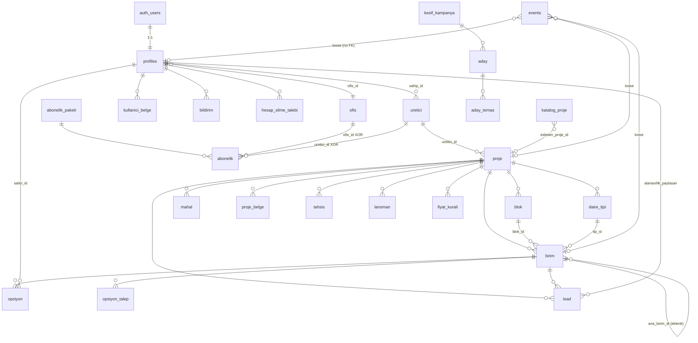
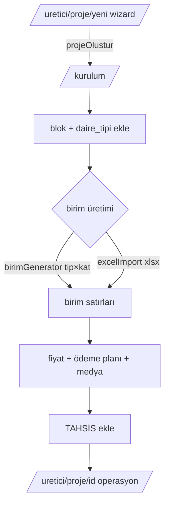
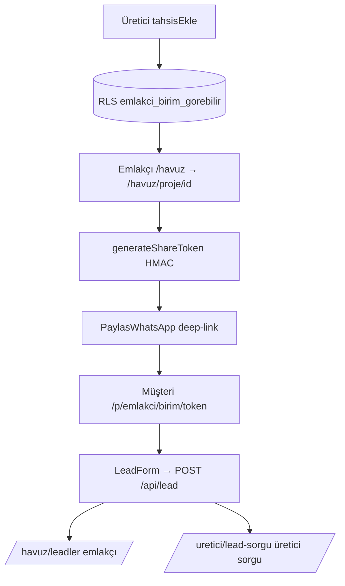
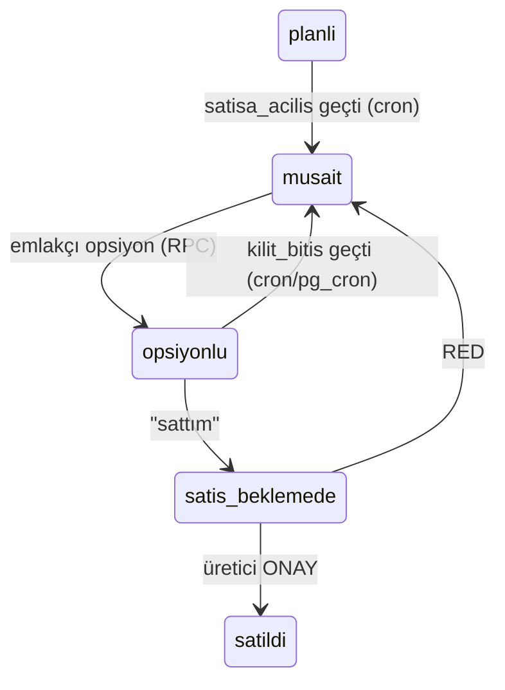
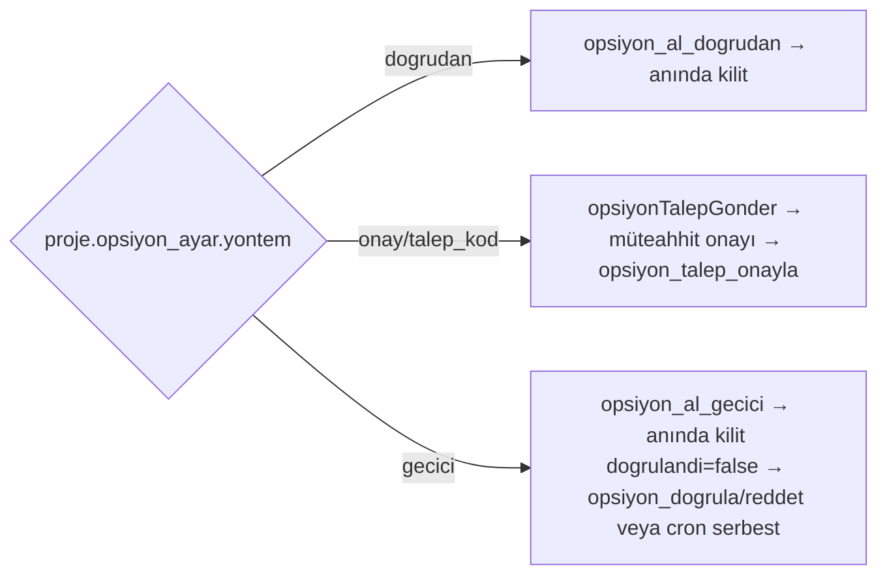
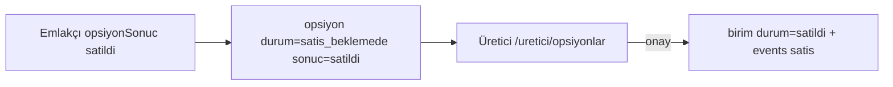

# PROJEDAR — MASTER PROJECT INTELLIGENCE (TEK DOSYA)

> Bu dosya, Projedar repository'sinin tam kimlik/ürün/teknik envanterini **tek dosyada** toplar.
> Kaynak: repo kod denetimi (2026-08-09, `main` branch) + bağlayıcı dokümanlar.
> Kanıt etiketleri: **KANITLI** (koddan doğrulandı) · **ÇIKARIM** (dolaylı sonuç) · **MOCK** (bilinçli demo veri) · **TODO** · **ESKİ/DRIFT** (doküman↔kod uyumsuzluğu).
> Gizli değerler (secret/anahtar/token/parola) hiçbir yerde yazılmadı; yalnız varlıkları ve amaçları belirtildi.
> İçindekiler: (0) Ne yaptım / nasıl yaptım · (00→11) 12 tematik bölüm · (Ek) PROJEDAR_AI_CONTEXT.

---

# 0. BU RAPORDA NE YAPTIM, NASIL YAPTIM (metodoloji + öne çıkan bulgular)

## 0.1 Yöntem

Görev: repository'nin **tamamını** okuyup, başka bir yapay zekaya verildiğinde onu neredeyse kod görmüş kadar bilgili yapacak bir master ürün-istihbarat dokümanı üretmek. Kod yazılmadı, hiçbir dosya değiştirilmedi (yalnız yeni analiz dokümanları oluşturuldu + changelog memory güncellendi).

Çalışma sırası:
1. **Doğrudan (ben):** repo ağacı + 582 tracked dosya haritası, `package.json`, `next.config.ts`, `vercel.json`, kök bağlayıcı dokümanlar (`ProjePazar-Sistem-Kurallari.md`, `Projedar-Urun-Referansi.md`, `ProjePazar-Sentez-Karar-Raporu.md`, `ProjePazar-Tasarim-Ruhu.md`, backlog), ve kritik kod dosyaları (`src/lib/roller.ts`, `src/lib/sharing.ts`, `src/lib/supabase/middleware.ts`, `src/proxy.ts`, `process.env.*` grep, SEO/PWA dosya varlığı).
2. **7 paralel explorer agent (kod-seviyesi deep-dive):** (a) üretici paneli, (b) havuz/emlakçı paneli + mikrosite, (c) admin paneli + keşif, (d) API/cron/auth/lib, (e) public/landing/SEO, (f) tasarım sistemi/component/PWA/marka, (g) DB/migration/RLS/seed.
3. **Çapraz doğrulama + sentez:** her iddia kanıt-etiketli, dosya-yolu referanslı. Doküman↔kod çelişkilerinde **kod-gerçeği** esas alındı.

Ölçek: ~305 src dosyası, ~96 route, 25 tablo, 14 enum, 27 DB migration.

## 0.2 En kritik bulgular (kod-gerçeği vs doküman drift'i — kod kazanır)

- **Tasarım sistemi doküman ile uyuşmuyor:** canlı `globals.css` = **"Spatial Açık"** (ink `#10243a`, paper `#eef1f6`, font **Outfit/Inter/Geist Mono**); marka dokümanları "Berrak Güven" der (`#0F2638`/`#F4F2EE`/Bricolage-Instrument). Sinyal trio kesin ve ortak: müsait `#2fb36b` / opsiyon `#e3a12c` / satıldı `#d15a4e`.
- **`supabase-schema.sql` (kök) bilinçli eski:** canlı gerçek = kök + `db/*.sql` (27 migration). Çelişkide `db/*` kazanır (ör. opsiyon INSERT artık admin-only, `emlakci_birim_gorebilir` 6-arg).
- **Env drift:** kod `NEXT_PUBLIC_SITE_URL` kullanır, doküman `NEXT_PUBLIC_APP_URL` der. WhatsApp/Anthropic runtime env'i **yok** (Faz-2 teyidi).
- **Middleware = `src/proxy.ts`** (Next 16 "proxy" convention; `middleware.ts` yok). `/api` proxy'den muaf → her route kendi auth'unu yapar.
- **25 tablo** (doküman "16/19+" der).
- **Harici analytics/ödeme/test altyapısı YOK:** GA4/GTM/PostHog/Meta Pixel/Stripe/iyzico/Jest/Playwright hiçbiri kodda değil. Analytics = birinci-parti `events` tablosu.
- **Çift-satış kalkanı DB'de kanıtlı:** `create unique index opsiyon_tek_aktif on opsiyon (birim_id) where durum in ('opsiyonlu','satis_beklemede')`.
- **Bir gerçek TODO/güvenlik:** `src/app/havuz/actions.ts:91-95` geçici debug, ham Postgres hata metnini kullanıcıya sızdırıyor (kaldırılmalı).
- **Keşif motoru KVKK riski:** iş-iletişim verisi rıza öncesi kazınıyor; opt-out reaktif; robots.txt kontrolü yok.
- **MOCK ayrımı:** ana sayfa "Canlı Portföy" kartları + hero sayaçları bilinçli demo ("örnek akış" etiketli); gerçek canlı veri yalnız panellerde ve mikrositede.
- **Hukuki sayfalar (gizlilik/kullanım/kvkk) TASLAK** — avukat incelemesi bekliyor; noindex ama sitemap'te listeli (zararsız tutarsızlık).

## 0.3 Bu dosyanın kaynağı olan 13 doküman

`docs/projedar-intelligence/` altında ayrı ayrı da mevcut: `00-MASTER-PROJEDAR-IDENTITY`, `01-PRODUCT-AND-BUSINESS`, `02-USERS-ROLES-PERMISSIONS`, `03-FEATURE-INVENTORY`, `04-DATA-MODEL`, `05-ROUTES-AND-PAGES`, `06-API-AND-INTEGRATIONS`, `07-SEO-GEO-PUBLIC-SURFACES`, `08-BRAND-COPY-DESIGN`, `09-INFRASTRUCTURE-SECURITY`, `10-TODO-ROADMAP-TECH-DEBT`, `11-CONTRADICTIONS-AND-OLD-CODE`, `PROJEDAR_AI_CONTEXT`. Aşağıda hepsi sırayla birleştirilmiştir.

---
---


<!-- ================= 00-MASTER-PROJEDAR-IDENTITY.md ================= -->

# 00 — MASTER PROJEDAR IDENTITY

> Kaynak: repo kod denetimi (2026-08-09, main) + bağlayıcı dokümanlar (`ProjePazar-Sistem-Kurallari.md`, `Projedar-Urun-Referansi.md`, `ProjePazar-Sentez-Karar-Raporu.md`, `ProjePazar-Tasarim-Ruhu.md`).
> Kanıt etiketleri: **KANITLI** (koddan doğrulandı) · **ÇIKARIM** (dolaylı sonuç) · **MOCK** (bilinçli demo veri) · **TODO** · **ESKİ/DRIFT** (doküman↔kod uyumsuzluğu).
> Gizli değerler (secret/anahtar) hiçbir yerde yazılmadı; yalnız varlıkları ve amaçları belirtildi.

---

## 1. EXECUTIVE SUMMARY

**Projedar nedir?** Çok-müteahhitli, üretici-kontrollü, **canlı bir konut stoğu dağıtım ağı**. Bir inşaat firması (müteahhit/"üretici") yeni konut projesinin stoğunu, fiyatını, satış durumunu ve dağıtımını tek merkezden yönetir; bağımsız gayrimenkul danışmanı ("emlakçı") yalnız kendisine **tahsis edilmiş** birimleri tek canlı havuzdan görür, tek tıkla WhatsApp'tan paylaşır ve gelen müşteri adaylarını (lead) toplar. Ortada **tek doğru kaynak** durur: bir fiyat/durum değişince yetkili tüm danışmanlara anında yansır. (KANITLI — `src/app/uretici/*`, `src/app/havuz/*`, `birim` tablosu.)

**Kime hizmet ediyor?** İki taraflı B2B: (a) yeni proje üreten kurumsal + geleneksel müteahhitler, (b) bağımsız emlak danışmanları / ofisleri / markaları. Alıcı (son kullanıcı) sisteme **giriş yapmaz**; yalnız danışmanın paylaştığı imzalı mikrosite linkini (`/p/[emlakci]/[birim]/[token]`) anonim görür ve lead formu doldurabilir. (KANITLI.)

**Çözdüğü temel problem:** "Bu daire hâlâ satılık mı, fiyatı ne?" sorusuna her an %100 doğru cevap. Bugünün gerçeği: stok Excel/PDF/WhatsApp gruplarında dağınık ve eski; aynı daire farklı kanalda farklı fiyat; çift satış felaketi; kim getirdi belirsizliği. Projedar bunu tek canlı kayıt + granüler tahsis + DB seviyesi çift-satış kilidi + görünür tazelik ile çözer.

**Merkezindeki mekanizma:** `tahsis` (allocation) → RLS ile görünürlük + `birim` (tek doğru fiyat/durum) + `opsiyon` (DB partial-unique-index çift-satış kilidi) + `events` (append-only iz zinciri / veri yerçekimi).

**Kategori — ne olduğu / olmadığı:**
- **Öyle:** B2B satış-dağıtım altyapısı / kapalı devre network / stok dağıtım sistemi + hafif SaaS.
- **Değil:** açık pazaryeri (Sahibinden/Topli değil), ilan portalı değil, tekil CRM (Novo/Yapısoft) değil, 3D/immersive stüdyo (Relata) değil, broker değil. "Saf satış altyapısı; komisyona dokunmaz, sözleşmeye taraf olmaz." (KANITLI — kod ve tüm landing copy'si bu çerçeveyi tutar.)

**Değer önerisi — müteahhit:** Stoğun tek canlı kayıtta; kime/neyi/hangi şartla satacağını sen belirlersin (granüler tahsis = kontrol kaybı korkusuna doğrudan cevap); çift satış yapısal olarak imkânsız (DB kilidi); "kim getirdi" iz zinciri; syndication (%zam saniyeler içinde tüm ağa); rakip müteahhit stoğunu/fiyatını göremez (satır-seviye RLS izolasyonu).

**Değer önerisi — danışman:** Tüm yetkili projeler tek ekranda, canlı fiyat/durum, tazelik damgası ("2 saat önce"); tamamen ücretsiz, "kazancın %100'ü senin, Projedar pay almaz"; imzalı mikrosite + müşteri kataloğu; lead senin.

**En önemli farklılaştırıcılar (moat = kombinasyon, tek özellik değil):** (1) çok-müteahhit tek canlı ortak havuz, (2) daire-seviyesi emlakçı-bazlı tahsis (RLS ile gizli görünürlük), (3) DB seviyesi ödemesiz çift-satış kalkanı (`opsiyon_tek_aktif` partial unique index), (4) komisyonsuz, (5) veri yerçekimi (`events` Faz-1'den birikir, geçmişe doldurulamaz), (6) WhatsApp/concierge ile dijitalleşmemiş küçük müteahhit erişimi, (7) Türkiye'ye özel (kat karşılığı arsa payı, koçan/KKTC, Türkçe-önce, EİDS kapalı-devre kalkanı).

**Bugün çalışan ürün (KANITLI — hepsi canlı, projedar.com):** 3 rol paneli (üretici kokpiti, emlakçı havuzu, admin), proje/blok/tip/birim kurulum sihirbazı + Excel import, granüler tahsis CRUD, opsiyon 3-yöntem (dogrudan/onay/geçici) + DB çift-satış kalkanı, planlı stok açılış (dalga), Supabase Realtime canlı fiyat listesi, imzalı paylaşım mikrositesi + müşteri kataloğu (print/PDF), KVKK-uyumlu lead akışı, tazelik sigortası cron'u, güven skoru RPC'leri, KYC belge doğrulama, admin gelir/hesap/denetim, BYOK pazarlama anahtar kasası, **Keşif** büyüme motoru (SerpAPI/Serper/Places ile aday keşfi + davet), SEO/GEO altyapısı (robots 31 AI crawler, sitemap, llms.txt, dinamik OG, `/proje/[slug]` + `/konut-projeleri` public SEO sayfaları), PWA (serwist).

**Planlanmış ama tamamlanmamış (Faz 2 — bilinçli sınır, TODO değil):** WhatsApp Cloud API ile giden mesaj (MVP = yalnız deep-link), serbest-metin AI parse ile stoğa yazma, dinamik fiyat otomasyonu (`fiyat_kurali` tablosu var, iş mantığı yok), Paylaşım Stüdyosu premium, arsa sahibi/marka konsolları (rol şemada var, ayrı panel yok), yurtdışı projeler (döviz/golden-visa/oturum kolonları şemada boş), hakediş defteri, müşteri-claim sertifikası, semantik/LLM eşleştirme.

**Kod-gerçeği vs pazarlama-iddiası ayrımı:** Landing iddialarının neredeyse tamamının backend karşılığı mevcut (§48 tablosu). Tek dikkat: ana sayfadaki "Canlı Portföy" kartları ve hero sayaçları **bilinçli demo veridir** (MOCK, "örnek akış" etiketli), DB-bağlı değildir; gerçek canlı veri yalnız panellerde ve mikrositede.

---

## 2. MASTER PRODUCT TRUTH (kanıtlı, 40 madde)

Aşağıdaki her madde koddan doğrulanmıştır ve başka bir yapay zekaya sistem bağlamı olarak verilebilir.

1. Ürün adı **Projedar**, domain **projedar.com**; eski ad **ProjePazar** (iç doküman dosya adlarında korunmuş). (KANITLI — `layout.tsx metadataBase`, `package.json name:"projedar"`.)
2. Stack: **Next.js 16.2.9 (App Router, TS strict) + React 19.2 + Tailwind v4 + Supabase (Postgres+Auth+Realtime+Storage+RLS) + Vercel + serwist PWA.** Build `next build --webpack`. (KANITLI — `package.json`, `next.config.ts`.)
3. Üç rol paneli ve **ayrı yüzeyler**: `uretici`→`/uretici`, `emlakci`→`/havuz`, `admin`→`/admin`. `ofis_yetkili/marka_yetkili/arsa_sahibi` şu an `/havuz`'a yönlenir (ayrı panel Faz-2). (KANITLI — `src/lib/roller.ts`.)
4. **admin = platform işletmecisi (BİZ), asla üretici değil.** Admin paneli stok/birim/fiyat düzenlemez; gelir/hesap/doğrulama/denetim yapar. (KANITLI — `src/app/admin/*`, footer copy.)
5. **DEĞİŞMEZ #1 — RLS önce:** görünürlük tamamen Postgres RLS'e devredilmiş; `tahsis` tablosu + SECURITY DEFINER fonksiyonlar (`emlakci_proje_tahsisli`, `emlakci_birim_gorebilir` 6-arg) belirler. Emlakçı `tahsis` satırını doğrudan okumaz. (KANITLI — `db/*.sql`.)
6. **Service-role (`SUPABASE_SERVICE_ROLE_KEY`) yalnız server/cron/route'ta**; `NEXT_PUBLIC` değil → client bundle'a girmez. Browser yalnız anon key. (KANITLI — `src/lib/supabase/{client,server,admin}.ts`.)
7. **DEĞİŞMEZ #2 — Tek doğru kaynak:** fiyat/durum yalnız `birim` tablosunda; paylaşımda/katalogda/mikrositede fiyat canlı değerden basılır, kopyalanmaz. WhatsApp metnine ve OG görseline fiyat **basılmaz** (donar/eskir diye). (KANITLI — `DaireModal.tsx`, `opengraph-image.tsx`.)
8. **DEĞİŞMEZ #3 — Çift-satış kalkanı DB'de:** `create unique index opsiyon_tek_aktif on opsiyon (birim_id) where durum in ('opsiyonlu','satis_beklemede')`. İkinci opsiyon INSERT'i 23505 unique_violation alır. Onay RPC'lerinde `FOR UPDATE`. (KANITLI — `supabase-schema.sql:188-190`, RPC'ler.)
9. Opsiyon INSERT'i emlakçıya **kapalı** (RLS `with check(is_admin())`); opsiyon yalnız SECURITY DEFINER RPC'lerle oluşturulur: `opsiyon_al_dogrudan`, `opsiyon_al_gecici`, `opsiyon_talep_onayla`. (KANITLI — `db/2026-06-29_opsiyon-talep-onay.sql`.)
10. Üç opsiyon yöntemi, proje bazında (`proje.opsiyon_ayar.yontem`): **dogrudan** (anında kilit), **onay/talep_kod** (müteahhit onayına düşer), **geçici** (anında kilitlenir ama `dogrulandi=false`, müşteri zorunlu + kota; müteahhit doğrular/reddeder, süre dolarsa cron serbest bırakır). (KANITLI.)
11. **DEĞİŞMEZ #4 — WhatsApp hibrit:** MVP yalnız giden **deep-link** (`wa.me/...`, emlakçı/admin kendi telefonundan). Cloud API ile giden mesaj ve serbest-metin AI parse = Faz 2. Kodda WHATSAPP/ANTHROPIC env'i yok. (KANITLI.)
12. **DEĞİŞMEZ #5 — Tazelik görünür:** `birim.son_guncelleme`; UI'da "X önce" + 4-kademe rozet; 15 günden eski → `stale=true` (günlük cron `freshnessCalistir`). (KANITLI — `cron/_lib/isler.ts`.)
13. **DEĞİŞMEZ #6 — Mobil-önce + PWA:** serwist SW (NetworkFirst navigations), `public/manifest.json` standalone, bottom-nav, ≥44px dokunma hedefleri. (KANITLI.)
14. Vercel cron: tek path `/api/cron`, günde bir **03:00 UTC**, region `syd1`; dispatcher sırası `opsiyon_suresi → stok_acilis → freshness → kesif_followup`. (KANITLI — `vercel.json`, `cron/route.ts`.)
15. Ayrıca **pg_cron** (DB içi) iki iş `*/15 * * * *`: `opsiyon-serbest-birak`, `opsiyon-hatirlat` (saat-granüllü opsiyon yaşam döngüsü). (KANITLI — `db/2026-08-05_opsiyon-yasam-dongusu.sql`.)
16. Veri modeli: **25 tablo, 14 enum, 2 storage bucket** (`proje-medya` public, `kyc-belge` private). (KANITLI.)
17. Çekirdek enum `birim_durum`: `musait, opsiyonlu, satis_beklemede, satildi, stop, planli, kiralandi`. (KANITLI.)
18. `birim_tur`: `daire, ofis, dukkan, villa, depo, otopark`; `islem_tipi`: `satilik, kiralik, satilik_kiralik, pay_satisi, satisa_kapali`; `tapu_durum`: `kat_irtifaki, kat_mulkiyeti, arsa_tapusu, kocan, yok`. (KANITLI.)
19. Üç net satış durumu birbirine karışmaz: **satılabilir** / **planlı** (`satisa_acilis` gelince cron açar) / **kalıcı satılamaz** (`sahiplik='arsa'` + `satilabilir=false`, arsa sahibi payı; havuzda görünür, satışa kapalı). (KANITLI.)
20. Eklenti birimler (otopark/depo) `birim.ana_birim_id` ile ana daireye bağlanır; KPI/tahsis hesaplarında `ana_birim_id IS NULL` filtresiyle hariç. (KANITLI.)
21. `tahsis` alanları: `kapsam jsonb {bloklar,katlar,tipler,turler,birimler}`, `hedef_tip (herkes|ofis|danisman)`, `hedef_id`, `hedef_filtre {marka,il,ilce,uzmanlik}` (canlı segment tahsisi), `komisyon_tip (yuzde|sabit|yok)`, `komisyon_deger`, `munhasir`, `kontenjan`, `fiyat_gorunur`, `bitis`. (KANITLI.)
22. Görünürlük denklemi: `demo` proje VEYA (KYC `belge_durumu='dogrulandi'` VE eşleşen aktif tahsis [herkes+segment-filtre | danisman=uid | ofis=current_ofis()] VE kapsam boyutları). (KANITLI — `emlakci_proje_tahsisli`.)
23. **Komisyon = yok (DEĞİŞMEZ).** Üretici tahsiste komisyon oranı/sabit tanımlayabilir (danışman kendi kazancını görür, başkasınınkini görmez — RLS); platform işlemden pay almaz. (KANITLI.)
24. Gelir modeli (fazlı): **ERKEN = müteahhit anlaşması (ana gelir, Admin'de manuel) + emlakçı bedava.** SONRA = emlakçı premium, ofis/franchise SaaS abonelik. `abonelik`/`abonelik_paketi` tabloları + admin CRUD var; MRR admin dashboard'da hesaplanır. (KANITLI.)
25. Paylaşım güvenliği: `generateShareToken` = HMAC-SHA256(`emlakci:birim`, `LEAD_SHARE_SECRET`) ilk 16 hex; **fallback yok** (env eksikse throw). Mikrosite token geçersizse `notFound()`. (KANITLI — `src/lib/sharing.ts`.)
26. Mikrosite (`/p/...`) verisi `createAdminClient` (RLS-bypass, server-only) ile çekilir; tek kapı HMAC token; görüntüleme anonim `events` sinyali (`after()`, PII/IP yok, KVKK-safe). (KANITLI.)
27. Lead: `/api/lead` public; HMAC token + Zod + `kvkk: z.literal(true)` (zorunlu ayrı açık rıza, boş checkbox) + telefon normalize + aynı telefon×birim 10 dk throttle (429). Lead `atanan_id=ilk_paylasan_id=emlakci`. (KANITLI.)
28. Lead görünürlüğü: RLS `lead_select` = admin VEYA atanan VEYA ilk_paylaşan; **müteahhit lead feed'i görmez** — yalnız `/uretici/lead-sorgu`'da ad/telefon birebir sorgu ile "ilk kaydeden danışman"ı görür (kim-getirdi görünürlüğü, sahiplik garantisi değil). (KANITLI — `db/2026-07-24_lead-select-rls.sql`.)
29. `events` append-only; INSERT RLS politikası yok → yalnız SECURITY DEFINER + service-role yazar. Ayrı `denetim` tablosu yoktur; iz zinciri = `events` + `opsiyon.karar_*` + `profiles.onaylayan_id`. (KANITLI.)
30. Güven skorları DB'de hesaplanır: RPC `emlakci_skor`, `muteahhit_skor` (+`*_tablo`); ağırlık yanıt 30 / SLA 25 / doğrulama 25 / tazelik 20; `<3 işlem → "Yeni"`. Düşük skorlu emlakçının geçici opsiyon kotası 1'e düşer. (KANITLI — `db/2026-08-05_guven-skoru.sql`.)
31. KYC: `kullanici_belge` (mesleki_yeterlilik/vergi_levhasi), `kyc-belge` private bucket (8MB, own-folder RLS), `ai_sonuc jsonb` (AI ön-tarama), `profiles.belge_durumu` (yok/beklemede/dogrulandi/red); trigger `belge_durumu_guard` non-admin'in kendini "dogrulandi" yapmasını engeller. (KANITLI.)
32. **Keşif motoru** (`src/lib/kesif` + `/api/admin/kesif`): admin BYOK anahtarlarıyla SerpAPI Maps + Serper web + Google Places'ten müteahhit/proje/ofis/emlakçı adayı keşfeder, siteden e-posta kazır, `aday` tablosuna dedup'lu yazar, Resend mail + WhatsApp deep-link ile davet eder; opt-out reaktif (`/api/kesif/cikis`). (KANITLI.)
33. Public SEO: `/proje/[slug]` (ISR 3600s) çift kaynak (kendi DB `public_slug` + kazınan `katalog_proje`); ince-içerik eşiği (`projeIcerikSkoru < 5 → notFound`); **canlı stok sayısı ve fiyat public'te GÖSTERİLMEZ** (rekabet bilgisi). `/konut-projeleri/[[...dilim]]` il/ilçe hub. (KANITLI.)
34. SEO altyapısı: `robots.ts` (31 AI crawler explicit allow; panel/mikrosite/mockup/sunum disallow), dinamik `sitemap.ts` (eşik-filtreli), `public/llms.txt`+`llms-full.txt`, dosya-tabanlı dinamik OG (`opengraph-image.tsx`), IndexNow (Bing/Yandex/Naver). (KANITLI.)
35. Tasarım sistemi **"Spatial Açık"** (kilit 2026-06-28); tokenlar `globals.css @theme`; sinyal trio kesin: müsait `#2fb36b` / opsiyon `#e3a12c` / satıldı `#d15a4e`. Kullanıcı-değiştirilebilir dark mode yok. Fontlar Outfit/Inter/Geist Mono. (KANITLI.)
36. Auth: Supabase e-posta/parola; `src/proxy.ts` (Next 16 middleware) oturumu tazeler, korumalı rotaları `/login`'e, pasif/onay-bekleyeni `/hesap-bekliyor`'a yönlendirir; `/api` proxy'den muaf (her route kendi auth'unu yapar). Kayıt → `handle_new_user` trigger → `durum='onay_bekliyor'` → admin onayı. (KANITLI.)
37. E-posta: Resend (transactional, best-effort; anahtar yoksa sessiz atlar) + markalı şablonlar (`mail-sablonlari/`, Supabase auth şablonları). SMS/push yok. (KANITLI.)
38. Bölge fiyat benchmark'ı: `src/data/bolge-benchmark.json` (kaynak emlakjet, ₺/m² giriş medyanı, 14 il / 47 ilçe); üretici stok kurulumunda rozet olarak; fiyatı asla override etmez (DEĞİŞMEZ #2). (KANITLI.)
39. `supabase-schema.sql` (kök) **bilinçli olarak eski**; canlı gerçek = kök şema + tüm `db/*.sql` migration'ları. Çelişkide `db/*.sql` kazanır. (KANITLI — dosya başı uyarısı + çapraz karşılaştırma.)
40. DB-kalkanı kültürü tutarlı: partial-unique/CHECK ile çift-satış (`opsiyon_tek_aktif`), bekleyen-talep tekilliği, tek-aktif-abonelik, tek-açık-silme-talebi, aday dedup, abonelik XOR — hiçbirinde uygulama katmanına güvenilmez. (KANITLI.)

---

## 3. PROJEDAR'IN GERÇEK ÜRÜN DURUMU (§48)

### A. Production-ready ve gerçekten çalışan
- Üretici paneli: kokpit, projeler, proje detay, kurulum sihirbazı (7 adım), stok tablosu + bina kesiti, tahsis CRUD, opsiyonlar onay/doğrulama kuyruğu, tahsis genel bakış, talep radarı, fiyat önerisi, raporlar, lead-sorgu, lansman, davet, bildirimler, ayarlar (firma profili). (KANITLI — tümü real Supabase, mock yok.)
- Emlakçı havuzu: havuz liste + filtre + harita (Leaflet), proje detay + Realtime canlı stok, opsiyonlarım, paylaştıklarım, leadler, eşleştir, lansman radarı, bildirimler, doğrulama (KYC), profil, müşteri kataloğu.
- Mikrosite `/p/[emlakci]/[birim]/[token]` (en zengin/olgun sayfa): canlı fiyat, galeri, ödeme slider, fiyat trendi, lead formu, anonim sinyaller, dinamik OG.
- Admin: dashboard/MRR, başvurular (onay+KYC birleşik), kullanıcılar, üreticiler, ofisler, üyelik paketleri, güven skorları, denetim, hesap-silme, kurucu liste, SEO yayın, pazarlama (BYOK), keşif.
- Opsiyon motoru (3 yöntem + DB kilidi), tazelik cron'u, planlı stok açılış, güven skoru RPC'leri, KYC akışı, SEO/GEO altyapısı, PWA.

### B. Çalışıyor fakat eksikleri/uyarıları var
- Ödeme planı özelliği `db/2026-06-28_odeme-plani.sql` migration'ı uygulanmadan graceful hata verir (migration-gated). (KANITLI.)
- `/hesap-bekliyor` sayfası eski stil token'ları kullanır (Berrak Güven/Spatial dışı). (KANITLI.)
- 3 hukuki sayfa (gizlilik/kullanım/kvkk) **TASLAK** — avukat incelemesi gerekiyor; ayrıca noindex olmalarına rağmen sitemap'te listeleniyorlar (zararsız tutarsızlık). (KANITLI.)
- `talep-radari` events sorgusu 20.000 satır limitli — hacimde SQL agregasyona taşınmalı (kod yorumu uyarıyor). (KANITLI.)

### C. UI mevcut fakat backend/mock durumda
- Ana sayfa "Canlı Portföy" 4 proje kartı + hero eritme sayaçları = **MOCK demo** ("örnek akış" etiketli, DB-bağlı değil). Diğer interaktif landing bileşenleri (CanliHavuzDemo, KilitKoreografi vb.) bilinçli simülasyon. (KANITLI.)
- `mockup-01..11` + `/tasarim/[yon]` = tasarım laboratuvarı sayfaları (noindex, ürün değil). (KANITLI.)

### D. Sadece plan / şema iskeleti / kullanılmayan
- `fiyat_kurali` tablosu (dinamik fiyat) — şema var, iş mantığı yok (Faz-2). (KANITLI.)
- `opsiyon_talep.kod/kod_son` kolonları — orijinal kod-mekanizması dormant (geçici/dogrudan/onay RPC'lerine geçildi). (ÇIKARIM.)
- `proje` yurtdışı kolonları (`oturum_uygun, golden_visa_esik, diller, para_birimi≠TRY`) — boş, Faz-2. (KANITLI.)
- `arsa_sahibi`/`marka_yetkili` rolleri — ayrı panel yok, `/havuz`'a düşer. (KANITLI.)

### İddia vs kod-gerçeği (seçme)
| Landing / doküman iddiası | Kodun gösterdiği gerçek |
|---|---|
| "Çift satış yapısal olarak imkânsız" | KANITLI — `opsiyon_tek_aktif` partial unique index + RPC FOR UPDATE. |
| "Komisyon yok / kazancın %100'ü senin" | KANITLI — platform pay almaz; `komisyon_tip='yok'` seçeneği; abonelik geliri. |
| "Rakip müteahhit fiyatımı göremez" | KANITLI — satır-seviye RLS + `uretici_id` izolasyonu. |
| "Canlı / anında güncellenir" | KANITLI panelde (Supabase Realtime `birim`); landing "Canlı Portföy" ise MOCK. |
| "Fiyat her yerde güncel" | KANITLI — paylaşımda/katalogda canlı basılır; WhatsApp metni/OG'ye bilinçli basılmaz. |
| "Doğrulanmış üretici/proje" | KANITLI — `uretici.dogrulanmis` + `proje.belge_dogrulandi` + KYC. |
| "Yurtdışı projeler" | Faz-2 — kolonlar boş, UI Faz-1 yurtiçi. |

---

## 4. EN GÜÇLÜ 10 ÜRÜN ÖZELLİĞİ (§49 — ürün gerçeği, pazarlama değil)

1. **DB seviyesi çift-satış kalkanı** (`opsiyon_tek_aktif` partial unique index + RPC `FOR UPDATE`) — ödemeye bağlı değil, uygulama katmanına güvenmez.
2. **Granüler tahsis + RLS gizli görünürlük** — daire/blok/kat/tip/tür/segment/ofis/danışman seviyesinde; emlakçı yalnız kendine açılanı görür, `tahsis` satırını bile okuyamaz.
3. **Tek doğru kaynak + canlı fiyat basımı** — fiyat yalnız `birim`'de; paylaşım/katalog/mikrosite anlık değerden basar, kopya yok.
4. **Supabase Realtime canlı stok** — emlakçı proje detayında birim değişiklikleri saniyeler içinde yansır.
5. **İmzalı paylaşım mikrositesi** (`/p/...`) — HMAC token, RLS-bypass sadece bu kapıda, anonim KVKK-safe görüntüleme sinyali, dinamik OG (fiyat basmadan).
6. **Opsiyon 3-yöntem motoru** (dogrudan/onay/geçici 2-fazlı) — müteahhit kontrollü, boş-opsiyon kalkanı (müşteri zorunlu + kota + düşük-skor kısıtı).
7. **Tazelik sigortası** — `son_guncelleme` + 4-kademe rozet + 15 günlük stale cron; "eski fiyatla rezil olma" değerini görünür kılar.
8. **Veri yerçekimi (`events`)** — append-only iz zinciri; talep radarı + güven skoru + fiyat geçmişi hep buradan; geçmişe doldurulamaz = moat.
9. **Keşif büyüme motoru** — SerpAPI/Serper/Places + site e-posta kazıma → `aday` funnel → davet/takip cron; cold-start silahı.
10. **Güven skoru sistemi** (DB RPC) — çift taraflı itibar; düşük-skor emlakçıya geçici opsiyon kotası kısıtı; admin komuta tabloları.

---

## 5. EN ÖNEMLİ 10 EKSİK (§50 — koddan görünür boşluklar)

1. **WhatsApp yalnız deep-link** — giden Cloud API otomasyonu ve serbest-metin parse yok (Faz-2 bilinçli sınır, ama "canlı senkron" vaadinin otomasyon ayağı eksik).
2. **Hakediş/komisyon defteri yok** — komisyon oranı gösterilir ama kazanılan-vs-ödenen takibi yok (retention kancası boşluğu).
3. **Zaman-damgalı müşteri-claim sertifikası yok** — lead timestamp var, ihraç edilen hukuki ispat aracı yok.
4. **Semantik/LLM eşleştirme yok** — `/havuz/eslestir` kural-tabanlı fit-skor; NLP/embedding Faz-2.
5. **Dinamik fiyat otomasyonu yok** — `fiyat_kurali` tablosu boş iskelet; sadece "öneri" (`/uretici/fiyat-onerisi`).
6. **Dağıtık rate-limit yok** — yalnız `/api/lead` 10-dk throttle (uygulama-katmanı, yarış penceresi); `/api/etkilesim` throttle'sız (token replay ile sinyal spam'i mümkün).
7. **RLS'e tam bağımlılık** — bazı panel sorguları client-side `profile_id`/`satici_id` filtresi içermez; RLS regresyonu doğrudan veri sızıntısı olur (tek savunma hattı).
8. **Geçici debug info-leak** — `havuz/actions.ts:91-95` ham Postgres hata metnini UI'a döndürüyor (kaldırılmalı "TANI (geçici)"). (TODO benzeri.)
9. **Hukuki sayfalar taslak** — gizlilik/kullanım/kvkk avukat incelemesinden geçmemiş; public `/hesap-silme` sayfası yok (app-store/portal beklentisi olursa boşluk).
10. **Cold-start / likidite** — ürün değil ama en büyük risk: iki taraflı pazar, müteahhit yoksa emlakçı gelmez (Keşif motoru + Kurucu Müteahhit stratejisi bunun azaltıcısı).

---

## 6. MASTER TANIMLAR (§55)

**25 kelime:** Projedar, müteahhitin yeni konut stoğunu tek canlı kaynaktan yönettiği, her emlakçının yalnız kendine tahsisli daireyi gördüğü, komisyonsuz, kapalı devre B2B satış dağıtım ağıdır.

**100 kelime:** Projedar, çok-müteahhitli ve üretici-kontrollü bir canlı konut stoğu dağıtım ağıdır. İnşaat firması projesinin stoğunu, fiyatını ve satış durumunu tek merkezden yönetir; bağımsız emlak danışmanı yalnız kendisine tahsis edilmiş birimleri tek canlı havuzdan görür, imzalı linkle WhatsApp'tan birebir paylaşır ve müşteri adayını toplar. Fiyat/durum tek doğru kaynakta (`birim`) tutulur, değişince tüm yetkili ağa anında yansır. Çift satış veritabanı seviyesinde imkânsızdır. Platform komisyona dokunmaz, sözleşmeye taraf olmaz; gelir müteahhit anlaşması ve (sonraki fazda) abonelikten gelir. Portal veya CRM değil; sektörün güven protokolü ve satış omurgasıdır.

**300-500 kelime:** Projedar, Türkiye'nin yeni konut projeleri için tasarlanmış, çok-müteahhitli ve üretici-kontrollü bir **canlı konut stoğu dağıtım ağıdır**. Ürünün çözdüğü problem nettir: bugün proje stoğu Excel, PDF, WhatsApp grupları ve telefon arasında dağınık ve eskidir; aynı daire farklı kanalda farklı fiyatla dolaşır; iki danışman aynı daireyi satabilir; kimin hangi müşteriyi getirdiği belirsizdir. Projedar bunu tek bir mimariyle çözer.

Sistemin çekirdeğinde **tek doğru kaynak** durur: her bağımsız bölümün fiyatı ve durumu yalnız `birim` tablosunda tutulur. Müteahhit ("üretici") projesini, bloklarını, daire tiplerini ve birimlerini bir kurulum sihirbazıyla (veya Excel import ya da concierge ile) tanımlar; fiyat, ödeme planı, şerefiye ve medyayı ekler. Ardından **granüler tahsis** yapar: hangi daireleri/blokları/katları/tipleri hangi ofise, danışmana veya segmente açacağını, komisyon görünürlüğünü ve münhasırlığı tek tek belirler. Görünürlük tamamen Postgres RLS'e devredilmiştir; emlakçı yalnız kendine tahsisli ve satılabilir birimleri görür, `tahsis` satırını bile okuyamaz. Rakip müteahhit, başka firmanın stoğunu/fiyatını göremez (satır-seviye izolasyon).

Emlakçı, tüm yetkili projelerini tek canlı havuzdan görür (filtre, harita, tazelik rozeti), bir birimi imzalı bir mikrosite linkiyle (`/p/[emlakci]/[birim]/[token]`, HMAC ile korunur) müşterisine WhatsApp'tan **birebir** paylaşır. Müşteri anonim mikrositede canlı fiyatı görür, KVKK açık rızasıyla lead bırakır; lead doğrudan paylaşan danışmana düşer. Çift satış **veritabanı seviyesinde** engellenir: bir birimde aynı anda tek aktif opsiyon olabilir (partial unique index). Opsiyon üç yöntemle alınır (anında/onaylı/geçici-doğrulamalı), hepsi müteahhit kontrolündedir.

Her paylaşım, görüntüleme, lead ve satış append-only `events` tablosuna yazılır; bu "veri yerçekimi" talep radarını, güven skorlarını ve fiyat geçmişini besler ve geçmişe doldurulamaz — asıl moat budur. Platform **komisyona dokunmaz**; gelir erken aşamada müteahhit anlaşması, sonraki aşamada emlakçı premium + ofis/franchise SaaS aboneliğidir.

Teknik olarak Next.js 16 (App Router) + Supabase (Postgres + Auth + Realtime + Storage + RLS) + Vercel + PWA üzerine kuruludur. Admin paneli platform işletmecisine aittir (asla üretici değildir): gelir, hesap tanımlama, doğrulama/güven rozeti, denetim ve büyüme motorunu (Keşif) yönetir. Projedar bir ilan portalı, açık pazaryeri veya CRM değildir; **gayrimenkulün güven protokolü ve satışın omurgasıdır.**

---

## 7. TEK CÜMLELİK POSITIONING — 5 ALTERNATİF (§56)

1. "Türkiye'nin yeni konut satış dağıtım altyapısı: müteahhit stoğunu tek merkezden yönetir, her emlakçı yalnız kendine tahsisli daireyi canlı görür, komisyonsuz." (doküman onaylı ana cümle)
2. "Yeni konut projeleri için tahsisli canlı satış ağı — portal değil, satışın omurgası."
3. "Çift satışın veritabanı seviyesinde imkânsız olduğu, komisyonsuz, üretici-kontrollü konut stoğu ağı."
4. "Bir daire değişir, bütün yetkili ağ anında güncellenir: gayrimenkulün güven protokolü."
5. "Müteahhit kontrolü + bağımsız emlakçı ağı + canlı tek doğru stok, tek kapalı devrede."

---

## 8. PROJEDAR'I REKABETÇİYE ANLATIR GİBİ (§51 — tarafsız)

Projedar, off-plan (proje/inşaat halindeki) konut satışı için bir **çok-taraflı dağıtım ağı + hafif transaction-governance katmanıdır**. Mimari olarak en yakın benzeri Dubai/MENA'daki off-plan "Sales OS" ürünleridir (DomusHub, Alnair, Nogbase), fakat üç yapısal fark taşır: (1) tek geliştiriciye kilitli SaaS değil, **çok-müteahhitli tek ortak canlı havuz**; (2) görünürlük **daire seviyesinde emlakçı-bazlı tahsis** ile RLS'te kesilir (proje-seviyesi değil); (3) çift-satış kilidi **ödemeye bağlı değil, DB partial-unique-index** ile sağlanır ve platform **komisyona hiç dokunmaz**.

Teknik olgunluk yüksek: 25 tablolu, RLS-önce, SECURITY DEFINER fonksiyonlarıyla görünürlük yöneten bir Postgres şeması; Supabase Realtime; append-only event log'dan türeyen talep/güven/fiyat analitiği; imzalı anonim paylaşım mikrositesi; günlük Vercel cron + saatlik pg_cron. Ürün canlı (projedar.com) ve üç rolün paneli de gerçek veriyle çalışıyor.

Zayıflıklar: iki taraflı pazarın cold-start'ı; WhatsApp otomasyonunun henüz deep-link seviyesinde olması; hakediş/sertifika gibi retention özelliklerinin Faz-2'de olması; dağıtık rate-limit ve bazı güvenlik cilalarının eksikliği; tek savunma hattının RLS olması. Yerel hendek güçlü: EİDS kapalı-devre kalkanı, KVKK-uyumlu lead akışı, kat karşılığı/koçan gibi Türkiye'ye özel modeller, Türkçe-önce.

---

## 9. YATIRIMCIYA ANLATIR GİBİ (§52)

- **Problem:** 2,7 trilyon TL/yıl ilk-el konut cirosu (2025), 88.572 yetki belgeli emlak işletmesi, ~25-40K kurumsal müteahhit; stok dağıtımı Excel/WhatsApp'ta dağınık, çift satış ve eski-fiyat kaynaklı iptal yaygın.
- **Çözüm:** tek doğru canlı stok + granüler tahsis + DB çift-satış kalkanı + görünür tazelik; komisyonsuz.
- **Kullanıcılar:** müteahhit (arz), bağımsız emlakçı/ofis/marka (dağıtım); alıcı dolaylı (mikrosite).
- **İş modeli:** erken = müteahhit anlaşması + emlakçı bedava; sonra = emlakçı premium + ofis/franchise SaaS abonelik (MRR altyapısı hazır). Komisyon yok (bilinçli).
- **Moat:** kombinasyon (çok-müteahhit + daire-seviye tahsis + DB kilit + komisyonsuz) + **veri yerçekimi** (events geçmişe doldurulamaz) + yerel regülasyon uyumu (EİDS/KVKK) + ağ etkisi.
- **Dağıtım avantajı:** WhatsApp/concierge ile dijitalleşmemiş müteahhide erişim + Keşif motoruyla otomatik aday keşfi.
- **Ölçeklenebilirlik:** multi-tenant baştan (`uretici_id` izolasyonu), serverless + RLS; Realtime "nice-to-have" (gayrimenkul temposu saat/gün). Ölçek uyarısı: bazı analitik sorguları agregasyona taşınmalı; Sydney→Frankfurt region migration TR latency için planlı.
- **Vizyon:** canlı stok ağı → proje veri altyapısı → fiyat/talep endeksi → yatırım platformu (finansal katman).
- **Olgunluk:** MVP çekirdeği canlı ve gerçek-veri; öz-değerlendirme (dokümandan): problem 9/10, çözüm 8/10, pazar 9/10, execution zorluğu 9/10, başarı ~6.5/10 — "execution belirler."

---

## 10. MÜTEAHHİDE / EMLAK DANIŞMANINA ANLATIR GİBİ (§53-54)

**Müteahhide:** Stoğunu bir kez gir, 40 danışmana tek tek WhatsApp'la fiyat güncelleme derdi bitsin. Kime hangi daireyi hangi şartla açacağına sen karar ver (granüler tahsis) — kontrolü bırakmadan her yere ulaş. İki danışman aynı daireyi satamaz (DB kilidi). Kim getirdi objektif iz zincirinde. Rakip firma stoğunu/fiyatını göremez. Doğrulanmış üretici rozetiyle sahte-ilan riskinden ayrış. Küçük müteahhitsen concierge kurar, WhatsApp'tan yönetirsin.

**Emlak danışmanına:** Tüm yetkili projelerin tek canlı ekranda; "son güncelleme 2 saat önce" — masada fiyat tutar, satış iptal olmaz. Tamamen ücretsiz, kazancının %100'ü sende (Projedar pay almaz). İmzalı linkle müşterine birebir paylaş; müşteri linkten lead bırakınca doğrudan sana düşer ("ilk bayrağı ben diktim"). Doğru daireyi bul (eşleştir), 48 saat opsiyonla kilitle, müşteri kataloğu üret. Saha için PWA: mobil-önce, kurulabilir.

---

*Devamı: `01`…`11` + `PROJEDAR_AI_CONTEXT.md`. Bağlayıcı kaynak: `ProjePazar-Sistem-Kurallari.md`. Bu doküman salt-okunur analizle üretildi; kod değiştirilmedi.*


---


<!-- ================= 01-PRODUCT-AND-BUSINESS.md ================= -->

# 01 — PRODUCT & BUSINESS

Etiketler: KANITLI / ÇIKARIM / MOCK / TODO / ESKİ.

---

## 1. Ürün özü

Çok-müteahhitli, üretici-kontrollü, **canlı konut stoğu dağıtım ağı**. Kategori cümlesi (kalıcı): "Yeni konut projeleri için tahsisli canlı satış ağı." Emlak yazılımı değil; sektörün güven protokolü.

- **Çekirdek değer:** "Bu daire hâlâ satılık mı, fiyatı ne?" → her an %100 doğru cevap.
- **Ne DEĞİL:** tekil CRM · açık pazaryeri · ilan portalı · 3D stüdyo · broker. Saf satış altyapısı, komisyona dokunmaz, sözleşmeye taraf olmaz.
- **Moat:** kombinasyon = çok-müteahhit ağ + granüler tahsis + DB çift-satış kalkanı + komisyonsuz + veri yerçekimi (events) + WhatsApp/concierge + Türkiye'ye özel.

## 2. İş modeli (fazlı; KANITLI kod + doküman)

**İlke:** komisyona dokunmadan yazılım/erişim/veriden gelir. **KOMİSYON YOK = DEĞİŞMEZ.**

**ERKEN AŞAMA (MVP / şu an):**
- **Ana gelir = MÜTEAHHİT ANLAŞMASI** — birebir B2B deal, Admin panelinde manuel yönetilir (sabit SaaS paketi şart değil). (KANITLI — `/admin/ureticiler` "abonelik ata (ana gelir)".)
- **Emlakçı = BEDAVA (basic)** — benimseme kaldıracı. "Kazancın %100'ü senin."

**SONRAKİ AŞAMA (değer kanıtlanınca):**
- Emlakçı premium (Paylaşım Stüdyosu / içerik / katalog-rapor export).
- Ofis / franchise abonelik (SaaS) — bütçe sahibi + ekip + havuz.
- İşlem ücreti — satış başı küçük opsiyonel pay (yalnız iz zinciri olgunlaşınca; komisyon değil).

**Kodda mevcut altyapı:** `abonelik_paketi` (hedef ofis/uretici/emlakci, `fiyat_aylik`, `kota_proje/koltuk/ai`, `gelismis_rapor`) + `abonelik` (ofis XOR uretici, tek-aktif partial unique index) + admin CRUD (`/admin/uyelik` `PaketYonetimi`) + MRR hesabı (admin dashboard, aktif/deneme abonelik `fiyat_aylik` toplamı). "Sabit/varsayılan fiyat yok — %100 admin-kontrollü." (KANITLI.)

**Çelişen/eski fiyat metinleri:** Sentez raporunda öneri fiyat bandları (emlakçı Pro 750/ay; müteahhit yıllık 150-600K; enterprise 650K+; küçük proje 40-85K yumuşak giriş; Nogbase ~685K/yıl, Novo 2-5K TL/user-ay çapaları) — bunlar **karar/öneri**, kodda paket olarak seed edilmemiş (admin elle tanımlar). (KANITLI — `scripts/` seed'lerinde hardcoded paket YOK.)

## 3. Müteahhit (üretici) tarafı — nasıl çalışır (KANITLI)

- **Kayıt:** self-registration (`/kayit?rol=uretici`) veya admin hesap açar (`/admin/ureticiler` → `ureticiEkle`, sahip owner + `uretici` firma) veya davet/keşif ile.
- **Ücret:** müteahhit anlaşması (manuel); erken aşamada kurucu müteahhit ücretsiz olabilir (karar).
- **Proje ekleme:** `/uretici/proje/yeni` 7-adım sihirbaz veya `/kurulum`: künye/imar → blok/tip → birim üretimi (`birimGenerator` tip×kat, cap 500) veya Excel import → fiyat/ödeme planı → medya → tahsis → yayınla.
- **Stok/fiyat:** birim tek doğru kaynak; toplu güncelle/sil, durum yönetimi, bina kesiti.
- **Tahsis (yetki verme):** `/uretici/proje/[id]` veya sihirbaz adım 6 → `tahsisEkle` (mod: tüm ağ / segment / ofis / danışman; kapsam blok/kat/tip/tür/birim; komisyon/münhasır/kontenjan/fiyat görünürlüğü). Geri çekme = tahsis silme.
- **Emlakçı-bazlı farklı stok:** evet — her tahsis farklı hedef+kapsam; segment tahsisinde sonradan eşleşen danışman da görür (canlı).
- **Satış bildirimi:** emlakçı "sattım" → `satis_beklemede` → müteahhit `/uretici/opsiyonlar`'da onaylar → `satildi`.
- **Komisyon/hakediş takibi:** komisyon **oranı/sabit** tanımlanır ve gösterilir; **kazanılan-vs-ödenen defteri YOK** (Faz-2). Platform işlemden **komisyon almaz**.
- **Abonelik altyapısı:** var (yukarıda); erken aşamada müteahhit anlaşması Admin'de manuel.
- **Concierge:** Ü2 (geleneksel) müteahhit için admin stok girer.

## 4. Emlak danışmanı / ofis tarafı (KANITLI)

- **Ücretsiz hesap:** evet (basic bedava). Premium/pro ayrımı gelir modelinde var, kodda emlakçı için paket zorunlu değil.
- **Hangi projeleri görür:** yalnız kendine **tahsisli** + KYC doğrulanmışsa; doğrulanmamış yalnız `demo` proje.
- **Stok/fiyat:** `/havuz` liste + `/havuz/proje/[id]` Realtime canlı fiyat listesi.
- **Fiyat güncellemesi:** Supabase Realtime + canlı basım (kopya yok).
- **Paylaşım:** WhatsApp deep-link (proje-genel kart metni + birim imzalı mikrosite linki). Fiyat metne/OG'ye basılmaz; canlı mikrositede.
- **Müşteri linki:** `/p/[emlakci]/[birim]/[token]` (HMAC).
- **PDF/sunum:** müşteri kataloğu (`/havuz/proje/[id]/katalog`, print/PDF, ayrı motor yok).
- **Rezervasyon/opsiyon:** `DaireModal` → dogrudan/geçici/talep; 48s kilit; `/havuz/opsiyonlarim`.
- **Lead:** mikrositeden gelen lead `/havuz/leadler`'e düşer; durum ilerletme, ara/WhatsApp, Excel export.
- **Favori/listeler:** mikrositede localStorage favori (anonim müşteri tarafı); danışman tarafında paylaştıklarım + eşleştir listesi.

## 5. Projedar gelir modeli — hangileri gerçekten mevcut

| Model | Durum |
|---|---|
| Müteahhit anlaşması (manuel B2B) | KANITLI — ana gelir, admin |
| Ofis/uretici abonelik (SaaS) | KANITLI altyapı — `abonelik`/`abonelik_paketi` + admin CRUD + MRR |
| Emlakçı premium | Planlı (gelir modeli), kodda zorunlu değil |
| Komisyon / işlem ücreti / lead fee | YOK (bilinçli — DEĞİŞMEZ komisyonsuz); işlem ücreti yalnız Faz-2 opsiyonel |
| Boost/vitrin/ilan geliri | ALINMAYACAK (konum bozar) |

## 6. Canlı stok mantığı (§6 detay — KANITLI)

- **Stok entity = `birim`** (bağımsız bölüm). Hiyerarşi: `proje → blok → daire_tipi` (şablon) → `birim` (blok_id, tip_id, kat, daire_no). Eklenti: `birim.ana_birim_id` (otopark/depo → ana daire).
- **Durum (`birim_durum` enum):** `musait, opsiyonlu, satis_beklemede, satildi, stop, planli, kiralandi`.
- **Fiyat:** `birim.liste_fiyati` (tek yer). `kira_bedeli`, `para_birimi` (MVP TRY), `usd_endeksli` (Faz-2 alan). Şerefiye `serefiye jsonb` (taban + kat/manzara %). Ödeme planı `odeme_plani jsonb` (peşinat/taksit/ara ödeme/vade farkı).
- **Fiyat geçmişi:** VAR — trigger `birim_fiyat_log` `liste_fiyati` değişince `events tip='fiyat'` (eski/yeni/pct); mikrosite `FiyatTrend` sparkline.
- **Alanlar:** net/brüt m², yön, manzara, oda tipi (daire_tipi), kat, tapu_durumu, teslim (proje seviyesi), kampanya (lansman), ödeme planı.
- **Güncelleme:** manuel (panel) + Excel/CSV import (`xlsx`, esnek TR/EN başlık, dry-run önizleme, mükerrer skip). API/webhook/entegrasyon YOK (MVP; Faz-2 WhatsApp).
- **"Canlı" ne kadar gerçek-zamanlı:** Supabase Realtime `birim` publication → emlakçı proje detayında saniyeler içinde. Cron saat/gün granülü (tazelik, açılış, opsiyon süresi). "Gerçek-zaman nice-to-have; gayrimenkul temposu saat/gün, DB kilidi + cron yeterli."

## 7. Tahsis ve yetki mekanizması (§7 — çekirdek, KANITLI)

**Nasıl açılır:** üretici `tahsisEkle` ile. Boyutlar:
- **hedef_tip:** `herkes` (tüm ağ; `hedef_filtre` ile segment: marka/il/ilçe/uzmanlık) · `ofis` (hedef_id=ofis) · `danisman` (hedef_id=profiles.id).
- **kapsam jsonb:** `bloklar[], katlar[], tipler[], turler[], birimler[]` (boş boyut = sınırsız; `birimler` = daire-seviyesi tahsis).
- **şartlar:** `komisyon_tip (yuzde/sabit/yok)` + `komisyon_deger`, `munhasir`, `kontenjan`, `fiyat_gorunur`, `bitis`.
- **Süreli:** `baslangic` + `bitis` (null = süresiz).

**Görünürlük zinciri (adım adım):**
```
Üretici → tahsisEkle → tahsis satırı
   ↓ (emlakçı tahsis satırını OKUMAZ)
RLS: proje/blok/daire_tipi/birim/mahal/proje_belge/lansman SELECT
   → SECURITY DEFINER emlakci_proje_tahsisli / emlakci_birim_gorebilir(6-arg)
   → demo VEYA (KYC dogrulandi AND eşleşen aktif tahsis AND kapsam boyutları)
Emlakçı → /havuz (yalnız tahsisli) → /havuz/proje/[id] → generateShareToken
   ↓ PaylasWhatsApp (deep-link, imzalı mikrosite linki)
Müşteri → /p/{emlakci}/{birim}/{token} → LeadForm → /api/lead
   ↓
Emlakçı → /havuz/leadler   +   Üretici → /uretici/lead-sorgu (yalnız sorgu)
```

**Diyagram:** Müteahhit → Proje → Stok(birim) → Tahsis → (Ofis/Segment/)Danışman → Müşteri(mikrosite) → Lead/Opsiyon → Satış onayı.

Kod bu yapıyı **tam destekliyor** (KANITLI). Not: emlakçı-bazlı komisyon görünürlüğü RLS ile izole (kendi kazancını görür).

## 8. Müşteri çakışması ve güven mekanizması (§8 — KANITLI)

- **Müşteri kaydı:** lead olarak; `telefon_norm` (normalize) + `birim_id`.
- **Duplicate/throttle:** aynı `telefon_norm + birim_id` son 10 dk → 429 (mükerrer koruma). Bu **çakışma çözümü değil**; lead her zaman link sahibi emlakçıya atanır.
- **TC kimlik:** lead'de yok; KYC'de TCKN (profil_detay, maskeli `maskeTckn`).
- **Aynı müşteri farklı emlakçı / sahiplik:** platform **sahiplik garanti etmez**. Model: "kim-getirdi GÖRÜNÜRLÜĞÜ" — danışman lead kaydeder; müteahhit `/uretici/lead-sorgu`'da ad/telefon birebir sorgulayınca "ilk kaydeden danışman"ı görür. Toplu listeleme yok; müteahhit lead feed'i görmez.
- **Koruma süresi (protection period):** açık bir süre-tabanlı lock YOK; "ilk bayrağı ben diktim" = `ilk_paylasan_id` kaydı (ilk paylaşan/kaydeden). Uyuşmazlık çözümü taraflar arası (platform arbitraj yapmaz).
- **Audit:** `events` (lead/paylaşım/görüntüleme) + `lead.created_at` + `ilk_paylasan_id`. Zaman-damgalı ihraç sertifikası YOK (Faz-2).

## 9. Regülasyon ve hukuki konumlanma (§27 — KANITLI landing/copy)

- **EİDS:** 1 Şubat 2026'dan beri satılık ilanlarda zorunlu; sosyal medyada yalnız EİDS linki (ceza 286.206 TL/paylaşım). Projedar konumu: **"İlan değil, tahsis"** — kapalı devre, açık ilan yok, birebir/WhatsApp paylaşım; kat irtifakı olmayan off-plan muaf. Landing'de EİDS şeritleri (`/muteahhit`, `/emlakci`, `/guven`). Bu bir **pazarlama+konumlanma iddiası**; teknik olarak kapalı-devre (panel/mikrosite noindex, robots disallow) ile desteklenir. Gri alan: `public_slug` mikrosite/`/proje` sayfalarının "ilan mahiyeti" sınırı (hukuk kontrolü gerektiği dokümanda not).
- **KVKK:** açık rıza (lead formunda ayrı boş checkbox, `kvkk: z.literal(true)`, İlke Kararı 2026/347 referansı), aydınlatma ≠ rıza ayrımı, veri minimizasyonu (anonim sinyaller, IP/PII yok), veri sorumlusu=danışman / veri işleyen=Projedar çerçevesi. `hesap_silme_talebi` (KVKK md.7/11). Çizgi: "piyasa/üretici zekâsı evet, müşteri profili hayır."
- **Taşınmaz Ticareti / yetki belgesi:** KYC (mesleki yeterlilik + taşınmaz ticareti yetki belgesi + vergi levhası). Dijital aracılık sözleşmesi şablonu (Taşınmaz Tic. Yön. m.20) YOK (Faz-2 backlog).
- **Hukuki sayfalar:** `/gizlilik`, `/kullanim-kosullari`, `/kvkk-aydinlatma` — **TASLAK**, noindex, avukat incelemesi gerekli. (KANITLI dosya-başı uyarı.)
- **"Kapalı sistem / özel ağ / tahsis / ilan değil" iddiaları:** landing pazarlama dili + teknik gerçek karışımı — kapalı-devre teknik olarak var (robots/noindex/RLS); "ilan değil" hukuki nitelemesi iddia (avukat onayı bekliyor).

## 10. Güven ve doğrulama (§28 — KANITLI)

- **Üretici doğrulama:** `uretici.dogrulanmis` (admin `ureticiDogrula`) → "Doğrulanmış Üretici" rozeti; vergi_no.
- **Proje doğrulama:** `proje.belge_dogrulandi` + `proje_belge` (ruhsat/iskan/yapı denetim).
- **Emlakçı KYC:** `kullanici_belge` (mesleki_yeterlilik/vergi_levhasi) → `kyc-belge` private bucket → admin `/admin/basvurular` (imzalı URL 1sa) → `belge_durumu=dogrulandi/red`. `ai_sonuc` AI ön-tarama (veri başka yerden gelir; admin okur). e-Devlet manuel doğrulama linki.
- **E-posta doğrulama:** Supabase (`email_confirm`), auth callback PKCE.
- **Telefon doğrulama:** OTP YOK; telefon normalize var (lead eşleştirme).
- **Vergi no / MERSİS / TCKN / MYS / TTBS:** `profiles.profil_detay jsonb` (rol bazlı: üretici YAMBİS/MERSİS/ticaret sicil, ofis TTBS/MYS, emlakçı TCKN/MYS). Belge no beyanı + belge upload; otomatik resmi API doğrulama YOK (manuel/AI ön-tarama).
- **Admin approval:** kayıt onayı (`profiles.durum`) + üretici rozeti + KYC — üç ayrı akış.
- **Güven skoru:** DB RPC (çift taraflı itibar).

## 11. Rakip haritası (özet — doküman; landing "isim vermeden" kıyas)

- **TR:** Novo CRM (tek müteahhit CRM, komisyonlu), Topli (çok-müteahhit, komisyonlu, kontrol yok), Konutmatik (tek müteahhit, kotalı tahsis), Tapuva (İstanbul, model benzeri, erken), EDAP (Ankara, belge-doğrulama, kademeli üyelik — pilot saha çakışması), RE-OS, Connject (KKTC, komisyonsuz köprü, statik).
- **Global:** DomusHub (en olgun off-plan Sales OS, tek geliştirici), Alnair (Dubai), Nogbase (UAE, komisyonsuz — modelin uluslararası doğrulaması), Kords/Nexprop/Relata/Flatter/UnitAtlas.
- **White-space:** dört mekanizmanın hepsini birleştiren yok — çok-müteahhit + daire-seviye tahsis (RLS) + DB ödemesiz çift-satış kalkanı + komisyonsuz.
- **Konum:** "geliştirici Sales OS değil, ağın kendisi + güven protokolü." "TR'de/dünyada ilk DEME" (Tapuva/EDAP/Topli erken de olsa var; kategori 2-5 yaş).

## 12. Hedef kitle pain→çözüm (özet)

**Müteahhit:** dağınık/eski stok → tek canlı kayıt; kontrol kaybı korkusu → granüler tahsis; çift satış → DB kilidi; kim sattı belirsiz → iz zinciri; emlakçı terörü (20 fiyat) → syndication; küçük müteahhit panel öğrenmez → concierge/WhatsApp.

**Emlakçı:** 5-10 dağınık kaynak → tek ekran; eski bilgiyle rezil olma → tazelik damgası; jenerik paylaşım → imzalı mikrosite; müşteri kapılma korkusu → ilk-paylaşan + lead protection; saha → PWA; teknolojiden uzak → basit mod (3 dokunuş).


---


<!-- ================= 02-USERS-ROLES-PERMISSIONS.md ================= -->

# 02 — USERS, ROLES & PERMISSIONS

Etiketler: KANITLI / ÇIKARIM.

---

## 1. Rol enum'u (DB gerçeği, KANITLI)

`rol` enum (`supabase-schema.sql`): `'uretici', 'emlakci', 'ofis_yetkili', 'arsa_sahibi', 'marka_yetkili', 'admin'`.

Rol → panel eşlemesi (`src/lib/roller.ts` `panelYolu`):
| Rol kodu | ROL_PANEL | ROL_ETIKET | Faz-1 gerçeği |
|---|---|---|---|
| `admin` | `/admin` | "Yönetim" | Ayrı tam panel |
| `uretici` | `/uretici` | "Üretici kokpiti" | Ayrı tam panel |
| `emlakci` | `/havuz` | "Emlakçı havuzu" | Ayrı tam panel |
| `ofis_yetkili` | `/havuz` | "Ofis konsolu" | **`/havuz`'a düşer** (ayrı konsol Faz-2) |
| `marka_yetkili` | `/havuz` | "Marka konsolu" | `/havuz` (Faz-2) |
| `arsa_sahibi` | `/havuz` | "Arsa sahibi" | `/havuz` (salt-okunur panel Faz-2) |
| bilinmeyen/null | `/` | — | — |

**KRİTİK AYRIM (KANITLI):** `admin` = platform işletmecisi (BİZ), asla üretici değildir. Üretici/ofis/emlakçı = müşteri. Admin paneli stok/birim/fiyat düzenlemez.

## 2. Rol yetki tablosu

| Rol | Kimdir | Görebildiği | Yapabildiği | Yapamadığı |
|---|---|---|---|---|
| `admin` | Platform işletmecisi (biz) | Tüm hesaplar, gelir/MRR, başvurular, KYC belge, denetim (events), aday/keşif, güven skorları | Hesap aç/düzenle/rol&durum ata, parola sıfırla, üretici/proje doğrula, abonelik ata, paket CRUD, KYC onay/red, keşif kampanya+davet, SEO yayın, KVKK silme işaretle | Kendi hesabını demote/pasifleştir; stok/birim/fiyat/bina kesiti düzenle (panelde yok) |
| `uretici` | Müteahhit firma sahibi | Kendi projeleri/blok/tip/birim/tahsis/opsiyon/lead-sorgu/lansman/events (yalnız kendi) | Proje/stok kurulum, fiyat/ödeme, medya, granüler tahsis CRUD, opsiyon onay/doğrula, dalga planla, Excel import, davet, firma profili | Başka üreticinin verisi (RLS izolasyon); komisyon alma; emlakçı lead feed'i toplu görme (yalnız sorgu) |
| `emlakci` | Bağımsız danışman | Yalnız kendine tahsisli + satılabilir + (KYC dogrulandi) birimler; kendi opsiyon/lead/paylaşım | Havuz gör/filtre, imzalı paylaş, opsiyon al (dogrudan/geçici/talep), katalog üret, lead durum ilerlet, eşleştir, KYC belge yükle | Tahsis satırını okuma; başka danışmanın kazancı/lead'i; opsiyonu doğrudan INSERT (RPC üzerinden); doğrulanmadan tahsisli detay (yalnız demo) |
| `ofis_yetkili` | Ofis/franchise yetkilisi | Faz-1: `/havuz` (emlakçı gibi) | Havuz işlemleri | Ayrı ofis konsolu (Faz-2); iç dağıtım/ekip performansı henüz yok |
| `marka_yetkili` | Remax/C21 marka | `/havuz` | — | Marka konsolu Faz-2 |
| `arsa_sahibi` | Kat karşılığı arsa sahibi | `/havuz` | — | Salt-okunur pay paneli + pay bildirimi Faz-2 |

## 3. RBAC / permission sistemi (KANITLI)

- **İki-katman + DB:** (a) route/layout guard, (b) server-action guard, (c) Postgres RLS (asıl kapı).
- **Layout guard'lar:**
  - `/admin/layout.tsx`: `getUser()` yoksa `/login`; `profiles.rol !== 'admin'` → `/`.
  - `/uretici/layout.tsx`: `rol` `uretici`|`admin` değilse `/`; admin ise amber "Admin olarak görüntülüyorsun" bandı.
  - `/havuz/layout.tsx`: izinli roller `HAVUZ_ROL = [emlakci, admin, ofis_yetkili, marka_yetkili, arsa_sahibi]`; değilse `panelYolu(rol)`; doğrulanmamış emlakçı → sarı "yalnız demo" bandı + `/havuz/dogrulama`.
- **Server-action guard'lar:** admin `adminGuard()` (her mutasyondan önce rol=admin doğrular, audit için user.id döner); üretici action'ları `projeSahibiMi()`/`geriYol()` open-redirect guard; havuz action'ları `zUuid` + `getUser()` + sahiplik RLS-select.
- **API guard'lar:** cron `cronYetkiKontrol` (Bearer CRON_SECRET, fail-closed); admin API `adminIdVeya()` (403); üretici arama `["uretici","admin"]` guard.
- **RLS (asıl):** her tabloda açık; SECURITY DEFINER fonksiyonlar (`is_admin`, `current_ofis`, `emlakci_proje_tahsisli`, `emlakci_birim_gorebilir`) recursion'ı kırar ve görünürlüğü belirler.

## 4. Organization / team / company mantığı

- **`ofis`** (emlak ofisi/franchise) → `profiles.ofis_id`. Ofis koltuk kapasitesi (`abonelik_paketi.kota_koltuk`), koltuk aşımı admin'de kırmızı rozet. Tahsis `hedef_tip='ofis'` ile ofise açılabilir; `current_ofis()` RLS'te kullanılır.
- **`uretici`** (müteahhit firma) → `sahip_id` (owner profil). Multi-tenant izolasyon `uretici_id`.
- **`marka`** (RE/MAX, C21…) → `profiles.marka` + `ofis.marka` (segment/datalist); ayrı marka konsolu Faz-2.
- **Bir kullanıcı birden fazla şirkete/projeye bağlı mı:** profil tek `ofis_id`'ye bağlı (1 ofis). Emlakçı çok projeye tahsisle bağlanır (many). Üretici sahip olduğu çok projeye. (ÇIKARIM: çoklu-ofis üyeliği modeli yok.)

## 5. Kayıt, login ve auth (§13 — KANITLI)

- **Provider:** Supabase Auth. **E-posta/parola** (birincil). Magic link/Google/Apple/SMS/OTP **yok** (mail şablonlarında magic-link/reauth şablonu var ama akış parola-merkezli).
- **Session:** `@supabase/ssr` cookie; `src/proxy.ts` (Next 16 middleware) her istekte `getUser()` ile server-side doğrular (getSession'a güvenmez), oturumu tazeler.
- **Protected routes:** `proxy.ts` `herkeseAcik()` whitelist dışı + oturumsuz → `/login`; oturumlu ama `durum!=='aktif'` → `/hesap-bekliyor`. `/api` proxy'den muaf (her route kendi auth'u).
- **Email verification:** Supabase `email_confirm`; admin `createUser` `email_confirm:true`.
- **Password reset:** `/sifremi-unuttum` (kullanıcı-enumerasyon koruması: her zaman aynı mesaj) → `/auth/callback?next=/sifre-yenile` → `/sifre-yenile` (recovery session zorunlu).
- **Invitation:** üretici davet (`davetToken` HMAC → `/kayit?rol=emlakci&d=...`), admin keşif daveti (`adayDavetToken` → `/kayit?rol=&aday=...`). Davet KYC'yi atlamaz.
- **Company invite:** üretici danışman davet eder (`/uretici/davet` `DavetPanel`).
- **Role-based redirect:** login sonrası `panelYolu(rol)`.
- **Kayıt trigger:** `handle_new_user()` (auth.users INSERT) → `profiles` satırı `durum='onay_bekliyor'`, `talep_rol` map (yalnız uretici/emlakci/ofis_yetkili kabul).
- **Auth kabuk UI:** `AuthKabuk.tsx` split layout (koyu marka paneli + form).

## 6. Onboarding akışları (§12 — KANITLI)

**Genel:**
```
/ (landing) → /kayit?rol=X → kayitOl → (emlakci) /kayit/belge → /hesap-bekliyor
                                     → (uretici/ofis) /hesap-bekliyor
admin onaylar (/admin/basvurular veya /admin/onay→basvurular) → durum=aktif → login → panelYolu(rol)
```

**Emlak danışmanı:**
signup (`/kayit?rol=emlakci`, `KayitForm` 3-adım: hesap türü → bilgiler → belgeler) → KYC belge (`/kayit/belge`: Mesleki Yeterlilik/Taşınmaz Ticareti Yetki Belgesi + barkod no opsiyonel + Vergi Levhası, PDF/image ≤8MB; "şimdilik atla" mümkün) → `/hesap-bekliyor` → admin onay + KYC doğrulama → `durum=aktif`, `belge_durumu=dogrulandi` → `/havuz`. Doğrulanmadan yalnız demo proje.

**Müteahhit:**
signup (`/kayit?rol=uretici`, rol bazlı alanlar: YAMBİS/MERSİS/ticaret sicil) → `/hesap-bekliyor` → admin onay + `uretici` firma bağla + (gerekirse) doğrula + abonelik ata → `/uretici` → proje kurulum zinciri (kendi kurar / concierge / WhatsApp).

**Kayıt form alanları (rol bazlı — `src/lib/kayitAlanlar.ts` taksonomisi):**
- Ortak: ad, telefon, e-posta, parola (min 8), rol seçimi.
- Üretici: firma adı, vergi no, YAMBİS/MERSİS/ticaret sicil no (profil_detay).
- Ofis: TTBS/MYS.
- Emlakçı: TCKN, MYS, mesleki yeterlilik seviyesi + KYC belgeler.
- Zorunlu/opsiyonel: ad/telefon/parola zorunlu; belge no'ları opsiyonel beyan; KYC belge yükleme onay için gerekli (atlanabilir ama doğrulanmadan kısıtlı).

## 7. Hesap durumu yaşam döngüsü

`hesap_durum` enum: `onay_bekliyor → aktif` (admin onay) / `pasif` (red/soft-delete) / `askida` / `arsivli`. `belge_durumu` (text): `yok → beklemede → dogrulandi | red`. Admin `hesapDurumDegistir` (kendi hesabını değiştiremez). `/hesap-bekliyor` durum-özel mesaj + WhatsApp hızlı aktivasyon CTA (`wa.me/905444790787`).

## 8. Güven/doğrulama akışları özeti

Üç ayrı akış: (a) kayıt onayı `profiles.durum`, (b) üretici güven rozeti `uretici.dogrulanmis`, (c) KYC belge `kullanici_belge.durum` + `profiles.belge_durumu`. Trigger `belge_durumu_guard` non-admin'in kendini "dogrulandi" yapmasını engeller (KYC-gate bypass kalkanı).


---


<!-- ================= 03-FEATURE-INVENTORY.md ================= -->

# 03 — FEATURE INVENTORY (modül modül)

Tümü KANITLI (real Supabase, RLS-aware) — aksi belirtilmedikçe. Mock/TODO ayrıca işaretli.

---

## A. ÜRETİCİ PANELİ (`/uretici`) — 17 sayfa + child bileşenler

| Modül | Rota | İşlev | Tablolar | Durum |
|---|---|---|---|---|
| Kokpit | `/uretici` | Dashboard: 6 KPI + stok dağılım barı + proje kartları + Talep Radarı rail + stok tablosu (top-20) | proje, birim, blok, daire_tipi, proje_belge(kapak) | production |
| Projeler | `/uretici/projeler` | Kapaklı kart grid (stok/tazelik/fiyat aralığı) | proje, birim, proje_belge | production |
| Proje detay | `/uretici/proje/[id]` | Günlük operasyon: `BinaKesiti` birim durum yönetimi + **TAHSİS CRUD (MOAT)** + medya | proje, blok, daire_tipi, birim, tahsis, ofis, proje_belge | production |
| Kurulum | `/uretici/proje/[id]/kurulum` | Bir kez kimlik: künye/imar/yatırım/ödeme/mahal/stok/tanıtım/belge/öznitelik/**opsiyon disiplini** | proje, proje_belge, blok, daire_tipi, mahal | production (ödeme planı migration-gated) |
| Yeni proje | `/uretici/proje/yeni` | `ProjeWizard` 7 adım: künye→blok/tip→birim üretimi→fiyat/ödeme→medya→tahsis→yayınla | (tüm kurulum action'ları) | production |
| Stok | `/uretici/stok` | Tek canlı fiyat listesi: `StokTablo` (Tablo/Bina Kesiti görünüm) + `DaireModal` (üretici) + `?durum=` filtre | proje, birim, blok, daire_tipi | production |
| Tahsis | `/uretici/tahsis` | Dağıtım genel bakış: proje-bazlı tahsis tablosu + "Kapsam Dışı" amber uyarı | proje, tahsis, ofis, blok | production (view; CRUD proje detayda) |
| Opsiyonlar | `/uretici/opsiyonlar` | Onay kuyruğu: bekleyen talepler + geçici opsiyon doğrulama + aktif kilit tablosu + aciliyet sinyalleri | birim, blok, daire_tipi, proje, opsiyon, opsiyon_talep, profiles(admin) | production |
| Talep Radarı | `/uretici/talep-radari` | Satış Zekâsı (veri moat): events dönüşüm hunisi + trend + kanal + tahsis performansı + fiyat-etki | proje, birim, events(≤20k/60g), tahsis | production (ölçek uyarısı) |
| Fiyat Önerisi | `/uretici/fiyat-onerisi` | Talep skoru → fiyat nudge (**yalnız öneri, fiyatı değiştirmez** DEĞİŞMEZ #2) | uretici→proje, birim, daire_tipi, events(30g), bolge-benchmark | production |
| Raporlar | `/uretici/raporlar` | Absorpsiyon + tip performansı + fiyat hareketleri (events tip=fiyat) | birim, daire_tipi, proje, events | production |
| Lead Sorgu | `/uretici/lead-sorgu` | Müşteri birebir sorgu (ad/telefon exact) → "ilk kaydeden danışman"; toplu liste YOK | proje, lead(admin), profiles, birim | production |
| Lansman | `/uretici/lansman` | Lansman/kampanya oluştur/sil (durum: lansman/on_talep/satista/etkinlik) | proje, lansman | production |
| Davet | `/uretici/davet` | Danışman davet (imzalı `davetToken` link + kopya/WhatsApp/mail) | (token) | production |
| Bildirimler | `/uretici/bildirimler` | Son 100 → `BildirimListe` | bildirim | production |
| Ayarlar | `/uretici/ayarlar` | Profil + kurumsal firma profili (`uretici.profil jsonb`) + KVKK export/sil | profiles, uretici | production |

**Çekirdek üretici mekanizmaları (KANITLI, `src/app/uretici/actions.ts` 1382 satır):**
- `birimGenerator` (tip×kat toplu üretim, cap 500, şerefiye kat %, `liste_fiyati=taban×(1+(kat-1)×kat_artis)`).
- `dalgaPlanla` (planlı stok açılış: `durum='planli', satisa_acilis=ISO`; cron açar → `acilis` event).
- `excelImport`/`stokDosyaCoz`/`stokImportOnizle` (xlsx, esnek başlık, dry-run 50 satır, mükerrer skip).
- `medyaYukle`/`medyaSil`/`tipGorseliYukle` (service-role, `proje-medya` bucket, IDOR sahiplik kontrolü, kapak singleton).
- `projeOpsiyonAyar` (opsiyon disiplini: yöntem + doğrulama_saat/kilit_gun/kota/onay_gun/yanit_sla/hatirlatma/uzatma/düşük-skor eşik → `proje.opsiyon_ayar jsonb`).
- `tahsisEkle` (Zod `TerimSemasi`, mod tum_ag/segment/ofis/danisman, kapsam boyutları, doğrulanmış emlakçılara bildirim cap 500).
- `talepOnayla/talepReddet/opsiyonDogrula/opsiyonReddet` (RPC'ler, en fazla-effort bildirim).

## B. EMLAKÇI HAVUZU (`/havuz`) — 12 sayfa + mikrosite

| Modül | Rota | İşlev | Durum |
|---|---|---|---|
| Havuz (Canlı Ağ) | `/havuz` | `HavuzListe`: filtre (ülke›il›ilçe + tip + durum + 8-kategori öznitelik facet) + 4 KPI + proje kartları (stok bar, 4-kademe tazelik) + Liste/Harita (Leaflet, sinyal-renkli pin) + WhatsApp paylaş | production |
| Proje detay | `/havuz/proje/[id]` | Hero/galeri/künye/kat planı/mahal + üretici kartı + `EmlakciStok` (Realtime) + `/p/` mikrosite link map + `KatalogSecici` | production |
| Opsiyonlarım | `/havuz/opsiyonlarim` | Aktif kilitler (48s geri sayım) + bekleyen talepler (geri çek) + sonuç (satıldı/vazgeç/uzat) | production |
| Paylaştıklarım | `/havuz/paylastiklarim` | events(paylasim) listesi, canlı fiyatla, Excel export | production |
| Leadler | `/havuz/leadler` | Lead kartları + durum ilerletme (optimistic) + ara/WhatsApp + Excel export (PII) | production |
| Eşleştir | `/havuz/eslestir` | Kriter fit-skor sıralaması (bütçe/oda/il/m²/kat); NLP Faz-2 | production (çekirdek) |
| Lansman | `/havuz/lansman` | Tahsisli projelerin lansman radarı (salt okunur) | production |
| Bildirimler | `/havuz/bildirimler` | Son 100 | production |
| Doğrulama | `/havuz/dogrulama` | KYC belge yükleme + durum kartı | production |
| Profil | `/havuz/profil` | Salt-okunur kimlik + bağlı ofis + KVKK | production |
| Katalog | `/havuz/proje/[id]/katalog` | Beyaz-etiket müşteri kataloğu (print/PDF, imzalı link/daire, canlı fiyat, `events tip='katalog'`) | production |

**Opsiyon akışı kalbi — `DaireModal.tsx` (emlakçı modu, KANITLI):**
- `gecici` → müşteri ad/tel/gerekçe zorunlu → `opsiyonAlGecici` (anında kilit, `dogrulandi=false`, kota).
- `dogrudan` → `opsiyonAlDogrudan` (anında kilit).
- `onay`/`talep_kod` → `opsiyonTalepGonder` (müteahhit onayına düşer).
- Çakışma görünümü: satılmış → kapalı; benim opsiyonum → bırak; başkasında → "işlem yapamazsın".
- Birim paylaşım metnine fiyat basılmaz (canlı mikrositede).

**`EmlakciStok.tsx`:** Supabase Realtime `channel("emlakci-birim-${projeId}")` postgres_changes `birim` filter proje_id → optimistic merge; "canlı" rozeti SUBSCRIBED.

**Havuz server actions (`src/app/havuz/actions.ts`):** `ilgiBildir`, `opsiyonTalepGonder`, `opsiyonAlDogrudan`, `opsiyonAlGecici`, `talepGeriCek`, `opsiyonBirakSessiz`, `opsiyonSonuc(satildi/vazgecildi)`, `opsiyonUzat`, `paylasimKaydet`, `leadDurumGuncelle`, `belgeYukle`. (TODO: `actions.ts:91-95` geçici debug ham Postgres hata metnini UI'a döndürüyor — kaldırılmalı.)

## C. MİKROSİTE (`/p/[emlakci]/[birim]/[token]`) — en olgun sayfa

Token doğrulama (`verifyShareToken`) → geçersizse `notFound()` → `createAdminClient` (RLS-bypass, tek kapı token). Canlı fiyat (DEĞİŞMEZ #2), galeri (lightbox), video (YouTube/Vimeo), proje hakkında, olanaklar (8 kategori), künye, kat planı, daire içi + yakın çevre, **etkileşimli ödeme slider** (`OdemeSlider`), **fiyat trendi** (`FiyatTrend`), benzer birimler (imzalı link), eklenti toplamı, harita (OSM), danışman kartı (tel+WhatsApp), durum-bağlı sağ kolon (`LeadForm` yalnız müsait+satılabilir). Anonim sinyaller: görüntüleme (`after()`, `events tip='goruntuleme'`), favori/ödeme (`/api/etkilesim`), hepsi PII/IP'siz. Dinamik OG (`opengraph-image.tsx`, fiyat basmaz), `robots: index:false`.

## D. ADMIN PANELİ (`/admin`) — platform işletmecisi

| Modül | Rota | İşlev | Durum |
|---|---|---|---|
| Dashboard | `/admin` | MRR + kullanıcı dağılımı + onay kuyruğu + üretici doğrulama + ofis abonelik + denetim son-5 + satış deck linkleri | production |
| Başvurular | `/admin/basvurular` | Onay + KYC birleşik workspace (`BasvuruWorkspace`, kayan detay, imzalı belge URL, AI ön-tarama rozeti, e-Devlet manuel doğrulama linki) | production |
| Kullanıcılar | `/admin/kullanicilar` + `/[id]` | Liste + yeni kullanıcı oluştur (service-role) + rol/ofis/durum/segment düzenle + parola sıfırla | production |
| Üreticiler | `/admin/ureticiler` | Firma+owner oluştur + güven rozeti doğrula + **abonelik ata (ana gelir)** | production |
| Ofisler | `/admin/ofisler` | Ofis+yetkili oluştur + koltuk kapasitesi + paket ata (aşım rozeti) | production |
| Üyelik | `/admin/uyelik` | `PaketYonetimi` CRUD (fiyat/kota/hedef; soft-disable if referenced) | production |
| Onay | `/admin/onay` | → `/admin/basvurular` redirect stub | — |
| Doğrulama | `/admin/dogrulama` | → `/admin/basvurular` redirect stub | — |
| Güven | `/admin/guven` | RPC `emlakci_skor_tablo`/`muteahhit_skor_tablo`; risk sıralı (düşük önce), <40 kırmızı | production |
| Denetim | `/admin/denetim` | events son 100, `?tip=` filtre, isim-join | production |
| Hesap-silme | `/admin/hesap-silme` | KVKK silme talepleri işaretle (gerçek silme manuel) | production (tracking) |
| Kurucu | `/admin/kurucu` | Lansman popup e-posta yakalamaları (events tip='kurucu' dedup) + CSV export | production |
| SEO | `/admin/seo` | Proje SEO sayfası yayınla (ince-içerik eşiği + slug + IndexNow + revalidate) | production |
| Pazarlama | `/admin/pazarlama` | BYOK API anahtar kasası (`pazarlama_entegrasyon` singleton, last-4 maskeli) | production |
| Keşif | `/admin/pazarlama/kesif` | `KesifPanel`: il+segment → kampanya → aday keşfi + davet | production |

## E. KEŞİF (BÜYÜME) MOTORU — `src/lib/kesif` + `/api/admin/kesif`

Admin BYOK anahtarlarıyla aday keşfi (bir web-scraping/lead-gen motoru):
1. `/admin/pazarlama/kesif` → il + segment (muteahhit/proje/ofis/emlakci) → `POST /api/admin/kesif`.
2. `kesfet()`: segment×sorgu için katmanlı kaynaklar — **SerpAPI Google Maps** (birincil), **Serper web** (fallback, muteahhit/proje'de her zaman, `tbs:qdr:y` tazelik), **Google Places Text Search v1** (çapraz).
3. Sorgu üretimi (`sorgular.ts`): Türkçe niyet + yıl (yeni/aktif projeli müteahhite süz).
4. İletişim çıkarımı (`cikar.ts`): SERP snippet'lerinden regex e-posta/telefon (LLM yok).
5. Site e-posta kazıma (`site-mail.ts`): website var e-posta yoksa `/iletisim`, `/contact` vb. doğrudan fetch (UA `ProjedarBot/1.0`, 9s, ~400KB, kurumsal e-posta tercih). **Gerçek scraping** ama nazik/sınırlı.
6. Dedup (`dedup.ts`): `normalize()` + DB `upsert onConflict:"firma_adi_norm,il" ignoreDuplicates`.
7. `aday` tablosuna yaz; `kesif_kampanya` sayaç güncelle.
8. Davet (`/api/admin/kesif/davet`): imzalı `/kayit` link (KYC atlamaz); email (Resend + opt-out) veya WhatsApp deep-link (server göndermez, admin açar). `aday_temas` log + `sonraki_takip=+3g`.
9. Takip cron (`kesifFollowupCalistir`): davet_edildi + opt_out=false + temas<3 → hatırlatma mail; `>=3` → soguk.

**KVKK/etik notu (ÇIKARIM):** iş-iletişim verisi rıza öncesi `aday`'a yazılır; opt-out reaktif; robots.txt kontrolü yok (yalnız UA). KVKK incelemesi önerilir.

## F. BİLDİRİM SİSTEMİ

`bildirim` tablosu (in-app; tip talep/onay/red/tahsis/lead/sistem). `src/lib/bildirim.ts` `bildirimYaz`/`bildirimlerYaz` (service-role, INSERT RLS yok) + best-effort mail (Resend). Okuma: `_bildirim/actions.ts` `bildirimOku`/`bildirimHepsiOku` (RLS self). UI `BildirimListe` + nav badge. Push/SMS yok.

## G. E-POSTA VE BİLDİRİMLER (§18)

- **Kanallar:** in-app bildirim + Resend e-posta (best-effort). SMS/push yok.
- **Türler:** kayıt onay, davet (üretici+keşif), yeni tahsis (emlakçıya), opsiyon talep (üreticiye), opsiyon doğrulama/sonuç, lead (emlakçıya), keşif takip.
- **Şablonlar:** `mail-sablonlari/` (davet, eposta-degisikligi, kayit-onay, magic-link, reauth, sifre-sifirlama) + `src/lib/mail.ts` markalı kabuk (`htmlKacir` XSS escape, İYS/ETK opt-out footer for marketing).

## H. ARAMA, FİLTRE, SIRALAMA (§19)

- **Havuz filtreleri (`HavuzFiltreler`):** il/ilçe (data'dan türetilir), Daire Tipi (1+1..Dubleks), Birim Türü (daire/villa/ofis/dükkan/depo/otopark), Durum (müsait/opsiyonlu), Fiyat min/max, Min kira getirisi %, 8-kategori öznitelik facet (AND). Sıralama: taze/ucuz/müsait. (Faz-1 yurtiçi: döviz/golden-visa/oturum filtreleri yok.)
- **Stok filtreleri (üretici):** proje + durum-bucket.
- **Eşleştir:** bütçe/oda/il/ilçe/m²/kat → fit-skor.
- **Backend arama:** danışman arama `/api/uretici/emlakci-ara` (server + service-role, ILIKE wildcard escape). Full-text search **yok** (pgvector/embedding Faz-2). Filtreleme çoğunlukla server-fetch + client-filter.

## I. DASHBOARD'LAR VE KPI'LAR (§20)

- **Üretici kokpit:** taze stok, satış hızı, açık lead, stok dağılımı (müsait/opsiyon/satıldı), proje kartları, talep radarı, tazelik uyarısı.
- **Emlakçı havuz:** toplam birim, müsait, opsiyon, proje sayısı (gerçek tahsisli havuzdan).
- **Emlakçı performans:** dönüşüm hunisi (paylaşım→görüntüleme→lead→opsiyon→satış), en çok dönüşen projeler.
- **Admin:** MRR, kullanıcı dağılımı, onay kuyruğu, üretici doğrulama, ofis abonelik, denetim.
- Tüm KPI'lar gerçek veriden (kod yorumları "uydurma sayı YOK"); istisna landing sayaçları (MOCK).

## J. RAPORLAMA & ANALİTİK

Üretici raporlar (absorpsiyon, tip performansı, fiyat hareketleri), talep radarı (dönüşüm hunisi, trend, kanal, tahsis performansı, fiyat-etki), fiyat önerisi (talep skoru → nudge). Emlakçı performans. Admin güven skoru tabloları + denetim. Hepsi `events` + `birim` + `opsiyon` + `lead`'den.


---


<!-- ================= 04-DATA-MODEL.md ================= -->

# 04 — DATA MODEL (Supabase Postgres + RLS)

Etiketler: KANITLI / ÇIKARIM. Kaynak: `supabase-schema.sql` (kök, **bilinçli eski**) + `db/*.sql` (27 migration, canlı gerçek) + `supabase/migrations/*.sql` (4 CLI migration) + `supabase/seed.sql`. Çelişkide **`db/*.sql` kazanır**.

**Özet:** 25 tablo · 14 enum · 2 storage bucket · Vercel cron (günlük) + pg_cron (2×15dk).

---

## 1. ENUM'lar (14 — exact değerler, KANITLI)

| Enum | Değerler |
|---|---|
| `rol` | uretici, emlakci, ofis_yetkili, arsa_sahibi, marka_yetkili, admin |
| `hesap_durum` | onay_bekliyor, aktif, pasif, askida, arsivli |
| `birim_durum` | musait, opsiyonlu, satis_beklemede, satildi, stop, planli, kiralandi |
| `birim_tur` | daire, ofis, dukkan, villa, depo, otopark |
| `islem_tipi` | satilik, kiralik, satilik_kiralik, pay_satisi, satisa_kapali |
| `tapu_durum` | kat_irtifaki, kat_mulkiyeti, arsa_tapusu, kocan, yok |
| `sahiplik` | muteahhit, arsa |
| `komisyon_tip` | yuzde, sabit, yok |
| `opsiyon_yontem` | dogrudan, talep_kod |
| `insaat_asama` | planlama, temel, kaba_insaat, ince_insaat, cevre_duzenleme, tamamlandi |
| `lead_kaynak` | paylasim, jenerik, kendi_kanali |
| `lead_durum` | yeni, arandi, gorusme, opsiyon, kazanildi, kaybedildi |
| `tahsis_hedef` | herkes, ofis, danisman |

**Enum değil, free `text` (yalnız comment/app enforce, DB CHECK yok):** `abonelik.durum` (deneme/aktif/askida/iptal), `opsiyon_talep.durum` (beklemede/onaylandi/reddedildi + legacy kod_verildi/kullanildi), `kullanici_belge.durum`, `profiles.belge_durumu` (yok/beklemede/dogrulandi/red), `lansman.durum`, `katalog_proje.durum`, `aday.durum` (funnel), `hesap_silme_talebi.durum`, opsiyon disiplininde `proje.opsiyon_ayar.yontem` (gecici/onay/dogrudan).

---

## 2. Tablo envanteri (25)

### profiles — kullanıcı/aktör (1:1 auth.users)
PK `id`→auth.users(id) cascade. `rol rol default emlakci`, `ad`, `telefon`, `ofis_id`→ofis, `foto_url`, `logo_url`, `aktif bool`, `durum hesap_durum default onay_bekliyor`, `son_giris`, `onaylayan_id`→profiles, `onay_tarihi`, `talep_rol rol`, `kayit_meta jsonb`, `belge_durumu text default 'yok'`, `marka/il/ilce/uzmanlik text` (segment), `profil_detay jsonb` (YAMBİS/MERSİS/TTBS/MYS/TCKN), `created_at`. Index `(il, marka) where rol='emlakci'`. RLS: self+admin; `profiles_belge_guard` trigger (non-admin `belge_durumu='dogrulandi'` yasak); `on_auth_user_created`→`handle_new_user()`.

### ofis — emlak ofisi/franchise
`id`, `ad`, `marka`, `il`, `ilce`. RLS: public read (`using(true)`), yazma yok → service-role/admin.

### uretici — müteahhit firma
`id`, `ad`, `vergi_no`, `dogrulanmis bool default false`, `sahip_id`→profiles, `profil jsonb` (logo/kurulus_yili/hakkinda/web/il/ilce/telefon), `created_at`. RLS: owner(sahip_id)+admin; `uretici_emlakci_select` (tahsisli emlakçı üretici kartını görür).

### proje
`id`, `uretici_id`→uretici cascade. Konum: ulke default TR, il/ilce/mahalle/ada/parsel, emsal/taks, lat/lng. Zaman: baslama/teslim/iskan_tarihi, `insaat_asamasi`, `ilerleme_yuzde`, etap. `kunye jsonb` (açıklama/donatı/öznitelik/yakın çevre), `opsiyon_yontemi opsiyon_yontem default dogrudan`, `opsiyon_ayar jsonb` (opsiyon disiplini), `belge_dogrulandi bool`, `video_url`, `sorumlu_ad/tel`, `public_slug text unique`, `demo bool default false`. Faz-2 yurtdışı: `para_birimi default TRY`, `kira_getirisi_pct`, `amortisman_yil`, `oturum_uygun`, `golden_visa_esik`, `diller text[]`. `son_guncelleme`, `created_at`. RLS: owner + `proje_emlakci_select`(emlakci_proje_tahsisli).

### blok
`id`, `proje_id` cascade, `ad`, `kat_sayisi`. RLS: owner + tahsisli emlakçı okur.

### daire_tipi — daire tipi şablonu
`id`, `proje_id` cascade, `ad`, `oda`, `net_m2/brut_m2`, `plan_url`, `taban_fiyat`, `para_birimi`, `banyo`, `balkon`, `otopark`. RLS: owner + tahsisli.

### birim — TEK DOĞRU KAYNAK (fiyat/durum)
`id`, `proje_id` cascade, `blok_id`→blok, `tip_id`→daire_tipi. `tur birim_tur default daire`, `islem_tipi default satilik`, `satilabilir bool default true`, `satisa_acilis timestamptz`, `tapu_durumu tapu_durum default kat_irtifaki`, `kat`, `daire_no`, `durum birim_durum default musait`, `liste_fiyati numeric`, `kira_bedeli`, `kira_sartlari jsonb`, `para_birimi`, `usd_endeksli bool`, `serefiye jsonb`, `yon/manzara`, `net_m2/brut_m2`, `sahiplik sahiplik default muteahhit`, `odeme_plani_url` (legacy), `odeme_plani jsonb` (pesinat_pct/taksit_sayisi/ara_odemeler/vade_farki_pct), `durum_notu`, `son_guncelleme` (freshness), `stale bool default false`, `ana_birim_id`→birim(self, eklenti), `created_at`. Index: proje_id, durum, ana_birim_id. **Realtime publication'da.** RLS: owner + `birim_emlakci_select`(emlakci_birim_gorebilir 6-arg). Trigger: `opsiyon_birim_senkron` (opsiyon'dan), `birim_fiyat_log` (liste_fiyati AFTER UPDATE → events fiyat).

### tahsis — GÖRÜNÜRLÜK MOTORU (DEĞİŞMEZ #1)
`id`, `proje_id` cascade, `kapsam jsonb {bloklar,katlar,tipler,turler,birimler}`, `hedef_tip tahsis_hedef`, `hedef_id`, `hedef_filtre jsonb {marka,il,ilce,uzmanlik}`, `munhasir bool`, `kontenjan`, `fiyat_gorunur bool default true`, `komisyon_tip komisyon_tip default yuzde`, `komisyon_deger`, `baslangic default now()`, `bitis`. Index proje_id. RLS: **owner-only (admin/üretici); emlakçı SELECT YOK** — emlakçı tahsisi doğrudan okumaz, görünürlük SECURITY DEFINER fonksiyonlarından.

### opsiyon — kilit
`id`, `birim_id` cascade, `satici_id`→profiles, `yontem`, `durum birim_durum default opsiyonlu`, `kilit_bitis`, `dogrulandi bool default true`, `dogrulama_bitis`, `musteri_ad`, `musteri_tel`, `gerekce`, `sonuc text` (satildi/vazgecildi), `sonuc_at`, `hatirlatildi bool`, `uzatildi bool`, `created_at`.
**★ ÇİFT-SATIŞ KALKANI (DEĞİŞMEZ #3):**
```sql
create unique index opsiyon_tek_aktif on opsiyon (birim_id)
  where durum in ('opsiyonlu','satis_beklemede');
```
RLS: `opsiyon_insert with check(is_admin())` (emlakçı doğrudan INSERT yasak → RPC'ler); select own/admin/owner; update admin/owner; delete own/admin. Trigger `opsiyon_birim_senkron` (birim.durum sync + son_guncelleme + delete'te serbest bırak).

### opsiyon_talep — talep→onay
`id`, `birim_id` cascade, `talep_eden_id`→profiles, `durum text default beklemede`, `kod`/`kod_son` (dormant), `not_emlakci`, `karar_veren_id`→profiles, `karar_at`, `opsiyon_id`→opsiyon. Partial unique `(talep_eden_id, birim_id) where durum='beklemede'`. RLS: own/admin/owner select; insert 6-arg gorebilir + müsait+satılabilir; delete own pending/admin.

### lead
`id`, `proje_id`→proje, `birim_id`→birim, `kaynak lead_kaynak`, `ad`, `telefon`, `telefon_norm` (normalize), `durum lead_durum default yeni`, `atanan_id`→profiles, `ilk_paylasan_id`→profiles, `kvkk_riza bool`, `created_at`. Index telefon_norm. RLS: insert `with check(true)` (anon form); select **admin OR atanan OR ilk_paylaşan** (üretici feed görmez — `db/2026-07-24`).

### events — append-only iz zinciri/audit
`id bigint identity`, `tip text` (paylasim/goruntuleme/lead/satis/opsiyon/fiyat/favori/durum/katalog/acilis/ilgi/kurucu/dogrulama/abonelik/seo_yayin), `profile_id/proje_id/birim_id`, `payload jsonb` (`eylem`: gecici/dogrudan/talep/satisa_donustu/vazgecildi/iptal/sure_doldu/dogrulandi…), `created_at`. Index birim_id, (tip, created_at desc). RLS: select admin/own/owner; **INSERT politikası YOK → yalnız SECURITY DEFINER + service-role.** Ayrı `denetim` tablosu yoktur.

### proje_belge / mahal
`proje_belge`: tip (ruhsat/iskan/yapi_denetim/kapak/foto/video/brosur), ad, url, dogrulandi. `mahal`: teslim standardı (mahal/zemin/duvar/tavan/marka/aciklama/sira). İkisi de owner + tahsisli-read.

### kullanici_belge — KYC
`id`, `profile_id` cascade, `tip` (mesleki_yeterlilik/vergi_levhasi), `url`, `ai_sonuc jsonb` (tip/ad/vergi_no/gecerli/skor/ozet), `durum text default beklemede`, `created_at`. RLS: self+admin. Bucket `kyc-belge` (private).

### abonelik_paketi / abonelik — SaaS
`abonelik_paketi`: ad, `hedef` (ofis/uretici/emlakci), `fiyat_aylik`, para_birimi, `kota_proje/kota_koltuk/kota_ai`, `gelismis_rapor bool`, `aktif`, `siralama`. RLS: public read + admin CRUD.
`abonelik`: `ofis_id`→ofis XOR `uretici_id`→uretici (CHECK `abonelik_tek_abone`), `paket_id`, `durum text default deneme`, baslangic/bitis, override kotalar, not_admin. Partial unique: `abonelik_ofis_aktif` + `abonelik_uretici_aktif` (tek aktif abonelik). RLS: admin + self.

### fiyat_kurali — dinamik fiyat (Faz-2 iskelet, iş mantığı YOK)
`proje_id`, `kapsam jsonb`, `tetik` (tarih/satis_adedi/doluluk_yuzde), `tetik_deger`, `aksiyon` (yuzde_zam/sabit_zam/yeni_fiyat), `aksiyon_deger`, `aktif`, `son_calisma`. RLS: owner.

### bildirim
`profile_id` cascade, `tip` (talep/onay/red/tahsis/lead/sistem), `baslik`, `govde`, `link`, `okundu bool default false`, `created_at`. Index (profile_id, okundu, created_at desc). RLS: self select/update; **INSERT yok → service-role** (anti-spoof).

### lansman
`proje_id` cascade, `baslik`, `aciklama`, `tarih`, `konum`, `durum text default lansman` (lansman/on_talep/satista/etkinlik). RLS: owner + tahsisli emlakçı select.

### katalog_proje — dış SEO katalog (olgusal-only)
`slug unique`, `ad`, `il/ilce/mahalle`, `gelistirici`, `oda_tipleri text[]`, `m2_min/max`, `daire_sayisi`, `durum` (lansman/insaat/teslim), `teslim`, `proje_web`, `kaynak_url`, `eslesen_proje_id`→proje, `aktif bool`, `icerik jsonb` (zengin SEO), created/updated. Index (il,ilce), (aktif) partial. **RLS açık, politika YOK → yalnız service-role** (SEO sayfaları createAdminClient).

### pazarlama_entegrasyon — BYOK anahtar kasası (singleton)
PK `id text default 'default' check(id='default')`. `claude_key`, `fal_key`, `elevenlabs_key`, `publer_key`, `publer_workspace_id`, `render_url`, `render_token`, `serpapi_key`, `serper_key`, `places_key`, `updated_at`, `updated_by`. **RLS açık, politika YOK → service-role only.** Plaintext (pgsodium/Vault Faz-2 sertleştirme notu).

### kesif_kampanya / aday / aday_temas — büyüme funnel (admin, service-role only)
`kesif_kampanya`: il, `segmentler text[]` (muteahhit/proje/ofis/emlakci), durum (calisiyor/tamamlandi/hata), bulunan_aday, sonuc jsonb, baslatan.
`aday`: firma_adi, `firma_adi_norm` (dedup), segment, kisi/email/telefon/website/il/ilce/adres, proje_sayisi, uygunluk_skoru (0-100 Claude), ozet, kaynak (serpapi_maps/serper_web/places), kaynak_url, kampanya_id, `durum` funnel (yeni→zenginlesti→davet_edildi→acildi→kayit_oldu|reddedildi|soguk), ilk/son_temas, sonraki_takip, temas_sayisi, donusen_user_id, `opt_out bool` (İYS/ETK), notlar, proje_adi/proje_durumu/proje_website/proje_telefon. Unique `(firma_adi_norm, il)`; partial takip index. Trigger updated_at. RLS yok → service-role.
`aday_temas`: aday_id cascade, kanal (email/whatsapp), yon (giden/gelen), konu/mesaj, durum (gonderildi/acildi/yanit/opt_out/hata), gonderen, meta. RLS yok → service-role.

### hesap_silme_talebi — KVKK
`profile_id` cascade, eposta, sebep, `durum text default beklemede` (beklemede/islendi/reddedildi), created_at, islenme_tarihi, isleyen_admin. Index (durum, created_at desc). Partial unique `(profile_id) where durum='beklemede'`. RLS: self insert/select + admin update. Gerçek silme manuel.

---

## 3. Fonksiyonlar & trigger'lar (hepsi SECURITY DEFINER, KANITLI)

**Görünürlük (RLS backbone):** `is_admin()`, `current_ofis()`, `current_marka/il/ilce/uzmanlik()`, `emlakci_proje_tahsisli(p_proje_id)` (demo OR KYC+eşleşen tahsis+segment), `emlakci_birim_gorebilir(birim,proje,blok,tip,kat,tur)` (6-arg, kapsam.birimler dahil; 5-arg drop edildi), `emlakci_uretici_gorebilir(uretici)`, `handle_new_user()` (+`on_auth_user_created`), `belge_durumu_guard()` (+trigger).

**Opsiyon yaşam döngüsü:** `opsiyon_birim_senkron()` (+trigger), `opsiyon_talep_onayla(talep,gun)` (FOR UPDATE, gün→opsiyon_ayar.onay_gun else 7), `opsiyon_talep_reddet`, `opsiyon_al_dogrudan(birim,gun=3)`, `opsiyon_al_gecici(birim,ad,tel,gerekce)` (müşteri zorunlu+kota, düşük-skor kota=1), `opsiyon_dogrula(ops)`, `opsiyon_reddet(ops)`, `opsiyon_uzat(birim)` (bir kez), `opsiyon_serbest_birak()`, `opsiyon_hatirlat()` (pg_cron).

**Fiyat geçmişi:** `birim_fiyat_log()` (+trigger AFTER UPDATE OF liste_fiyati; null/0 guard).

**Güven skoru:** `emlakci_skor(profil)`, `muteahhit_skor(uretici)` (yanıt 30/SLA 25/doğrulama 25/tazelik 20), `emlakci_skor_tablo()`, `muteahhit_skor_tablo()` (`<3` → null "Yeni").

**pg_cron:** extension + iki job `*/15 * * * *`: `opsiyon-serbest-birak`, `opsiyon-hatirlat`.

**Freshness:** `son_guncelleme=now()` `opsiyon_birim_senkron` ve app/RPC yazışlarında; `stale bool` günlük Vercel cron `freshnessCalistir` ile set edilir (15g eşik).

---

## 4. Storage bucket'ları (2)

- `proje-medya` — **public=true**, 50 MB; yazma yalnız service-role (client write policy yok).
- `kyc-belge` — **public=false**, 8 MB; policy `(storage.foldername(name))[1] = auth.uid()::text` (own folder) OR is_admin.

---

## 5. DB-kalkanı deseni (partial-unique/CHECK, hepsi DB'de — KANITLI)

| Kalkan | Mekanizma |
|---|---|
| Çift satış | `opsiyon_tek_aktif` partial unique on opsiyon(birim_id) |
| Bekleyen talep tekilliği | `opsiyon_talep_bekleyen_tek` (talep_eden_id,birim_id) where beklemede |
| Tek aktif abonelik | `abonelik_ofis_aktif` / `abonelik_uretici_aktif` |
| Abonelik XOR abone | CHECK `abonelik_tek_abone` |
| Tek açık silme talebi | `hesap_silme_tek_aktif` (profile_id) where beklemede |
| Aday dedup | `aday_firma_il_uniq` (firma_adi_norm, il) |

---

## 6. ER Diyagramı (Mermaid)



**Görünürlük kuralı (tüm ürünün özü):** emlakçı `tahsis`'i doğrudan okumaz; `proje/blok/daire_tipi/birim/mahal/proje_belge/lansman` RLS'i SECURITY DEFINER `emlakci_proje_tahsisli`/`emlakci_birim_gorebilir` çağırır → `demo` OR (KYC dogrulandi AND aktif eşleşen tahsis [herkes+segment | danisman=uid | ofis=current_ofis()] AND kapsam boyutları bloklar/katlar/tipler/turler/birimler).

---

## 7. Seed / mock veri (KANITLI — `supabase/seed.sql` + `scripts/`)

- `seed.sql`: 4 auth.users + 1 admin (`a0000000-…-0001`), 1 ofis (`5555…` Demo Gayrimenkul), 1 uretici (`6666…` Demo İnşaat A.Ş.), 1 proje (`7777…` Çankaya Vadi Konakları — 29c'nin demo projesi), 2 blok, 2 daire_tipi, **40 birim** (kat-premium fiyat, kat1-daire1 arsa payı `satilabilir=false`), 2 tahsis. Test şifresi `Projedar123!`. Hardcoded abonelik paketi **YOK** (admin tanımlar).
- Sabit UUID'ler: users 1111/2222/3333/4444, admin a0000000…, ofis 5555, uretici 6666, proje 7777, blok 8888/9999, tip aaaa/bbbb.
- Scriptler (hepsi `.env.local` okur, anahtar basmaz): `test-hesaplar.mjs`, `seed-uretici-hesap.mjs`, `seed-projeler.mjs`, `seed-demo.mjs` (fal.ai medya + events), `seed-tahsis.mjs`, `gen-gorseller.mjs`/`gen-katplan.mjs` (fal.ai FLUX), `katalog-import.mjs`, `katalog-uret.mjs` (SerpAPI+Claude sonnet-5), `katalog-enrich.mjs`, `mail-sablon-uret.mjs`.
- Python (`scripts/rakip-tarama/`, `scripts/emlakjet-envanteri/`): SerpAPI rakip tarama + emlakjet SSR scraping + benchmark üretimi (`bolge-benchmark.json` kaynağı). Stdlib, DB yazmaz.

## 8. Şemada olup kullanılmayan / dormant (ÇIKARIM)

- `fiyat_kurali` (Faz-2, iş mantığı yok).
- `opsiyon_talep.kod`/`kod_son` (kod-mekanizması dormant; geçici/dogrudan/onay'a geçildi).
- `proje` yurtdışı kolonları (para_birimi≠TRY, oturum_uygun, golden_visa_esik, diller) — boş.
- `birim.usd_endeksli`, `odeme_plani_url` (legacy).


---


<!-- ================= 05-ROUTES-AND-PAGES.md ================= -->

# 05 — ROUTES & PAGES (+ component & flows)

Etiketler: KANITLI. Index durumu: robots.ts + page-level metadata'dan.

---

## 1. Route envanteri

### Public (index)
| URL | Rol | Amaç | Index |
|---|---|---|---|
| `/` | Public | Ana hub landing (hero video + canlı portföy demo + ağ etkisi + SSS + JSON-LD) | index |
| `/muteahhit` | Public | Üretici rol landing | index |
| `/emlakci` | Public | Emlakçı rol landing | index |
| `/guven` | Public | Güven protokolü sayfası | index |
| `/proje/[slug]` | Public | Public proje mikrosite (ISR 3600; canlı stok/fiyat GİZLİ) | index (eşik geçerse) |
| `/konut-projeleri/[[...dilim]]` | Public | SEO hub (kök/il/ilçe kırılımı) | index |

### Public (noindex / gizli)
| URL | Rol | Amaç | Index |
|---|---|---|---|
| `/p/[emlakci]/[birim]/[token]` | Public anonim | İmzalı paylaşım mikrositesi (HMAC) | noindex |
| `/kayit` (+ `/kayit/belge`) | Public/Auth | Self-registration + KYC belge | noindex (robots disallow) |
| `/login`, `/sifremi-unuttum`, `/sifre-yenile` | Public | Auth | disallow |
| `/hesap-bekliyor` | Auth | Durum bekleme + WhatsApp CTA | disallow |
| `/gizlilik`, `/kullanim-kosullari`, `/kvkk-aydinlatma` | Public | Hukuki (TASLAK) | **noindex** (ama sitemap'te var — tutarsızlık) |
| `/sunum`, `/sunum/*`, `/sunum/v2/*` | Gizli link | Yüz yüze deck'ler (üretici/emlakçı/pitch/gtm/finansal/is-plani) | noindex, sitemap dışı |
| `/tasarim` + `/tasarim/[yon]` | Dahili | Tasarım yönü örnekleri | disallow |
| `/mockup-01..11` | Dahili | Tasarım laboratuvarı | noindex |
| `/auth/callback` | Sistem | PKCE callback (route) | — |

### Private paneller
| URL ailesi | Rol | Amaç |
|---|---|---|
| `/uretici`, `/uretici/*` (17 sayfa) | uretici/admin | Müteahhit kokpiti (§03.A) |
| `/havuz`, `/havuz/*` (12 sayfa) | emlakci/admin/ofis/marka/arsa | Emlakçı havuzu (§03.B) |
| `/admin`, `/admin/*` (15+ sayfa) | admin | Platform yönetimi (§03.D) |

### Dynamic route şablonları
```
/proje/[slug]
/konut-projeleri/[[...dilim]]         (optional catch-all: [], [il], [il,ilce])
/p/[emlakci]/[birim]/[token]
/uretici/proje/[id]
/uretici/proje/[id]/kurulum
/uretici/proje/yeni
/havuz/proje/[id]
/havuz/proje/[id]/katalog
/admin/kullanicilar/[id]
/tasarim/[yon]
```

### API route'ları (detay §06)
```
/api/cron  (+ /freshness /option-expiry /stok-acilis)
/api/lead            (POST public, HMAC)
/api/etkilesim       (POST public, HMAC)
/api/kesif/cikis     (GET public, opt-out)
/api/indexnow        (GET, CRON_SECRET)
/api/uretici/emlakci-ara   (GET, uretici/admin)
/api/admin/kesif           (GET/POST/PATCH, admin)
/api/admin/kesif/davet     (POST, admin)
/auth/callback             (GET)
```

## 2. Public proje sayfası (`/proje/[slug]`) — public vs panel farkı (§10)

- **Public'te gösterilen:** proje adı, konum, aşama+ilerleme%, teslim, kira getirisi%, oda tipleri, m² band, birim sayısı ("N bağımsız bölüm"), künye (ada/parsel/emsal/TAKS/imar/arsa/otopark), olanaklar, açıklama, harita, geliştirici kartı.
- **Public'te GİZLENEN (bilinçli):** **canlı stok SAYISI ve FİYAT asla public değil** (`AgdaGuvenSeridi` yalnız doğrulama + aşama + teslim + "canlı stok danışman panelinde" sinyali). FAQ: "fiyat ve güncel stok yalnız ağdaki yetkili danışmanlara canlı açılır."
- **Çift kaynak:** kendi DB `proje` (opt-in `public_slug`) + dış `katalog_proje` (kazınan); `eslesen_proje_id` set → matched public_slug'a redirect.
- **İnce-içerik kalkanı:** `projeIcerikSkoru < 5 → notFound()` + metadata `{}`.
- **Thin-content varyant motoru:** `varyant(slug,n)` hash ile FAQ cevap varyantı; `projeIcerikBloklari` (8 giriş/6 süreç/8 etiket) — **genel B2B cümleler, uydurma proje verisi DEĞİL**.
- **Görseller:** `temaGorsel(il)` (8 il) else `havuzGorsel(slug,slot)` — hepsi "Temsili görsel" (AI üretimi).
- **Bileşenler:** `ProjedarBanner`, `B2BCta`, `DavetPopup` (3-yönlü dönüşüm popup, 7s/40% scroll, KVKK checkbox + honeypot). `after()` → görüntüleme event.
- **JSON-LD:** WebPage + ApartmentComplex + BreadcrumbList + FAQPage.

## 3. Çekirdek component envanteri (iş mantığı taşıyanlar)

### src/components/ui/ (shared)
`AuthKabuk` (auth shell), `BottomNav` (mobil 5 tab), `EmlakciNav` (havuz sidebar 9), `UreticiNav` (üretici sidebar 13), `Form` (Input/Textarea/Select/Field/Grup), `Grafik` (Donut/OranBar/YiginBar/Lejant, saf SVG), `LogoLoader` (radar spinner), `PwaKur` (PWA install prompt), `SubmitButton` (useFormStatus), `Toast` (ToastSaglayici/useToast).

### Brand
`Logo` (radar mark, tek kaynak), `GridMark` (3×3 ızgara), `GuvenRozeti` (güven skoru rozeti).

### Feature bileşenleri (öne çıkanlar)
- Üretici: `ProjeWizard`, `BinaKesiti`, `StokTablo`, `DaireModal` (üretici+emlakçı modu), `TahsisForm`/`TahsisHedef`, `OpsiyonKarar`/`TalepKarar`, `GeneratorForm`, `StokImport`, `StokKurulumu`, `OzellikSecici`, `ProjeKomutBari`, `DavetPanel`, `PaketYonetimi`, `BildirimListe`.
- Emlakçı: `HavuzListe`, `HavuzFiltreler`, `HavuzHarita` (Leaflet), `EmlakciStok` (Realtime), `KatalogSecici`, `OpsiyonSonucBtn`, `LeadDurum`, `Eslestirici`, `PaylasWhatsApp`, `ExcelIndir`.
- Mikrosite: `LeadForm`, `OdemeSlider`, `FiyatTrend`, `FavoriButton`, `Galeri`, `YazdirButonu`, `opengraph-image`.
- Landing: `HeroZamanAkisi`/`HeroFazSeridi`, `CanliPortfoy` (MOCK), `CanliHavuzDemo`, `CanliKomutaMerkezi`, `KilitKoreografi`, `TahsisPaneli`, `KapiHaritasi`, `AgDiyagrami`, `DagitimAgi`, `BirebirPaylasim`, `Sayaclar` (MOCK), `CeliskiSahnesi`, `SizintiSahnesi`, `SoruSahnesi`, `TazelikDemo`, `HavuzKarti`, `SonMesajCta`, `LansmanPopup`, `UyelikPopup`, `MagneticButton`, `Reveal`, `DegilRotasyonu`, `AgBuyuyor` (footer).
- SEO: `ProjedarBanner`, `ProjedarGorsel`/`ProjeGorsel`, `B2BCta`, `DavetPopup`.
- Hesap: `HesapVeVeri` (KVKK export/sil).
- Sunum: `DeckShell`, `Slayt`, `parcalar`.

## 4. Ürün flow'ları (Mermaid — kodda olan)

### Müteahhit proje yayınlama + stok


### Emlakçıya proje açma → paylaşım → lead


### Opsiyon durum makinesi + çift-satış kalkanı

Kalkan: `opsiyon_tek_aktif` partial unique index + `opsiyon_birim_senkron` trigger + onay RPC `FOR UPDATE`. İkinci opsiyon INSERT'i 23505 hatası.

### Opsiyon yöntemi (proje bazında)


### Satış


**Kodda eksik/tam olmayan akış:** hakediş/komisyon ödeme akışı YOK (yalnız oran gösterimi); zaman-damgalı claim sertifikası YOK; EOI/ön-talep ayrı akış YOK (opsiyon_talep var); yurtdışı satış akışı Faz-2.

## 5. Responsive / mobile (§30)

Mobil-önce PWA: `BottomNav` (havuz 5 tab), `UreticiNav mobil` (yatay chip scroll), ≥44px dokunma hedefleri, 16px input (zoom-safe), safe-area insets, `PwaKur` install prompt (Android beforeinstallprompt + iOS Safari hint), swipe gallery (mikrosite), WhatsApp CTA her yerde, responsive kartlar. serwist SW offline graceful (NetworkFirst navigations 3s timeout).


---


<!-- ================= 06-API-AND-INTEGRATIONS.md ================= -->

# 06 — API & INTEGRATIONS

Etiketler: KANITLI / ÇIKARIM. Gizli değerler yazılmadı.

---

## 1. API mimarisi (App Router route handlers + server actions)

**Auth topolojisi:** `src/proxy.ts` (Next 16 middleware) matcher `/api`'yi **hariç tutar** → her `/api/*` route kendi auth'unu yapar (yorumdan KANITLI: "api rotaları kendi auth'unu yönetir"). Server actions Next.js POST/action korumasına dayanır; ayrı CSRF token yok.

### AUTH
| Endpoint | Method | Auth | I/O |
|---|---|---|---|
| `/auth/callback` | GET | — | `exchangeCodeForSession(code)`; open-redirect kalkanı (`next` yalnız `/` başlayıp `//` başlamayan); hata→`/login?hata` |
| `(auth)/login` actions | server action | — | `girisYap` (Zod email+pw min6, `signInWithPassword`, `son_giris` update, `durum!=aktif`→`/hesap-bekliyor` else `panelYolu(rol)`), `cikisYap` |
| `(auth)/sifremi-unuttum` | server action | — | `sifreSifirlamaIste` (kullanıcı-enum koruması: her zaman aynı mesaj) |
| `(auth)/sifre-yenile` | server action | recovery session | `sifreYenile` (pw min6 + eşleşme, `updateUser`, `signOut`) |

### CRON (hepsi GET, `cronYetkiKontrol` = Bearer CRON_SECRET, fail-closed)
| Endpoint | İş | İstemci |
|---|---|---|
| `/api/cron` | Dispatcher (sıralı): `opsiyon_suresi → stok_acilis → freshness → kesif_followup` | service-role |
| `/api/cron/freshness` | 15g eski birim `stale=true` | service-role |
| `/api/cron/option-expiry` | Süresi geçen opsiyon sil (trigger birimi müsait yapar) + geçici doğrulama penceresi dolan serbest | service-role |
| `/api/cron/stok-acilis` | `planli` + `satisa_acilis<=now` + `satilabilir` → `musait` + `acilis` event | service-role |
| `/api/indexnow` | `indexNowGonder()` (force-dynamic) | — |

### PUBLIC / TOKEN-GATED
| Endpoint | Method | Kapı | Not |
|---|---|---|---|
| `/api/lead` | POST | HMAC `verifyShareToken` + Zod (`kvkk: z.literal(true)`, ad 2-80, tel 7-20, niyet enum) + normalize + **10dk throttle (429)** | service-role; `lead` insert (atanan=ilk_paylasan=emlakci) + `events lead` + emlakçıya bildirim |
| `/api/etkilesim` | POST | HMAC token; tip ∈ [favori, odeme_hesap] | service-role `events` (PII yok). **Throttle YOK** (token replay riski); `catch{}` sessiz (log yok) |
| `/api/kesif/cikis` | GET | `adayDavetGecerli(...,"cikis")` HMAC | `aday.opt_out=true`, inline HTML; İYS/ETK opt-out |

### ROLE-GUARDED
| Endpoint | Method | Auth | Not |
|---|---|---|---|
| `/api/uretici/emlakci-ara` | GET | `["uretici","admin"]` (401/403) → sonra service-role | ILIKE wildcard escape (`%_\`); q min2 + ≥1 kriter; top-20 + count |
| `/api/admin/kesif` | GET/POST/PATCH | `adminIdVeya()` (403); `maxDuration=300` | GET aday liste + funnel; POST kampanya + `kesfet()` + mail extract + upsert dedup; PATCH aday düzenle |
| `/api/admin/kesif/davet` | POST | `adminIdVeya()` (403) | email (Resend) veya WhatsApp deep-link (server göndermez); opt_out→409; proje segment davet edilemez→400 |

## 2. CRON detayı (KANITLI `cron/_lib/isler.ts`)

- **Vercel cron:** `vercel.json` tek `{path:"/api/cron", schedule:"0 3 * * *"}`, region `syd1`. Günde bir 03:00 UTC. Sıra önemli: freshness EN SON (önceki işler `son_guncelleme` tazeler).
- **pg_cron (DB içi):** iki job `*/15 * * * *` — `opsiyon-serbest-birak`, `opsiyon-hatirlat` (saat-granüllü opsiyon yaşam döngüsü). Vercel cron + pg_cron birlikte çalışır.
- `freshnessCalistir`: `birim.stale=true where son_guncelleme < now-15g and stale=false`.
- `stokAcilisCalistir`: `planli+satilabilir+satisa_acilis<=now → musait, son_guncelleme=now, stale=false` + `acilis` event.
- `opsiyonSuresiCalistir`: expired opsiyon (kilit_bitis geçmiş VEYA dogrulandi=false+dogrulama_bitis geçmiş) → DELETE (trigger birimi serbest) + `sure_doldu` event.
- `kesifFollowupCalistir`: TAKIP_GUN=3, MAKS_TEMAS=3; davet_edildi+opt_out=false+temas<3+email → hatırlatma mail + `aday_temas` + temas++; `>=3` → soguk.

## 3. Supabase client mimarisi (RLS-kritik)

| İstemci | Dosya | Anahtar | RLS |
|---|---|---|---|
| Browser | `src/lib/supabase/client.ts` | anon | enforced |
| Server (SSR/route/action) | `src/lib/supabase/server.ts` | anon + cookie session | enforced (user) |
| Service-role | `src/lib/supabase/admin.ts` `createAdminClient()` | SERVICE_ROLE_KEY | **BYPASS** |

`createAdminClient` env eksikse throw; `autoRefreshToken:false, persistSession:false`; yalnız server (`NEXT_PUBLIC` değil → bundle'a girmez, DEĞİŞMEZ #1). Service-role kullanım yerleri: cron, `/api/{lead,etkilesim,kesif/cikis,uretici/emlakci-ara,admin/kesif/*}`, `lib/{events,bildirim,tahsis}.ts`, mikrosite, admin/havuz/uretici action'larının cross-profile okumaları, sitemap.

## 4. Entegrasyonlar (§16)

| Servis | Amaç | Kod yeri | Aktif |
|---|---|---|---|
| **Supabase** | Postgres + Auth + Realtime + Storage + RLS | `src/lib/supabase/*`, tüm veri | ✅ |
| **Vercel** | Serverless + cron (syd1) + hosting | `vercel.json`, deploy | ✅ |
| **Resend** | Transactional e-posta (best-effort) | `src/lib/mail.ts`, davet/keşif/auth | ✅ (anahtar varsa) |
| **Leaflet + OSM** | Harita (anahtarsız raster) | `HavuzHarita`, mikrosite | ✅ |
| **serwist** | PWA service worker | `src/app/sw.ts`, `next.config.ts` | ✅ |
| **IndexNow** | SEO ping (Bing/Yandex/Naver) | `src/lib/seo/indexnow.ts`, `/api/indexnow` | ✅ |
| **SerpAPI** | Google Maps aday keşfi | `src/lib/kesif/serpapi-maps.ts` | ✅ (BYOK) |
| **Serper** | Web arama fallback | `src/lib/kesif/serper-web.ts` | ✅ (BYOK) |
| **Google Places** | Text Search v1 çapraz kaynak | `src/lib/kesif/places.ts` | ✅ (BYOK) |
| **WhatsApp** | Giden **deep-link** (`wa.me`) — Cloud API YOK | `PaylasWhatsApp`, davet, opsiyon teyit | ✅ (deep-link); Cloud API Faz-2 |
| **fal.ai** | Görsel/kat planı üretimi (offline script) | `scripts/gen-*.mjs` | ✅ (script; runtime değil) |
| **Anthropic Claude** | Katalog içerik üretimi (offline script) + keşif skor | `scripts/katalog-uret.mjs` (`claude-sonnet-5`) | ✅ (script); runtime AI Faz-2 |
| **ElevenLabs / Publer / render** | Ses reel / oto-yayın / render (BYOK anahtar kasada) | `pazarlama_entegrasyon` | Anahtar alanı var; "sonraki faz" |
| **emlakjet** | Bölge benchmark scraping kaynağı (offline) | `scripts/emlakjet-envanteri/` | ✅ (offline) |
| Firebase/Clerk/Auth0/Stripe/iyzico/GA4/GTM/Sentry/PostHog/Mapbox/Twilio/SendGrid | — | YOK | ✗ (kodda yok; ödeme entegrasyonu hiç yok) |

**Ödeme altyapısı:** YOK — hiçbir ödeme sağlayıcı (Stripe/iyzico/LemonSqueezy) entegre değil. Abonelik geliri admin'de manuel; online ödeme/escrow bilinçli kapsam dışı ("sözleşmeye taraf olmayız").

## 5. WhatsApp ve paylaşım mantığı (§17 — KANITLI)

- **Mekanizma:** yalnız giden **deep-link** `https://wa.me/[num]?text=...` (emlakçı/admin kendi telefonundan; ücretsiz). Cloud API ile giden mesaj YOK (DEĞİŞMEZ #4 → Faz-2). Serbest-metin AI parse YOK.
- **`waNumara()`:** TR numara normalize.
- **Proje-genel paylaşım metni:** ad + konum + "N müsait daire · tipler" + "X'den başlayan fiyatlarla" (bu kart metni — fiyat basılır çünkü genel).
- **Birim paylaşım metni:** ad + daire/oda/m² + "Güncel fiyat ve detay: {shareUrl}" — **fiyat metne basılmaz** (WhatsApp cache'inde donar/eskir → DEĞİŞMEZ #2).
- **Tokenized link:** `/p/[emlakci]/[birim]/[token]`, HMAC-SHA256 16-hex, expire yok (statik türev), forge kalkanı.
- **PDF:** müşteri kataloğu `window.print()` (ayrı PDF motoru yok).
- **OG preview:** dinamik `opengraph-image.tsx` (fiyat/durum basmaz, donar diye), `robots: index:false`.
- **Tracking:** paylaşım/görüntüleme/katalog anonim `events` (danışman attribution `profile_id`; müşteri PII yok).
- **Consultant attribution:** `ilk_paylasan_id`/`atanan_id` lead'de.

## 6. E-posta akışları (§18)

Resend (`src/lib/mail.ts`, best-effort — anahtar yoksa sessiz atlar; `htmlKacir` XSS escape). Türler: kayıt onay, davet (üretici + keşif, İYS/ETK opt-out zorunlu cold-invite'ta), yeni tahsis, opsiyon talep/doğrulama/sonuç, lead, keşif takip. Şablonlar `mail-sablonlari/*.html` (davet, eposta-degisikligi, kayit-onay, magic-link, reauth, sifre-sifirlama) — Supabase auth + app markalı. Push/SMS **yok**.

## 7. Analytics ve dönüşüm takibi (§25)

- **Harici analytics YOK kodda:** GA4/GTM/Meta Pixel/PostHog/Mixpanel/Plausible/Vercel Analytics **entegre değil** (ÇIKARIM — src'de import yok; PostHog MCP oturumda var ama koda bağlı değil).
- **Yerel event sistemi (`events` tablosu) = birinci-parti analytics:** `paylasim, goruntuleme, lead, opsiyon(eylem: gecici/dogrudan/talep/satisa_donustu/vazgecildi/sure_doldu/dogrulandi), satis, fiyat, favori, odeme_hesap, katalog, acilis, ilgi, kurucu, dogrulama, abonelik, seo_yayin`. Bunlar talep radarı + güven skoru + fiyat geçmişi + denetimi besler.
- **CTA dönüşümü:** landing → `/kayit` (rol query); kurucu popup e-posta yakalama (`events tip='kurucu'`); mikrosite lead. Dönüşüm izleme birinci-parti (harici pixel yok). ÇIKARIM: reklam-attribution için harici analytics eklenmesi gerekebilir.

## 8. Veri kaynakları (§43)

- **Gerçek-zaman / near-real-time:** `birim` (Supabase Realtime), opsiyon durumu (RPC + trigger), lead (anlık insert).
- **Cron-güncellenen:** stale (günlük), planlı açılış (günlük), opsiyon süresi (günlük Vercel + 15dk pg_cron).
- **Manuel:** proje/stok/fiyat (üretici panel/Excel/concierge), tahsis, abonelik (admin).
- **Dış feed / scraped:** `katalog_proje` (offline `katalog-import.mjs`), `bolge-benchmark.json` (offline emlakjet), `aday` (keşif motoru — SerpAPI/Serper/Places + site kazıma).
- **Seed/mock:** `supabase/seed.sql` + `scripts/seed-*.mjs` (demo hesaplar/projeler; landing "Canlı Portföy" hardcoded MOCK).


---


<!-- ================= 07-SEO-GEO-PUBLIC-SURFACES.md ================= -->

# 07 — SEO / GEO / PUBLIC SURFACES

Etiketler: KANITLI / ÇIKARIM / TODO.

---

## 1. SEO altyapı dosyaları

### robots.ts (`src/app/robots.ts`)
- **Disallow (gizli):** `/havuz`, `/uretici`, `/admin`, `/api`, `/hesap-bekliyor`, `/p/`, `/tasarim`, `/login`, `/kayit`, `/mockup`, `/sunum`, `/_bildirim`.
- **31 AI crawler explicit allow:** GPTBot, OAI-SearchBot, ChatGPT-User, ClaudeBot, Claude-Web, Claude-SearchBot, anthropic-ai, PerplexityBot, Perplexity-User, Google-Extended, GoogleOther, Google-CloudVertexBot, Applebot, Applebot-Extended, Amazonbot, Bytespider, CCBot, Meta-ExternalAgent, FacebookBot, cohere-ai, Diffbot, PhindBot, YouBot, DuckAssistBot, PetalBot, Bravebot, ImagesiftBot, Timpibot (+ genel `*`). sitemap + host set.

### sitemap.ts (dinamik)
- Statik: `/` (1.0), `/muteahhit` (0.9), `/emlakci` (0.9), `/guven` (0.7), 3 hukuki (0.3 — **ama noindex**, tutarsızlık).
- Hub: `/konut-projeleri` (0.6) + il (0.5) + ilçe (0.4) — `tumHubProjeleri()`.
- Projeler: kendi DB `public_slug` **projeIcerikSkoru≥5 filtre** (0.7) + `katalog_proje` (aktif, eşleşmemiş, eşik-filtre, dedup, 0.5). DB-down → graceful boş.

### llms.txt / llms-full.txt
- `public/llms.txt` (76 satır, özet) + `public/llms-full.txt` (151 satır, genişletilmiş). İkisi de: Projedar tanımı, Hakkında, Ana Sayfalar (link), Temel Özellikler, Kimler İçin, Farklılıklar, 7 SSS, Yasal Uyarı. "İlan portalı değildir", komisyon yok, kapalı-devre B2B, PWA vurgusu. Global llms.txt standardına uygun.

### IndexNow
- `src/lib/seo/indexnow.ts`; key dosyası `public/a3f5c9e1b7d2486fa3f5c9e1b7d2486f.txt` (public token, secret değil). Bing/Yandex/Naver (Google değil). Default URL'ler `/`, `/muteahhit`, `/emlakci`, `/guven`. `INDEXNOW_KEY` env + public fallback. Admin SEO yayınında proje URL'i push.

### RFC 8288 Link header + Content-Signal (`next.config.ts`)
- `/` için `Link: </llms.txt>; rel=alternate; type=text/markdown, </sitemap.xml>; rel=sitemap` (AI/agent keşfi).
- Tüm yollara `Content-Signal: search=yes, ai-train=yes, ai-input=yes` (2025 içerik izin standardı). Panel/mikrosite robots'ta zaten disallow.

## 2. Root metadata (`src/app/layout.tsx`)
- `metadataBase: https://projedar.com`, `lang="tr"`, `applicationName: Projedar`, manifest linked, apple-web-app capable.
- Title (template YOK — çift "Projedar" olmasın diye): **"Projedar — Canlı Konut Stoğu Dağıtım Ağı"**.
- Description: "Çok-müteahhitli, üretici-kontrollü canlı konut stoğu dağıtım ağı. Tek doğru kaynak, granüler tahsis, çift-satış kalkanı, görünür tazelik."
- `robots: index,follow` (site geneli indexlenebilir); googleBot max-image-preview:large, max-snippet:-1.
- OG type=website, siteName=Projedar, locale=tr_TR; twitter summary_large_image. Fonts Outfit/Inter/Geist Mono. themeColor `#eef1f6`.

## 3. Dinamik OG görseli (`src/app/opengraph-image.tsx`)
- Dosya-tabanlı, node runtime, 1200×630 PNG, koyu komuta gradient. İçerik: wordmark "Projedar" + "Canlı konut stoğu dağıtım ağı" + "Tek doğru kaynak · Çift satış kalkanı · Komisyon yok" + müsait/opsiyon/satıldı sinyal satırı + "Canlı · 2 dk önce". Tüm route'lara otomatik; twitter fallback buna. Mikrositede birim-özel OG (`/p/.../opengraph-image.tsx`, fiyat basmaz).

## 4. JSON-LD schema envanteri (KANITLI)

| Sayfa | Schema tipleri |
|---|---|
| `/` | Organization, WebSite (inLanguage tr-TR), SoftwareApplication (BusinessApplication, offers price "0" TRY), Service (areaServed Türkiye), SiteNavigationElement, FAQPage (7 Q) |
| `/muteahhit` | WebPage, BreadcrumbList, FAQPage (7 Q) |
| `/emlakci` | BreadcrumbList, FAQPage (6 Q) |
| `/guven` | WebPage, BreadcrumbList, FAQPage (6 Q) |
| `/proje/[slug]` | WebPage, **ApartmentComplex** (address, geo, numberOfAccommodationUnits, amenityFeature, developer Org), BreadcrumbList, FAQPage |
| `/konut-projeleri` | CollectionPage, ItemList (eşik-geçen, max 50), BreadcrumbList |

## 5. Public vs private ayrımı (kritik)

- **Public index:** `/`, `/muteahhit`, `/emlakci`, `/guven`, `/proje/[slug]` (eşik geçerse), `/konut-projeleri/*`.
- **Public noindex:** `/p/...` mikrosite, hukuki sayfalar, sunum, mockup, tasarim.
- **Bilerek public YAPILMAYAN:** canlı stok sayısı + fiyat (yalnız danışman paneli/mikrosite); panel içeriği (havuz/uretici/admin robots disallow); tahsis bilgisi.
- **Middleware SEO muafiyeti:** `proxy.ts` matcher robots.txt/sitemap.xml/opengraph-image/twitter-image + `.txt/.xml` uzantılarını `/login` redirect'inden muaf tutar (crawler'lar için kritik fix).

## 6. Indexlenebilir URL aileleri
```
/                              (hub landing)
/muteahhit /emlakci /guven     (rol/güven landing)
/konut-projeleri               (SEO hub kök)
/konut-projeleri/{il}          (il kırılımı)
/konut-projeleri/{il}/{ilce}   (ilçe kırılımı)
/proje/{slug}                  (proje mikrosite, eşik≥5)
```

## 7. SEO açısından mevcut durum / boşluklar

**Güçlü (KANITLI):** 31 AI crawler allow, dinamik eşik-filtreli sitemap, iki llms.txt, dosya-tabanlı OG, IndexNow, kapsamlı JSON-LD, ince-içerik kalkanı (doorway-safe hub + `/proje` `notFound` eşiği), thin-content varyant motoru, Content-Signal + Link header.

**Boşluk/uyarı:**
- Blog / knowledge-base / rehber / sözlük / hesaplayıcı **YOK** (içerik altyapısı — §24). Programmatic SEO yalnız `/proje` + `/konut-projeleri` katalog kaynaklı.
- 3 hukuki sayfa noindex ama sitemap'te (zararsız tutarsızlık — TODO temizlik).
- Public `/hesap-silme` yok (app-store/portal account-deletion URL beklentisi olursa boşluk).
- `/firma/[slug]` müteahhit kurumsal SEO sayfası yok (backlog).
- `.well-known/*` agent-readiness ikincil (kapalı-devre B2B için).

## 8. GEO / AI search envanteri (§23)

**Var (KANITLI):** answer-first landing yapısı, FAQPage schema (4 public sayfa + proje), semantic HTML, structured data (yukarıda), server-rendered content (SSR/ISR), robots AI-crawler ayarları (31), llms.txt + llms-full.txt, Content-Signal header, güncelleme tarihi (proje `son_guncelleme`, hukuki "son güncelleme 2026-06-18"), yazar/kaynak (üretici Organization developer).

**Yok/zayıf:** blog citability blokları, harici otorite alıntıları (peer-review yok — sektör ürünü), Person/author schema (blog olmadığı için), date-stamped article schema (blog yok), Reddit/Ekşi mention pipeline (harici).

## 9. İçerik / sektörel sayfa altyapısı (§24)

- **CMS/MDX/Markdown blog:** YOK. İçerik DB-tabanlı (`katalog_proje.icerik jsonb` + `proje.kunye`) veya kod-içi copy.
- **Slug sistemi:** `public_slug` (proje), `katalog_proje.slug`, `slugify(il/ilce)` (hub). Kategori/tag/author/publish-date **yok** (blog olmadığı için).
- **Programmatic SEO:** `/proje/[slug]` (çift kaynak + varyant motoru) + `/konut-projeleri` hub. Sektörel bilgilendirme sayfaları (emlakçı arama-niyeti hedefli) **planlı ama henüz yok** — bu, en son kullanıcı oturumunun konusu (session summary "Sektörel sayfalar" görevi).
- **Sonuç:** mevcut altyapı proje-SEO'ya uygun; sektörel/rehber SEO-GEO sayfaları için blog/içerik altyapısı (MDX veya DB) eklenmeli.

## 10. Bölge veri seti (`src/data/bolge-benchmark.json`)
Tek dataset: `{kaynak:emlakjet, olcu:tl_m2_giris_medyan, proje_toplam:1500, min_proje:2, il:{14 giriş}, ilce:{47 giriş}}`. Örn İstanbul 114944₺/672 proje, Ankara 80000/177, İzmir/Çeşme 293103/11. Üretici stok benchmark rozeti (public yüzey değil). "Satış değil, benchmark."


---


<!-- ================= 08-BRAND-COPY-DESIGN.md ================= -->

# 08 — BRAND, COPY & DESIGN

Etiketler: KANITLI / ESKİ (doküman↔kod drift).

---

## 1. Marka kimliği (§2)

### İsim
- Ürün adı **Projedar**; domain **projedar.com**. (KANITLI — `layout.tsx`, `manifest.json`, `package.json name:"projedar"`.)
- **Eski ad: ProjePazar** — iç doküman dosya adlarında korunmuş (`ProjePazar-*.md`), repo/marka Projedar. Kodda "ProjePazar/Proje Pazar" kullanıcıya görünür yerde yok. Wordmark: "proje" (navy) + "dar" (teal). Repo: `dianoche09/projedar`.
- **Marka anlamı:** proje + "-dar" (sahiplik/yön eki) + "radar" çağrışımı — logo bir **radar** (sonar halkaları + sinyal blip'leri + yeşil ping). "Canlı, doğru bilgi radarı."
- **Subdomain:** yok (tek domain); panel yolları path-based (`/uretici`, `/havuz`, `/admin`).

### Positioning / slogan adayları (§57 — kodda geçen)
- Site title: **"Projedar — Canlı Konut Stoğu Dağıtım Ağı"**
- Homepage title: "Projedar — Yeni projelerin profesyonel satış ağı"
- Hero H1: **"Bloklar yükselir. Stok erir."**
- `/muteahhit` H1: "Envanter kontrolü sende. Çift satış yapısal olarak imkânsız."
- `/emlakci` title: "Emlakçılar için Projedar: Ücretsiz | Komisyonun %100'ü senin"
- `/guven` H1: "Güven sözle kurulmaz. Mimariyle kurulur."
- OG: "Tek doğru kaynak · Çift satış kalkanı · Komisyon yok"
- Footer tagline: "Proje sahibi ve gayrimenkul danışmanlarını canlı, doğru veriyle buluşturan kapalı konut stoğu ağı."
- Kategori cümlesi: "Yeni konut projeleri için tahsisli canlı satış ağı."
- **En uyumlu (ürünle):** "Bloklar yükselir. Stok erir." (hero) + "Çift satış yapısal olarak imkânsız" (müteahhit) + "Komisyonun %100'ü senin" (emlakçı).

### Marka tonu (metin analizi)
- **Ton:** kurumsal + teknoloji-odaklı + sektör-içi + güven-ağırlıklı. Yatırımcı ve müteahhit diline (kontrol, envanter, çift satış, tahsis) ve emlakçı diline (kazanç, müşteri, paylaş) ayrı seslenir (iki-mod).
- **Sık kelimeler:** canlı, tek doğru kaynak, tahsis, çift satış, kilit, tazelik, komisyon yok, kapalı devre, güven protokolü, kontrol.
- **Kaçınılan (memory kuralları — KANITLI kodda uygulanmış):** çıplak "komisyon yok" yerine "kazancın %100'ü senin / Projedar pay almaz"; "kıtlık/sınırlı kontenjan" vaadi yok ("suni aciliyet, sahte sayaç yok" `/muteahhit`); uzun tire "—" içerikte kullanılmaz (virgül/iki nokta); fiyat için "bayat" değil "eski/güncel değil"; "kapalı" tek başına değil (spesifik/pozitif çerçeve).

## 2. Görsel kimlik / tasarım sistemi

### Sistem adı
**"Spatial Açık"** (kilit 2026-06-28). Kanonik referans dosya: `tasarimlar/v2-emlakci.html`. Tokenlar `src/app/globals.css` `@theme` (Tailwind v4, CSS-first; ayrı tailwind config yok). PostCSS: `@tailwindcss/postcss`.

**ESKİ/DRIFT UYARISI:** Marka dokümanları ("Berrak Güven", `ProjePazar-Tasarim-Ruhu.md`, Marka Panosu) daha eski token seti verir; **canlı kod (`globals.css`) farklıdır.** Aşağıdaki değerler kod-gerçeğidir.

### Renk paleti (KANITLI — `globals.css @theme`)
| Token | Hex | Rol | Doküman değeri (ESKİ) |
|---|---|---|---|
| `--color-ink` | `#10243a` | ana metin | doküman `#0F2638` |
| `--color-ink-soft` | `#46586b` | ikincil metin | `#5E6B78` |
| `--color-navy` | `#13314b` | marka navy | aynı |
| `--color-teal` | `#1e9b8a` | aksiyon/aktif | aynı |
| `--color-teal-d` | `#1a8676` | teal hover | — |
| `--color-green` | `#2fb36b` | **SİNYAL müsait** | aynı |
| `--color-amber` | `#e3a12c` | **SİNYAL opsiyon** | aynı |
| `--color-red` | `#d15a4e` | **SİNYAL satıldı** | aynı |
| `--color-paper` | `#eef1f6` | zemin | doküman `#F4F2EE` (drift) |
| `--color-card` | `#ffffff` | kart | aynı |
| `--color-gray` | `#5e6b78` | muted | aynı |
| `--color-hair` | `rgba(16,36,58,0.08)` | hairline | `#DCE3E8` |

Soft yüzeyler: `--color-soft #f5f8fa`, `--color-navy-soft #eaf0f5`, `--color-green-soft #e5f5ec`, `--color-amber-soft #fbf0da`, `--color-red-soft #f8e7e4`, `--color-teal-soft #e2f3f0`. Body = katmanlı radial+linear aurora gradient (teal+navy glow, `background-attachment:fixed`).

Tokenlanmamış hardcoded hex'ler (worth noting): btn-primary hover `#0d2438`; WhatsApp btn `#1faa5b`/`#178c4a`; durum metinleri `#1f7d4c`/`#9a6a12`/`#a23f34`; hücre gradientleri `#37c178→#2fb36b` vb.; deck teal `#2fd3bc`. `GuvenRozeti`/`Grafik` raw `slate-*` + `#9a6a12` (token değil — minor tutarsızlık).

### Sinyal sistemi (KANITLI, çoklu dosyada tutarlı)
**yeşil `#2fb36b` = müsait · amber `#e3a12c` = opsiyon · kırmızı `#d15a4e` = satıldı.** Tazelik kademeleri `.t-0/.t-7/.t-15/.t-eski` (yeşil→yeşil→amber→gri; 4-kademe: 0-24sa yeşil, 1-7g teal, 7-15g amber, 15g+ gri).

### Tipografi (KANITLI — `next/font/google`)
- **Outfit** → display/başlık/wordmark (`--font-outfit`).
- **Inter** → arayüz/metin (`--font-sans`).
- **Geist Mono** → veri/fiyat/sayaç (`--font-mono`, tabular-nums).
- **ESKİ/DRIFT:** doküman Bricolage Grotesque + Instrument Sans der; kod Outfit + Inter kullanır.
- **Uyarı:** üç font `subsets:["latin"]` (latin-ext YOK) → Türkçe glyph fallback riski.
- `.font-display` letter-spacing -0.018em; mono tnum. Buton 13.5px, input 15px, th 10.5px uppercase.

### Radius / spacing / shadow / border
- Radius: kart 20px, buton 13px, chip 11px, input 12px, nav-item 14px, hücre 9px, pill/rozet 999px.
- Shadow: `--shadow-card`/`--shadow-cardlg` + 3-kademe `--golge-1/2/3` (subtle/default/hover-lift).
- Border 1px `var(--cizgi)`; focus ring 4px teal @12%.
- Butonlar ≥44px min-height; Form h-11 (44px) — dokunma-hedefi uyumlu.

### Dark / light mode
- **Kullanıcı-değiştirilebilir dark mode YOK** (sıfır `dark:` class, `prefers-color-scheme` yok). Sabit light "Spatial Açık".
- Koyu yüzeyler yalnız izole temalar: `.komuta` (Bloomberg-style komuta merkezi), `.deck-*` (sunum), `AuthKabuk` sol panel.
- `prefers-reduced-motion` tam saygı (global kill-switch); focus-visible ring; active scale(0.96) tap.

## 3. PWA / manifest
`public/manifest.json`: name "Projedar — Canlı Konut Stoğu Dağıtım Ağı", short_name "Projedar", start_url "/", display standalone, orientation any, background_color `#eef1f5`, **theme_color `#13314b`** (viewport themeColor `#eef1f6` ile drift), lang tr. İkonlar: icon-192 (any), icon-512 (any+maskable), icon.svg. serwist SW (`src/app/sw.ts`→`public/sw.js`): navigations NetworkFirst (3s timeout), skipWaiting, clientsClaim, navigationPreload.

## 4. Brand asset yolları (public/)
- İkon/favicon: `public/icon-192.png`, `icon-512.png`, `icon.svg`, `apple-touch-icon.png`, `src/app/favicon.ico`.
- OG: `src/app/opengraph-image.tsx` (dinamik).
- Hero/marka: `public/gorseller/hero-arkaplan.jpg`, `hero-bina.jpg`, `danisman-1/2.jpg`, `proje-fallback.jpg`, `render-*.jpg`, `katplan-*.jpg`, `proje/hero-{il}.jpg`, `tema/ankara-cankaya.jpg`.
- Sunum: `public/sunum/*.jpg` (13).
- AI-üretim: `public/generated/mockup-01..10/*` + `shared/*` + `media-manifest.json`.
- Logo adayları: `public/logo-adaylari{,-2..5}.html` (working tree, git-untracked kısmı).
- **Yabancı asset (dikkat):** `public/mockups/assets/kolayimar-logo.png` — kardeş projeden (Projedar markası değil).

## 5. Tasarım laboratuvarı (mockup + tasarim)
- `mockup-01..11` (noindex "Projedar Design Lab"): 01 Architectural Data Twin, 02 Sales Control Room, 03 Living Distribution Network, 04 Cinematic Property Infra, 05 Physical Data System, 06 Senkron İki Telefon, 07 Faz Şeridi (timelapse.mp4), 08 Satış Ofisi Panosu, 09 Galeri Vitrini, 10 Davetiye Baskısı, 11 Sessiz Lüks Hero (Hallmark skill).
- `/tasarim/[yon]` (`yonler.ts`): 4 yön — luks (gold/Playfair r=4), minimal (indigo/Inter r=8), cesur (dark/lime `#C8FF3D`/Space Grotesk r=12), sicak (terracotta/Plus Jakarta r=18) + ortak 8×5 bina durum matrisi.

## 6. UI karakteri (12 madde)
1. "Canlı Proje Satış Komuta Merkezi" — Bloomberg terminali + Linear cilası. 2. Light "Spatial" zemin (aurora gradient + blueprint grid). 3. Trust-sinyal-güdümlü (yeşil/amber/kırmızı her yerde). 4. "Canlılık" motifi (nabız pulse, radar logo, canlı event feed, tarama çizgileri). 5. Radar logo = marka DNA (tek `Logo` bileşeni). 6. Mobil-önce PWA (bottom nav, ≥44px, 16px input). 7. Yuvarlak/ferah kartlar (20px radius, 3-kademe hover-lift). 8. Monospace tabular-nums (fiyat/veri). 9. Güçlü motion ama tam reduced-motion-guarded. 10. İki izole dark tema (komuta/deck), global dark yok. 11. Print-optimize (renk-tam rozet, deck→A4). 12. Self-contained CSS class'lar (`.kart .btn-* .chip .durum .taze .tbl .nav-item .hucre`, `v2-emlakci.html`'den).

## 7. Copy envanteri (§38 — verbatim seçme)

**Hero/landing:** "Bloklar yükselir. Stok erir." · "Aynı daire. Dört kanal. Dört ayrı fiyat." · "Opsiyon bir söz değil. Kilittir." · "Herkes her şeyi görmek zorunda değil" · "Tek proje aracı değil, ağ" · "Stok sende, fiyat sende, kontrol sende."

**Müteahhit value prop:** "Envanter kontrolü sende. Çift satış yapısal olarak imkânsız." · "Kim neyi görür, sen belirlersin." · "Suni aciliyet, sahte sayaç yok."

**Emlakçı value prop:** "Tamamen ücretsiz, komisyonun %100'ü senin." · "Grup mesajı değil. Canlı havuz." · "Eski fiyatla müşteri karşısında rezil olma." · "Söz değil, mimari." · "İlk bayrağı ben diktim."

**Güven:** "Güven sözle kurulmaz. Mimariyle kurulur." · 6 teminat (Sıfır çift satış / Herkes yalnız kendine açılanı görür / Doğrulanmış ağ / Komisyon yok / Kapalı davetli devre / Tek doğru kaynak) · "İlan değil, tahsis."

**CTA:** "Ücretsiz başla" · "Proje sahibiyim, görüşelim →" · "Danışmanım, ücretsiz katıl →" · "Projenizi konuşalım" · "İncele / WhatsApp Paylaş".

**Empty states:** "Sana tahsisli proje bulunmuyor…" · "Henüz tahsis yok — kimse göremez." · "Aktif opsiyonun yok…" · "Henüz lead yok…" · "Stok eklendikçe içgörüler burada belirir."

**Notification/bildirim:** "Yeni müşteri (lead)" · "opsiyonunuz müteahhit onayıyla kesinleşti" · tahsis/talep/onay/red bildirimleri.

**Error/uyarı:** "Bu daireyi az önce başka danışman opsiyonladı" · "Talebiniz zaten alındı" (429) · "Davet linki şu an üretilemiyor (sistem yapılandırması eksik)" · "Yetkisiz ilan yasal risk taşımaktadır."

## 8. Terminoloji sözlüğü (§39)

| TR (UI) | Kod (EN/TR) | Anlam |
|---|---|---|
| Üretici / Müteahhit | `uretici` | Proje/stok sahibi inşaat firması |
| Emlakçı / Danışman | `emlakci` | Bağımsız satış danışmanı |
| Ofis | `ofis` / `ofis_yetkili` | Emlak ofisi/franchise |
| Marka | `marka_yetkili` | Remax/C21 marka |
| Arsa sahibi | `arsa_sahibi` | Kat karşılığı arsa sahibi |
| Admin / Yönetim | `admin` | Platform işletmecisi (biz) |
| Proje | `proje` | Konut projesi |
| Blok | `blok` | Proje bloğu |
| Daire tipi | `daire_tipi` | Tip şablonu (3+1 vb.) |
| Birim / Bağımsız bölüm | `birim` | Tek satılabilir ünite (tek doğru kaynak) |
| Stok | `birim` küme | Satılabilir birim havuzu |
| Tahsis | `tahsis` | Kime/neyi/hangi şartla görünür kılma (allocation) |
| Opsiyon | `opsiyon` | Birim kilidi (hold/option) |
| Talep | `opsiyon_talep` | Opsiyon onay isteği |
| Lead / Müşteri adayı | `lead` | Müşteri talebi |
| Lansman | `lansman` | Kampanya/duyuru |
| Şerefiye | `serefiye` | Kat/manzara fiyat farkı |
| Tazelik | `son_guncelleme`/`stale` | Verinin ne kadar güncel olduğu |
| Kim getirdi | `ilk_paylasan_id` | Lead'i ilk paylaşan/kaydeden |
| Aday | `aday` | Keşif motoru prospect'i |
| Kapsam | `tahsis.kapsam` | Tahsisin blok/kat/tip/tür/birim boyutu |

**Terminoloji tutarsızlığı:** "üretici" ↔ "müteahhit" (kod `uretici`, UI ikisi de); "emlakçı" ↔ "danışman" (kod `emlakci`, UI ikisi de) — bilinçli iki dil. `opsiyon_yontem` enum'da `talep_kod` var ama UI'da yöntem "onay" olarak geçer; `proje.opsiyon_ayar.yontem` `gecici/onay/dogrudan` string'i legacy `opsiyon_yontemi` enum'la senkron tutulur (drift noktası).


---


<!-- ================= 09-INFRASTRUCTURE-SECURITY.md ================= -->

# 09 — INFRASTRUCTURE, SECURITY, PERFORMANCE, A11Y, TESTS

Etiketler: KANITLI / ÇIKARIM / TODO. Gizli değerler yazılmadı.

---

## 1. Teknoloji stack (§32 — KANITLI `package.json`)

| Katman | Teknoloji |
|---|---|
| Framework | Next.js **16.2.9** (App Router) |
| Language | TypeScript **^5** (strict) |
| Frontend | React **19.2.4** + React DOM 19.2.4 |
| CSS | Tailwind **v4** (`@tailwindcss/postcss`, CSS-first `@theme`) |
| UI | Custom component set (shadcn/Radix/MUI YOK); `lucide-react` ^1.22 ikonlar |
| Motion | `motion` ^12.42 |
| Backend/DB | Supabase (`@supabase/supabase-js` ^2.108, `@supabase/ssr` ^0.12) — Postgres + Auth + Realtime + Storage + RLS |
| Auth | Supabase Auth (e-posta/parola, PKCE callback) |
| Storage | Supabase Storage (`proje-medya` public, `kyc-belge` private) |
| Hosting | Vercel (serverless + cron, region `syd1`) |
| Maps | Leaflet ^1.9 + OSM (anahtarsız) |
| Mail | Resend ^6.16 |
| Excel | `xlsx` ^0.18 (stok import/export) |
| Validation | Zod ^4.4 |
| PWA | serwist ^9.5 (`@serwist/next`) |
| State | React server components + `useState`/`useTransition` (harici state lib yok) |
| Forms | Native + server actions + `useFormStatus` |
| Toploader | `nextjs-toploader` ^3.9 |
| Analytics | Yerel `events` tablosu (harici GA4/PostHog/pixel kodda yok) |
| Monitoring | Yok kodda (Sentry entegre değil; claude.ai Sentry MCP oturumda ama koda bağlı değil) |
| Testing | **Yok** (Jest/Vitest/Playwright/Cypress bağımlılığı yok) |

## 2. Deployment & infrastructure (§33 — KANITLI)

- **Vercel:** serverless (Fluid Compute); `vercel.json` region `syd1`, cron `/api/cron` 03:00 UTC; `maxDuration=300` keşif route'larında.
- **Build:** `next build --webpack` (Turbopack değil — bilinçli). `dev: next dev --webpack`.
- **Domain:** `projedar.com` (metadataBase, canonical).
- **CI/CD:** `.github/` mevcut (workflow); "direkt canlıya" deseni (memory: PR ceremony yok, main'e push→Vercel deploy).
- **Environment ayrımı:** production odaklı; env pull `--environment=production` (memory `hesaplar-ayri`). Ayrı staging kod-kanıtı yok.
- **Region migration planı:** Sydney→Frankfurt (TR latency, Faz-2).
- **Next 16 notu:** middleware → `src/proxy.ts` (proxy convention).

## 3. Environment variables (§34 — KANITLI koddan; değerler YAZILMADI)

| Kategori | Değişken | Amaç |
|---|---|---|
| Supabase | `NEXT_PUBLIC_SUPABASE_URL` | Supabase proje URL (public) |
| Supabase | `NEXT_PUBLIC_SUPABASE_ANON_KEY` | Anon key (browser/server RLS) |
| Supabase | `SUPABASE_SERVICE_ROLE_KEY` | Service-role (server/cron, RLS bypass — NEXT_PUBLIC değil) |
| App | `NEXT_PUBLIC_SITE_URL` | Base URL (link/mail/mikrosite) |
| Güvenlik | `LEAD_SHARE_SECRET` | HMAC paylaşım/davet token imzası (fallback YOK) |
| Cron | `CRON_SECRET` | Cron Bearer auth (fail-closed) |
| Mail | `RESEND_API_KEY` | Resend transactional e-posta |
| Mail | `MAIL_FROM` | Gönderen adresi |
| SEO | `INDEXNOW_KEY` | IndexNow anahtarı (public token, fallback var) |

**Not/drift:** Doküman `NEXT_PUBLIC_APP_URL` der; kod `NEXT_PUBLIC_SITE_URL` kullanır. Faz-2 (kodda YOK): `WHATSAPP_*`, `ANTHROPIC_API_KEY` (runtime). Keşif anahtarları (serpapi/serper/places) + içerik anahtarları (claude/fal/elevenlabs/publer/render) **env'de değil, DB `pazarlama_entegrasyon`'da BYOK**. `.env.example` + `.env.local` var (permission-korumalı; değerler okunmadı).

## 4. Güvenlik (§44 — KANITLI)

**Güçlü:**
- **RLS-önce (DEĞİŞMEZ #1):** her tabloda açık; görünürlük SECURITY DEFINER fonksiyonlarında. Service-role yalnız server (bundle'a girmez).
- **DB-kalkanları (partial-unique/CHECK):** çift-satış (`opsiyon_tek_aktif`), bekleyen-talep, tek-abonelik, tek-silme-talebi, aday-dedup, abonelik-XOR.
- **KYC-gate trigger:** `belge_durumu_guard` (non-admin kendini doğrulayamaz).
- **HMAC token:** paylaşım/davet (`LEAD_SHARE_SECRET`, fallback yok → forge kalkanı).
- **Cron fail-closed:** `CRON_SECRET` yoksa 500.
- **Input validation:** Zod tüm body-alan route'larda + server actions; ILIKE wildcard escape (`emlakci-ara`); UUID validation (`zUuid` lenient + strict `z.string().uuid()`).
- **Auth:** `getUser()` (server-side token doğrula, getSession'a güvenme); open-redirect kalkanı (auth callback + `geriYol`); kullanıcı-enumerasyon koruması (şifre sıfırlama); XSS escape (`htmlKacir` mail).
- **KVKK:** ayrı açık rıza checkbox, anonim sinyaller (IP/PII yok), veri minimizasyonu, `hesap_silme_talebi`.
- **IDOR kalkanları:** medya/tip yükleme sahiplik kontrolü; storage own-folder policy.
- **admin çift-guard:** layout + `adminGuard()` + kendi hesabını demote edememe.

**Zayıf / risk (ÇIKARIM):**
- **Tek savunma hattı RLS:** bazı panel sorguları client-side owner filtresi içermez (leadler, bildirimler); RLS regresyonu = veri sızıntısı.
- **HMAC token 16-hex (64 bit):** kısaltılmış; keyed HMAC olduğu için pratik olarak brute-force online guessing gerektirir (rate-limit'siz endpoint'lerde teorik yüzey).
- **Dağıtık rate-limit yok:** yalnız `/api/lead` 10dk throttle (uygulama-katmanı, yarış penceresi); `/api/etkilesim` throttle'sız (token replay → sinyal spam).
- **CSRF:** özel token yok (Next.js server action korumasına dayanır) — standart posture.
- **Plaintext API anahtarları:** `pazarlama_entegrasyon` düz metin (pgsodium/Vault Faz-2 notu).
- **Keşif KVKK:** iş-iletişim verisi rıza öncesi kazınır; opt-out reaktif; robots.txt kontrolü yok (yalnız UA).
- **Geçici debug info-leak (TODO):** `havuz/actions.ts:91-95` ham Postgres hata metni UI'a.
- **Secret rotate önerisi:** doküman geçmiş token ifşasını not eder (operasyonel).
- Potansiyel ciddi açık **görülmedi**; yukarıdakiler sertleştirme/cila seviyesi (exploit tarifi verilmedi).

## 5. Performans (§45 — KANITLI)

- **Rendering:** SSR (paneller), **ISR** (`/proje/[slug]` + `/konut-projeleri` `revalidate=3600`), server components ağırlıklı.
- **CDN/edge:** Vercel edge cache; statik asset'ler; OG dosya-tabanlı (cache'lenebilir).
- **Realtime:** Supabase Realtime yalnız `birim` (proje-filtre); "nice-to-have" (tempo saat/gün).
- **Pagination:** stok tablosu 30/sayfa; denetim/bildirim limit 100; lead-sorgu 25.
- **Image opt:** Next Image + AI-üretim statik görseller; harita OSM raster.
- **Query opt:** indexler (proje_id, durum, ana_birim_id, telefon_norm, (tip,created_at)). **Ölçek uyarısı:** `talep-radari` events 20.000 satır limitli — hacimde SQL agregasyona taşınmalı (kod yorumu). Binlerce proje/stok için RLS SECURITY DEFINER fonksiyon çağrıları maliyet olabilir (ÇIKARIM — profil gerekebilir).
- **Cron dispatcher:** sıralı; toplu update'ler; region syd1 (TR latency → Frankfurt planı).

## 6. Erişilebilirlik & UX (§46 — KANITLI)

- `Form` bileşeni: görünür label, `Field` (label/helper/error), ≥44px, 16px input (zoom-safe) — ui-ux-pro-max kuralları belgelenmiş.
- Focus-visible ring (teal @12%); active scale(0.96) tap feedback.
- `prefers-reduced-motion: reduce` tam saygı (global kill-switch + per-section).
- Loading states: `LogoLoader`, `SubmitButton` pending, `loading.tsx` (üretici).
- Empty states: her liste sayfasında anlamlı boş-durum copy'si.
- Toast: `ToastSaglayici`/`useToast` (basari/hata/bilgi, 3.5s).
- **Boşluk (ÇIKARIM):** aria/keyboard-nav derinliği sınırlı denetlenmiş; kapsamlı a11y audit kod-kanıtı yok (skeleton yerine spinner).

## 7. Test altyapısı (§47)

- **YOK.** `package.json`'da hiçbir test framework yok (Jest/Vitest/Playwright/Cypress). `test/`, `__tests__/`, `*.test.ts` kod-kanıtı yok.
- Kalite güvencesi: TypeScript strict + ESLint (`eslint src`, `eslint-config-next`) + manuel QA + gstack/browser skill'leri (harici).
- **Kritik flow'lar (opsiyon/çift-satış/RLS) otomatik test edilmiyor** — DB-kalkanları koruma sağlar ama regresyon testi yok (risk).
- Scriptler (`scripts/test-hesaplar.mjs`) test hesabı seed'i, unit test değil.

## 8. Kod kalitesi gözlemi (Zero-Tolerance uyumu)
- Mock/dummy/placeholder üretim kodunda **yok** (landing demo'ları bilinçli+etiketli). TODO/FIXME **yok** (tek geçici: havuz debug leak). `console.log` yok (yalnız `console.error`). Unused import taraması temiz (ÇIKARIM — agent grep'leri). Tasarım token sistemi büyük ölçüde uygulanmış (birkaç raw slate-* istisna).


---


<!-- ================= 10-TODO-ROADMAP-TECH-DEBT.md ================= -->

# 10 — TODO, ROADMAP SIGNALS & TECH DEBT

Etiketler: KANITLI / ÇIKARIM / MOCK / TODO.

---

## 1. Feature flag / gizli / gelişmekte olan (§35)

Kodda formal feature-flag sistemi **yok**. "Gelecek" işaretleri şöyle görünür:
- **`demo` bayrağı:** `proje.demo=true` — doğrulanmamış emlakçının görebildiği tek proje (KYC-öncesi tanıtım). Feature-flag benzeri.
- **"Sonraki faz" etiketli (kodda alan var, akış yok):** `pazarlama_entegrasyon` içinde ElevenLabs/Publer/render anahtarları ("Sesli Reel / Otomatik Yayın" — sonraki faz); içerik motoru (kart/karusel) anahtarları mevcut.
- **Şema iskeleti (dormant):** `fiyat_kurali` (dinamik fiyat, iş mantığı yok), `opsiyon_talep.kod/kod_son`, `proje` yurtdışı kolonları (para_birimi≠TRY, oturum_uygun, golden_visa_esik, diller).
- **Rol iskeleti:** `arsa_sahibi`, `marka_yetkili` (panel yok, `/havuz`'a düşer).
- **Mockup/tasarim sayfaları:** `mockup-01..11`, `/tasarim/[yon]` (design-lab, noindex — ürün değil).
- **Spec/plan dosyaları (`docs/superpowers/`):** admin başvurular, emlakçı katalog, sunum deckleri, emlakçı performans, keşif davet motoru — bunların çoğu **uygulanmış** (kod mevcut).

## 2. Roadmap sinyalleri (§35 — plan vs deneme ayrımı)

**Kesin plan (doküman + kod iskeleti destekli):**
- WhatsApp Cloud API (giden mesaj otomasyonu) — MVP deep-link.
- WhatsApp serbest-metin AI parse ile stoğa yazma (DEĞİŞMEZ #4 → Faz-2; "yanlış parse = yanlış stok = ölümcül").
- Dinamik fiyat otomasyonu (`fiyat_kurali` hazır: kat katsayısı + fiyat geçmişi).
- Paylaşım Stüdyosu premium (emlakçı gelir kademesi).
- Ofis/franchise SaaS abonelik konsolu (`abonelik` altyapısı hazır).
- Arsa sahibi paneli + pay bildirimi; marka konsolu.
- Yurtdışı projeler (döviz/golden-visa/oturum/çok-dil — şema kolonları boş).
- AI hibrit search (pgvector) + semantik eşleştirme (`/havuz/eslestir` NLP).
- Kolayimar video motoru entegrasyonu; Identity Graph (KVKK kapısı, kullanıcı kararı bekliyor).
- Finansal katman (Bloomberg vizyonu: fiyat/talep endeksi → yatırım platformu).
- Sydney→Frankfurt region migration.

**Backlog (§ `ProjePazar-Gelistirme-Duzeltme-Backlog.md` + Sentez):**
- Hakediş defteri (kazanılan-vs-ödenen; platform pay ALMAZ, sadece takip).
- Zaman-damgalı müşteri-claim sertifikası (PDF/QR, hukuki ispat).
- Dijital aracılık sözleşmesi şablonu (Taşınmaz Tic. Yön. m.20).
- EOI / pre-launch ön-talep yönetimi.
- Link-teklif + görüntülenme analitiği (DomusHub deseni).
- `/firma/[slug]` müteahhit kurumsal SEO sayfası + `uretici.public_slug`.
- Performans skoru → iyi emlakçıya öncelikli tahsis.
- **Sektörel bilgilendirme SEO/GEO sayfaları** (emlakçı arama-niyeti hedefli — en son kullanıcı oturumunun konusu; blog/içerik altyapısı gerekir).

**Vizyon aşamaları:** bugün canlı stok ağı → +12ay proje veri altyapısı → +24ay fiyat/talep endeksi → +36ay yatırım platformu.

## 3. Backlog P0/P1/P2 (KANITLI — repo backlog dosyası, 2026-08)

**P0 (güven-kritik, çoğu metin):**
- ✅ (yapıldı — commit'lerde görülüyor) `/muteahhit` "Bölge başına sınırlı kurucu kontenjanı" kaldır (kıtlık-vaadi-yok ihlali).
- ✅ "Komisyona ortak olmaz" wording (ProjedarBanner/B2BCta/DavetPopup/proje/emlakci) — "kazancın %100'ü senin".
- M4 SSS "rakip müteahhit fiyatımı görebilir mi?" (RLS izolasyonu) — `/muteahhit`+`/guven` (kısmen eklendi).
- E7 EİDS + sosyal-medya paylaşım politikası `/emlakci` (eklendi).
- ✅ 🔴 CANLI BUG `/konut-projeleri` hub 404 → route oluşturuldu (commit `fbb4223`).

**P1 (içerik + deck):** `/proje` iki-mod içerik (katalog vs ağdaki proje), "Bu sayfa nedir" tekrar kaldırma, `/firma/[slug]`, deck rekabet/finansal slaytlar, konum cümlesi hizalama.

**P2 (Faz-2 ürün):** hakediş defteri, claim sertifikası, aracılık sözleşmesi, EOI, link-teklif analitiği, WhatsApp Cloud API.

**Almayacaklarımız (DEĞİŞMEZ):** boost/vitrin geliri, komisyon escrow/işlem-başı ücret (sadece takip), serbest-metin AI stok yazma (MVP yasak).

## 4. TODO / FIXME / teknik borç (§36)

- **Formal TODO/FIXME: yok** (grep temiz tüm slice'larda).
- **Geçici debug (kaldırılmalı — TODO):** `src/app/havuz/actions.ts:91-95` `opsiyonTalepGonder` ham Postgres hata metnini (`code`+`message`) kullanıcıya döndürüyor ("TANI (geçici)"). Bilgi ifşası riski.
- **Migration-gated:** ödeme planı (`db/2026-06-28_odeme-plani.sql` uygulanmazsa graceful hata) — `kurulum/page.tsx:350`, `actions.ts:1219`, `ProjeWizard.tsx:410`.
- **Ölçek borcu:** `talep-radari` events 20.000 satır limit → SQL agregasyona taşı.
- **Tasarım borcu:** `Grafik.tsx`/`GuvenRozeti.tsx` raw `slate-*` + hardcoded `#9a6a12`/`#f1f5f9` (token değil); manifest `theme_color #13314b` vs viewport `#eef1f6` drift; 3 Google font `latin-ext` yok (Türkçe glyph fallback).
- **Güvenlik borcu (sertleştirme):** dağıtık rate-limit, `/api/etkilesim` throttle + log, `pazarlama_entegrasyon` plaintext→Vault, HMAC token uzunluğu, secret rotate.
- **Test borcu:** sıfır otomatik test (kritik opsiyon/RLS flow'ları).
- **Hukuki borç:** 3 hukuki sayfa TASLAK (avukat), public `/hesap-silme` yok, EİDS "ilan mahiyeti" hukuk kontrolü, dijital aracılık sözleşmesi.
- **SEO borcu:** noindex hukuki sayfalar sitemap'te; blog/içerik altyapısı yok (sektörel SEO için gerekli).

## 5. Kategori dışı — NE YAPMAYIZ (§35 tersi)
3D/immersive stüdyo motoru · tam CRM/muhasebe/ERP/post-sales evrak · online ödeme/escrow + otomatik sözleşme üretimi · fuar/phygital · B2C açık ilan portalı · boost/vitrin geliri · komisyon escrow.

## 6. Kapsam disiplini testi (her yeni özellik için)
"Canlı stok + üretici-kontrolü + güven protokolü + dağıtımı mı güçlendiriyor; yoksa beni Sales OS / CRM / ERP / 3D stüdyo mu yapıyor?" + REFRAME: "Veri yerçekimini artırıyor mu?"


---


<!-- ================= 11-CONTRADICTIONS-AND-OLD-CODE.md ================= -->

# 11 — CONTRADICTIONS & OLD/UNUSED CODE

Etiketler: KANITLI / ÇIKARIM / ESKİ / MOCK.

---

## 1. Çelişki raporu (§60)

| Konu | Kaynak A | Kaynak B | Muhtemel güncel durum |
|---|---|---|---|
| Şema gerçeği | `supabase-schema.sql` (kök): `opsiyon_insert` emlakçı-can-insert; 5-arg `emlakci_birim_gorebilir` | `db/2026-06-29*.sql`: insert `is_admin()` only; 6-arg fonksiyon | **`db/*` kazanır** — kök şema bilinçli eski (dosya başı uyarı) |
| Tasarım renk (paper) | Doküman/Marka Panosu: `#F4F2EE` | `globals.css`: `#eef1f6` | **Kod (`#eef1f6`)** — "Spatial Açık" (2026-06-28) eski "Berrak Güven"i geçersiz kıldı |
| Tasarım metin (ink) | Doküman `#0F2638` | `globals.css` `#10243a` | Kod |
| Fontlar | Doküman: Bricolage Grotesque + Instrument Sans | Kod: Outfit + Inter + Geist Mono | Kod |
| Env değişkeni | Doküman `NEXT_PUBLIC_APP_URL` | Kod `NEXT_PUBLIC_SITE_URL` | Kod |
| Tazelik eşiği | DEĞİŞMEZ metni "N günden eski" | Kod: stale=15g; UI rozeti 7g amber | İkisi birlikte — cron 15g `stale`, UI 7g amber uyarı |
| Emlakçı ücret | Bazı deck/fiyat metinleri "Pro 750/ay" | Kod: emlakçı bedava, paket zorunlu değil | Erken = bedava (basic); premium sonra |
| Komisyon dili | Eski "Komisyon yok" / "Komisyonun %100'ü senin" | Backlog: "Projedar komisyona ORTAK OLMAZ" | Güncel = "kazancın %100'ü senin / Projedar pay almaz" (çıplak "komisyon yok" yasak) |
| "TR'de ilk / emsal yok" | Eski konumlanma | Sentez: Tapuva/EDAP/Topli var, kategori 2-5 yaş | "İlk DEME"; "kombinasyonda saf-play az, TR'de en derini biz" |
| Lead modeli | Eski "Lead Engine" (platform lead dağıtır) | 2026-06-18 reframe: platform lead dağıtmaz | Danışman kendi lead'ini toplar; müteahhit yalnız sorgular |
| Opsiyon yöntemi | Enum `opsiyon_yontem (dogrudan, talep_kod)` | `proje.opsiyon_ayar.yontem (gecici, onay, dogrudan)` | Yeni jsonb ayar aktif; legacy enum senkron tutulur |
| Marka adı | Doküman dosya adları `ProjePazar-*` | Kod/domain `Projedar` | Projedar (dosya adları korundu) |
| Ana sayfa "canlı" veri | Landing "Canlı Portföy" kartları | Kod: hardcoded 4 demo proje | MOCK ("örnek akış" etiketli); gerçek canlı yalnız panel/mikrosite |
| Hukuki sayfa index | Sitemap: 3 hukuki sayfa (priority 0.3) | Page metadata: `robots noindex` | noindex kazanır (sitemap tutarsız — zararsız) |
| Tablo sayısı | Doküman "16 tablo / 19+ tablo" | DB gerçeği: 25 tablo | 25 (kök 16 + db migration'ları) |
| Rol paneli | Doküman: ofis/marka/arsa ayrı konsol | Kod: hepsi `/havuz` | Faz-1 `/havuz`; ayrı konsol Faz-2 |

**Not:** Çelişkilerin çoğu **doküman-eski / kod-güncel** yönünde. Kural: bağlayıcı öz `ProjePazar-Sistem-Kurallari.md` + kod; çelişkide **kod-gerçeği** esastır (bu doküman seti kodu esas aldı).

## 2. İç fonksiyon çoğaltmaları (KANITLI — last-applied wins)
- `handle_new_user()` 3× tanımlı (`create or replace`); final = hesap_durum versiyonu (talep_rol/kayit_meta).
- `emlakci_*_gorebilir` / `opsiyon_talep_onayla` birden çok kez `create or replace`; final: 6-arg gorebilir, `FOR UPDATE` + onay_gun onayla.
- 5-arg `emlakci_birim_gorebilir` `db/2026-06-29d`'de `drop function` (orphan temizlik).

## 3. Kullanılmayan / eski / dormant kod (§37)

- **Kök `supabase-schema.sql`:** eski snapshot (canlı ≠ bu dosya; `db/*` uygula). Referans amaçlı tutuluyor.
- **`fiyat_kurali` tablosu:** dinamik fiyat — şema var, iş mantığı yok (Faz-2 iskelet).
- **`opsiyon_talep.kod / kod_son`:** kod-mekanizması dormant (geçici/dogrudan/onay RPC'lerine geçildi).
- **`proje` yurtdışı kolonları:** `para_birimi≠TRY, oturum_uygun, golden_visa_esik, diller` — boş, Faz-2.
- **`birim.usd_endeksli`, `odeme_plani_url`:** dursun/legacy.
- **`arsa_sahibi`/`marka_yetkili` rolleri:** ayrı panel yok (`/havuz`'a düşer).
- **Mockup/tasarim sayfaları:** `mockup-01..11`, `/tasarim/[yon]`, `public/*_mockup.html`, `public/logo-adaylari*.html`, `public/mockups/*` — design-lab, ürün değil (working-tree'de bir kısmı git-untracked).
- **Yabancı asset:** `public/mockups/assets/kolayimar-logo.png` (kardeş projeden — Projedar markası değil).
- **`_bildirim` dizini:** yalnız server actions (component yok; UI `BildirimListe`).
- **Redirect stub sayfalar:** `/admin/onay`, `/admin/dogrulama` → `/admin/basvurular` (bilinçli konsolidasyon, ölü değil).
- **Landing demo bileşenleri:** `CanliPortfoy`, `Sayaclar`, `CanliKomutaMerkezi` — MOCK/örnek veri (bilinçli, etiketli).

## 4. Eski ürün vizyonu izleri (git/doküman)
- **ProjePazar → Projedar** marka geçişi (domain projedar.com).
- **"Lead Engine" kaldırıldı** (2026-06-18) — platform artık lead dağıtmaz/garanti vermez.
- **"Sales Intelligence Platform" reframe** (2026-06-28/29) — "veri yerçekimi" pusulası, "Tahsisli Canlı Satış Ağı" kategorisi, geliştirici-önce landing.
- **"Berrak Güven" → "Spatial Açık"** tasarım sistemi evrimi (renk/font drift bundan).
- Son commit'ler: lansman popup redesign, `/konut-projeleri` hub (404 fix), landing güven-kritik wording, bölge benchmark genişletme.

## 5. Neyi gösteriyor
Repo **hızlı iterasyonda, kod-güncel doküman-geriden** bir üründür: canlı MVP + zengin doküman katmanı + aktif reframe geçmişi. Şema evrimi disiplinli (migration'lar, DB-kalkanları), tasarım/marka aktif olgunlaşıyor (Spatial Açık, yeni logo adayları). Dormant iskeletler (fiyat_kurali, yurtdışı kolonları, ofis/marka/arsa rolleri) net Faz-2 sinyalleri; MOCK'lar bilinçli+etiketli. En önemli okuma kuralı: **çelişkide koda ve `db/*.sql`'e güven.**


---


<!-- ================= PROJEDAR_AI_CONTEXT.md ================= -->

# PROJEDAR — AI CONTEXT (tek parça sistem bağlamı)

> Bu metin, Projedar hakkında bir yapay zekaya verilebilecek yoğun ve kendine-yeter bağlamdır. Repo kod denetimiyle (2026-08-09, main branch) doğrulanmıştır. Çelişkide **kod-gerçeği** esastır. Gizli değerler yazılmamıştır.

---

## 1. Marka ve konumlanma

**Projedar** (domain **projedar.com**, repo `dianoche09/projedar`; eski ad **ProjePazar**, iç doküman dosya adlarında korunmuş) Türkiye'nin yeni konut projeleri için tasarlanmış, **çok-müteahhitli, üretici-kontrollü, canlı bir konut stoğu dağıtım ağıdır.** Wordmark "proje" (navy) + "dar" (teal); logo bir radar (proje + "-dar" + radar çağrışımı). Konumlanma cümlesi: "Türkiye'nin yeni konut satış dağıtım altyapısı: müteahhit stoğunu tek merkezden yönetir, her emlakçı yalnız kendine tahsisli daireyi canlı görür, komisyonsuz. Portal değil, satışın omurgası."

**Ne DEĞİL:** açık pazaryeri (Sahibinden/Topli), ilan portalı, tekil CRM (Novo), 3D/immersive stüdyo (Relata), broker. "Saf satış altyapısı; komisyona dokunmaz, sözleşmeye taraf olmaz." Kategori cümlesi: "Yeni konut projeleri için tahsisli canlı satış ağı" — sektörün güven protokolü.

**Marka tonu:** kurumsal, teknoloji-odaklı, sektör-içi, güven-ağırlıklı; iki dile ayrılır (müteahhit: kontrol/envanter/çift satış; emlakçı: kazanç/müşteri/paylaş). Kaçınılan diller (uygulanmış kurallar): çıplak "komisyon yok" → "kazancın %100'ü senin / Projedar pay almaz"; kıtlık/kontenjan vaadi yok; uzun tire yok; "bayat" yerine "güncel değil"; "kapalı" tek başına değil.

---

## 2. Çözülen problem ve çekirdek mekanizma

Bugün proje stoğu Excel/PDF/WhatsApp/telefon arasında dağınık ve eskidir; aynı daire farklı kanalda farklı fiyat; çift satış felaketi; kim-getirdi belirsizliği. Çekirdek değer: **"Bu daire hâlâ satılık mı, fiyatı ne?" sorusuna her an %100 doğru cevap.**

Çekirdek mekanizma dört parçadır:
1. **Tek doğru kaynak (`birim` tablosu):** her bağımsız bölümün fiyatı/durumu tek yerde; paylaşımda/katalogda/mikrositede canlı basılır, kopyalanmaz.
2. **Granüler tahsis (`tahsis` + RLS):** müteahhit kime/neyi/hangi şartla açacağını daire seviyesinde belirler; görünürlük tamamen Postgres RLS'e devredilmiş; emlakçı yalnız kendine tahsisliyi görür, `tahsis` satırını bile okumaz.
3. **DB seviyesi çift-satış kalkanı (`opsiyon_tek_aktif`):** bir birimde aynı anda tek aktif opsiyon (partial unique index); ödemeye bağlı değil, uygulama katmanına güvenmez.
4. **Veri yerçekimi (`events`):** her paylaşım/görüntüleme/lead/satış append-only iz zincirine yazılır; talep radarı + güven skoru + fiyat geçmişini besler; geçmişe doldurulamaz = asıl moat.

---

## 3. Roller ve panel ayrımı (DEĞİŞMEZ)

`rol` enum: `uretici, emlakci, ofis_yetkili, arsa_sahibi, marka_yetkili, admin`. Her rol AYRI panel görür (`src/lib/roller.ts`):
- **`uretici` (müteahhit) → `/uretici`** — Müteahhit Kokpiti (proje/stok/tahsis/opsiyon/fiyat/lead-sorgu/analitik).
- **`emlakci` → `/havuz`** — Emlakçı Havuzu (tahsisli canlı stok/paylaş/opsiyon/lead/eşleştir).
- **`admin` → `/admin`** — Platform işletmecisi (BİZ), **asla üretici değil**: gelir/hesap/doğrulama/denetim/büyüme. Stok/birim/fiyat düzenlemez.
- **`ofis_yetkili`, `marka_yetkili`, `arsa_sahibi` → `/havuz`** (Faz-1; ayrı konsol Faz-2).

**İki-mod ilkesi:** SIMPLE (dijitalleşmemiş Ü2/E2: WhatsApp + birkaç buton, concierge) ve PRO (Ü1/E1: tam panel). "Ü2/E2'yi tutan ürün Ü1/E1'i zaten tutar."

**Yetki:** iki-katman guard (route/layout + server-action `adminGuard`/sahiplik) + asıl kapı **Postgres RLS**. Multi-tenant baştan (`uretici_id` izolasyonu) — rakip müteahhit başka firmanın stoğunu/fiyatını göremez.

---

## 4. İş modeli ve gelir (komisyon yok = DEĞİŞMEZ)

**İlke:** komisyona dokunmadan yazılım/erişim/veriden gelir; sözleşmeye taraf olunmaz.
- **ERKEN (şu an):** ana gelir = **müteahhit anlaşması** (birebir B2B, Admin'de manuel); **emlakçı bedava** ("kazancın %100'ü senin"). 
- **SONRA:** emlakçı premium (Paylaşım Stüdyosu/içerik) + ofis/franchise SaaS abonelik + (opsiyonel) işlem ücreti.
- **Altyapı:** `abonelik_paketi` (hedef ofis/uretici/emlakci, fiyat/kota) + `abonelik` (tek-aktif) + admin CRUD + MRR hesabı hazır. Sabit/varsayılan fiyat yok; %100 admin-kontrollü.
- **Alınmayacak:** boost/vitrin geliri, komisyon escrow, işlem-başı ücret (yalnız takip), serbest-metin AI stok yazma.

---

## 5. Canlı stok, tahsis ve opsiyon mekaniği

**Hiyerarşi:** `proje → blok → daire_tipi` (şablon) → `birim` (blok_id, tip_id, kat, daire_no). Eklenti (otopark/depo) `birim.ana_birim_id` ile ana daireye bağlanır.

**Birim durumları (`birim_durum` enum):** `musait, opsiyonlu, satis_beklemede, satildi, stop, planli, kiralandi`. Üç net satış durumu karışmaz: **satılabilir** / **planlı** (`satisa_acilis` gelince cron açar) / **kalıcı satılamaz** (`sahiplik='arsa'` + `satilabilir=false`, arsa payı; havuzda görünür, satışa kapalı). Türler: `daire/ofis/dukkan/villa/depo/otopark`; işlem: `satilik/kiralik/satilik_kiralik/pay_satisi/satisa_kapali`; tapu: `kat_irtifaki/kat_mulkiyeti/arsa_tapusu/kocan/yok`.

**Kurulum:** üretici `/uretici/proje/yeni` 7-adım sihirbaz veya `/kurulum`: künye/imar → blok/tip → birim üretimi (`birimGenerator` tip×kat, şerefiye, cap 500) veya Excel import (xlsx, dry-run) → fiyat/ödeme planı (`odeme_plani jsonb`) → medya → tahsis → yayınla. Concierge (admin) Ü2 için stok girer.

**Tahsis alanları:** `kapsam jsonb {bloklar,katlar,tipler,turler,birimler}` (boş = sınırsız), `hedef_tip (herkes|ofis|danisman)`, `hedef_filtre {marka,il,ilce,uzmanlik}` (canlı segment), `komisyon_tip (yuzde|sabit|yok)` + `komisyon_deger`, `munhasir`, `kontenjan`, `fiyat_gorunur`, `bitis`. Görünürlük denklemi (SECURITY DEFINER `emlakci_proje_tahsisli`/`emlakci_birim_gorebilir` 6-arg): `demo` proje VEYA (KYC `belge_durumu='dogrulandi'` VE eşleşen aktif tahsis [herkes+segment | danisman=uid | ofis=current_ofis()] VE kapsam boyutları).

**Opsiyon (kilit) — üç yöntem (`proje.opsiyon_ayar.yontem`):**
- **dogrudan:** `opsiyon_al_dogrudan` RPC → anında kilit.
- **onay/talep_kod:** `opsiyonTalepGonder` → `opsiyon_talep` (bekleyen-tek unique) → müteahhit `opsiyon_talep_onayla` (FOR UPDATE).
- **geçici:** `opsiyon_al_gecici` → anında kilit ama `dogrulandi=false`, müşteri zorunlu + kota (düşük güven skoru → kota 1); müteahhit `opsiyon_dogrula`/`opsiyon_reddet`; doğrulama penceresi dolarsa cron serbest bırakır.

Opsiyon INSERT'i emlakçıya **kapalı** (RLS `with check(is_admin())`) → yalnız SECURITY DEFINER RPC'ler. **Çift-satış kalkanı:** `create unique index opsiyon_tek_aktif on opsiyon(birim_id) where durum in ('opsiyonlu','satis_beklemede')` + `opsiyon_birim_senkron` trigger + onay RPC `FOR UPDATE`. Durum makinesi: musait → opsiyonlu → satis_beklemede → (müteahhit onay) satildi / (red) musait; opsiyonlu → (kilit_bitis) musait; planli → (satisa_acilis) musait.

---

## 6. Paylaşım, lead ve müşteri çakışması

**Paylaşım:** emlakçı `/havuz/proje/[id]`'de her birim için `generateShareToken(emlakci,birim)` = HMAC-SHA256(`LEAD_SHARE_SECRET`) ilk 16 hex (fallback yok). WhatsApp **deep-link** (`wa.me`, emlakçı telefonundan, ücretsiz) ile imzalı mikrosite linki `/p/[emlakci]/[birim]/[token]` paylaşılır. **Fiyat WhatsApp metnine ve OG görseline basılmaz** (donar/eskir) — canlı yalnız linkin arkasındaki mikrositede.

**Mikrosite (`/p/...`):** en olgun sayfa; token geçersizse `notFound()`; veri `createAdminClient` (RLS-bypass, tek kapı token) ile; canlı fiyat, galeri, ödeme slider, fiyat trendi, benzer birimler, lead formu. Görüntüleme anonim `events` sinyali (`after()`, IP/PII yok, KVKK-safe). Dinamik OG (`opengraph-image.tsx`, fiyat basmaz), `robots: index:false`.

**Lead:** `/api/lead` public; HMAC token + Zod + `kvkk: z.literal(true)` (ayrı boş açık-rıza checkbox, İlke Kararı 2026/347) + telefon normalize + aynı telefon×birim 10dk throttle (429). Lead `atanan_id=ilk_paylasan_id=emlakci`. Emlakçıya `/havuz/leadler`'e düşer + bildirim. RLS `lead_select` = admin/atanan/ilk_paylaşan.

**Müşteri çakışması / kim-getirdi:** platform **sahiplik garanti etmez, arbitraj yapmaz.** Danışman lead kaydeder (`telefon_norm`); müteahhit `/uretici/lead-sorgu`'da ad/telefon **birebir sorgulayınca** "ilk kaydeden danışman"ı görür — toplu liste yok, müteahhit lead feed'i görmez. "İlk bayrağı ben diktim" = `ilk_paylasan_id`. Süre-tabanlı koruma yok; uyuşmazlık taraflar arası.

---

## 7. Güven, doğrulama, tazelik

- **Üretici doğrulama:** `uretici.dogrulanmis` (admin) → "Doğrulanmış Üretici" rozeti. **Proje:** `proje.belge_dogrulandi` + `proje_belge`.
- **Emlakçı KYC:** `kullanici_belge` (mesleki_yeterlilik/vergi_levhasi) → `kyc-belge` private bucket (own-folder RLS) → admin `/admin/basvurular` (imzalı URL 1sa, AI ön-tarama `ai_sonuc`, e-Devlet manuel doğrulama) → `belge_durumu=dogrulandi/red`. Trigger `belge_durumu_guard` non-admin'in kendini doğrulamasını engeller.
- **Tazelik (DEĞİŞMEZ #5):** `birim.son_guncelleme`; UI "X önce" + 4-kademe rozet (0-24sa yeşil, 1-7g teal, 7-15g amber, 15g+ gri); günlük cron `freshnessCalistir` 15g eskiyi `stale=true`.
- **Güven skoru:** DB RPC `emlakci_skor`/`muteahhit_skor` (yanıt 30/SLA 25/doğrulama 25/tazelik 20); `<3 işlem → "Yeni"`; düşük-skor emlakçının geçici opsiyon kotası 1; admin `/admin/guven` komuta tabloları.

---

## 8. Teknik mimari

**Stack:** Next.js 16.2.9 (App Router, TS strict, `next build --webpack`) + React 19.2 + Tailwind v4 (CSS-first `@theme`) + Supabase (Postgres + Auth + Realtime + Storage + **RLS her tabloda**) + Vercel (serverless + cron, region syd1) + serwist PWA. Leaflet+OSM harita, Resend mail, `xlsx`, `zod`, `motion`, `lucide-react`. Harici state lib / test framework / ödeme sağlayıcı / harici analytics (GA4/PostHog/pixel) **YOK**.

**Supabase istemcileri:** browser (anon), server (anon+cookie), service-role (`createAdminClient`, RLS-bypass, **yalnız server** — `NEXT_PUBLIC` değil, bundle'a girmez). Görünürlük SECURITY DEFINER fonksiyonlarında; `events`/`bildirim` INSERT yalnız service-role (RLS insert politikası yok).

**Auth:** Supabase e-posta/parola; `src/proxy.ts` (Next 16 middleware) her istekte `getUser()` (server doğrular), korumalıyı `/login`'e, pasif/onay-bekleyeni `/hesap-bekliyor`'a; `/api` proxy'den muaf (kendi auth'u). Kayıt → `handle_new_user` trigger → `durum='onay_bekliyor'` → admin onay → `panelYolu(rol)`.

**Cron:** Vercel `/api/cron` günlük 03:00 UTC, dispatcher `opsiyon_suresi → stok_acilis → freshness → kesif_followup`; ayrıca pg_cron 2 job `*/15dk` (opsiyon serbest-bırak/hatırlat). Cron auth fail-closed (`CRON_SECRET`).

**Veri modeli:** 25 tablo, 14 enum, 2 bucket. Ana tablolar: `profiles, ofis, uretici, proje, blok, daire_tipi, birim, tahsis, opsiyon, opsiyon_talep, lead, events, proje_belge, mahal, kullanici_belge, abonelik_paketi, abonelik, fiyat_kurali, bildirim, lansman, katalog_proje, pazarlama_entegrasyon, kesif_kampanya, aday, aday_temas, hesap_silme_talebi`. DB-kalkanı deseni tutarlı (partial-unique/CHECK: çift-satış, bekleyen-talep, tek-abonelik, tek-silme, aday-dedup, abonelik-XOR). `supabase-schema.sql` (kök) bilinçli eski; canlı = kök + `db/*.sql` (27 migration).

---

## 9. Public yüzeyler, SEO/GEO

**Public/private ayrımı:** paneller (havuz/uretici/admin) + mikrosite robots disallow/noindex. Public index: `/`, `/muteahhit`, `/emlakci`, `/guven`, `/proje/[slug]` (ince-içerik eşiği ≥5), `/konut-projeleri/[[...dilim]]` (il/ilçe hub). **Canlı stok sayısı ve fiyat public'te GÖSTERİLMEZ** (rekabet bilgisi; yalnız danışman paneli/mikrosite).

**`/proje/[slug]`:** ISR 3600s, çift kaynak (kendi DB `public_slug` + kazınan `katalog_proje`), thin-content varyant motoru (genel B2B cümleler, uydurma proje verisi değil), JSON-LD ApartmentComplex+FAQ+Breadcrumb, "temsili görsel" AI-üretim.

**SEO altyapı:** `robots.ts` (31 AI crawler explicit allow), dinamik eşik-filtreli `sitemap.ts`, `public/llms.txt`+`llms-full.txt`, dosya-tabanlı dinamik OG, IndexNow (Bing/Yandex/Naver), Content-Signal + RFC-8288 Link header, kapsamlı JSON-LD (Organization/WebSite/SoftwareApplication/Service/FAQPage). **Blog/içerik altyapısı YOK** (sektörel SEO/GEO sayfaları için planlı).

---

## 10. Büyüme motoru (Keşif) ve regülasyon

**Keşif (`src/lib/kesif` + `/api/admin/kesif`):** admin BYOK anahtarlarıyla (SerpAPI Maps + Serper web + Google Places) müteahhit/proje/ofis/emlakçı adayı keşfeder, siteden e-posta kazır (UA `ProjedarBot/1.0`), `aday` tablosuna dedup'lu yazar (`firma_adi_norm,il`), Resend mail + WhatsApp deep-link ile davet eder, takip cron'u yürütür. Opt-out reaktif (`/api/kesif/cikis`). KVKK incelemesi önerilir (iş-iletişim verisi rıza öncesi).

**Regülasyon:** EİDS (1 Şubat 2026 zorunlu) — Projedar "ilan değil, tahsis" kapalı-devre konumu (açık ilan yok, birebir/WhatsApp; off-plan muaf). KVKK: ayrı açık rıza, veri minimizasyonu, "piyasa zekâsı evet müşteri profili hayır", `hesap_silme_talebi`. Taşınmaz ticareti: KYC belge. **Hukuki sayfalar (gizlilik/kullanım/kvkk) TASLAK, avukat incelemesi bekliyor.** Dijital aracılık sözleşmesi + claim sertifikası Faz-2.

---

## 11. Mevcut durum, bilinen eksikler, roadmap

**Çalışan (canlı, gerçek-veri):** 3 rol paneli, kurulum+Excel+tahsis+opsiyon(3 yöntem)+dalga+Realtime+mikrosite+katalog+lead+tazelik+güven skoru+KYC+admin gelir/denetim+BYOK+Keşif+SEO/GEO+PWA. Landing "Canlı Portföy"/sayaçlar bilinçli MOCK ("örnek akış").

**Bilinen eksikler:** WhatsApp Cloud API (deep-link'te), hakediş defteri, claim sertifikası, dijital sözleşme, EOI, semantik eşleştirme, dinamik fiyat otomasyonu (`fiyat_kurali` boş), dağıtık rate-limit, otomatik test, blog/içerik altyapısı, public `/hesap-silme`. Teknik borç: geçici debug leak (`havuz/actions.ts:91-95`), talep-radari ölçek limiti, plaintext BYOK anahtarlar, tasarım token istisnaları, latin-ext font eksiği.

**Roadmap sinyalleri:** WhatsApp otomasyonu + AI parse, dinamik fiyat, Paylaşım Stüdyosu, ofis/marka/arsa konsolları, yurtdışı projeler (şema kolonları boş), pgvector AI search, Identity Graph, finansal katman (fiyat/talep endeksi → yatırım platformu), Frankfurt migration. Kapsam dışı (DEĞİŞMEZ): 3D stüdyo, tam CRM/ERP, online ödeme/escrow, B2C açık ilan portalı.

---

## 12. Kritik terminoloji (kod ↔ UI)

uretici=müteahhit/üretici · emlakci=emlakçı/danışman · ofis=emlak ofisi · admin=platform işletmecisi(biz) · proje/blok/daire_tipi=şablon · **birim=bağımsız bölüm=stok=tek doğru kaynak** · tahsis=allocation(görünürlük) · opsiyon=kilit/hold · opsiyon_talep=onay isteği · lead=müşteri adayı · lansman=kampanya · şerefiye=kat/manzara fiyat farkı · tazelik=son_guncelleme/stale · ilk_paylasan_id=kim getirdi · aday=keşif prospect'i · kapsam=tahsis boyutu · events=iz zinciri/audit(ayrı denetim tablosu yok).

---

## 13. Bir AI'nın Projedar üzerine çalışırken uyması gereken DEĞİŞMEZLER

1. **RLS-önce** — görünürlük tahsis+RLS'te; client'tan service-role YOK.
2. **Tek doğru kaynak** — fiyat/durum yalnız `birim`'de; kopya yok; paylaşımda canlı basılır; metne/OG'ye fiyat basma.
3. **Çift-satış kalkanı DB'de** — `opsiyon_tek_aktif`; uygulama katmanına güvenme.
4. **WhatsApp yalnız deep-link** (MVP); serbest-metin AI parse ile stoğa yazma YASAK (Faz-2).
5. **Tazelik görünür** — `son_guncelleme=now()` her yazışta; stale rozet.
6. **Mobil-önce + PWA.**
7. **Komisyon YOK** — çıplak "komisyon yok" deme, "kazancın %100'ü senin".
8. **admin ≠ üretici** (platform işletmecisi).
9. Yeni özellik kapsam-disiplini testinden geçmeli ("canlı stok+üretici kontrolü+güven+dağıtım mı, yoksa CRM/ERP/3D mi?"); çelişkide bağlayıcı kaynak `ProjePazar-Sistem-Kurallari.md` + kod.
10. Migration'lar browser Supabase SQL Editor'den uygulanır (MCP/CLI bu projede Unauthorized); `db/` altına yaz, kullanıcıya kopyalanır SQL bloğu ver.


---
